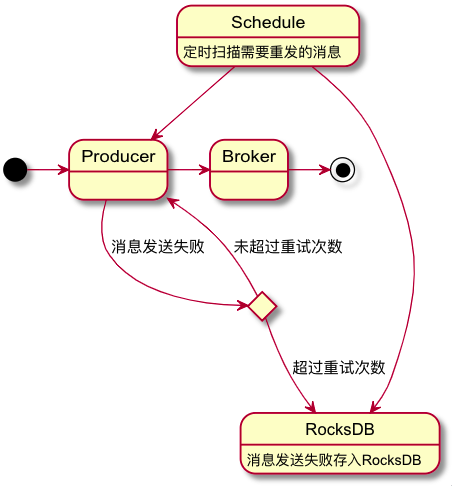
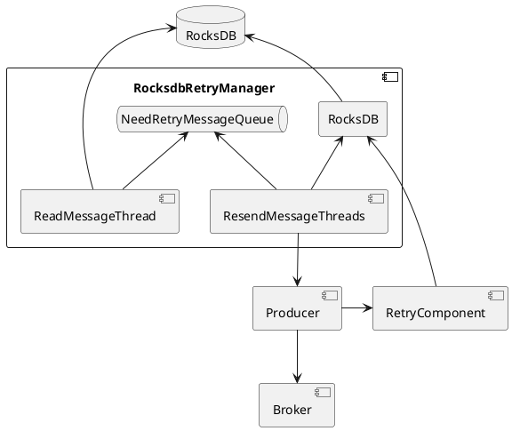
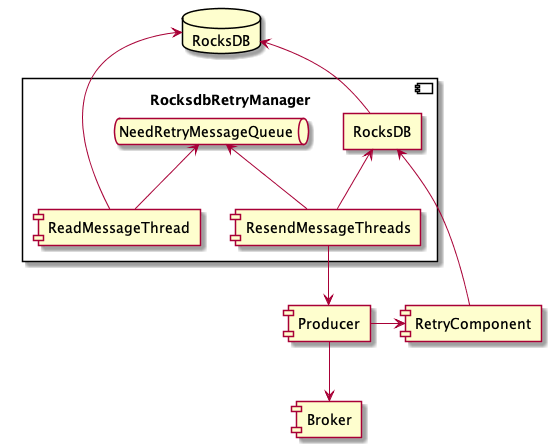

# RocketMQ 发送重试方案设计


## 基本概念

### 消息类型

- 普通消息：消息系统所传输信息的物理载体，生产和消费数据的最小单位，每条消息必须属于一个主题。RocketMQ中每个消息拥有唯一的Message ID，且可以携带具有业务标识的Key。
- 顺序消息：
  - 分区顺序：对于指定 Topic，所有消息根据 sharding key 进行区块分区，在同一个分区内的消息按照 FIFO 进行发布和消费
  - 全局顺序：对于指定 Topic，所有消息按照 FIFO 进行发布和消费
- 事务消息：应用本地事务和发送消息操作可以被定义到全局事务中，提供类似 X/Open XA 的分布事务功能，通过事务消息能达到分布式事务的最终一致
- 定时消息：定时消息会暂存在名为 SCHEDULE_TOPIC_XXXX 的 topic 中，并根据 delayTimeLevel 存入特定的queue，broker 会调度地消费 SCHEDULE_TOPIC_XXXX，将消息写入真实的topic


### 发送方式 / CommunicationMode（通讯方式）

- SYNC（同步）：producer 向 broker 发送消息，执行 API 时同步阻塞等待， 直到broker 服务器返回发送结果。
- ASYNC（异步）：producer 向 broker 发送消息时指定消息发送成功及发送异常的回调方法，调用 API 后立即返回，producer 发送消息线程不阻塞 ，消息发送成功或失败的回调任务在一个新的线程中执行 。
- ONEWAY（单向）：producer 向 broker 发送消息，执行 API 时直接返回，不等待broker 服务器的结果 。


### 发送状态

- **SEND_OK：消息发送成功**。要注意的是消息发送成功也不意味着它是可靠的。要确保不会丢失任何消息，还应启用同步 Master 服务器或同步刷盘，即 SYNC_MASTER 或 SYNC_FLUSH。
- **FLUSH_DISK_TIMEOUT：消息发送成功但是服务器刷盘超时。**此时消息已经进入服务器队列（内存），只有服务器宕机，消息才会丢失。消息存储配置参数中可以设置刷盘方式和同步刷盘时间长度，如果Broker服务器设置了刷盘方式为同步刷盘，即FlushDiskType=SYNC_FLUSH（默认为异步刷盘方式），当Broker服务器未在同步刷盘时间内（默认为5s）完成刷盘，则将返回该状态——刷盘超时。**(Broker 的刷盘策略设置成 SYNC_FLUSH 时才可能抛出这个错误，表示没有在规定时间内完成刷盘)**
- **FLUSH_SLAVE_TIMEOUT：消息发送成功，但是服务器同步到Slave时超时**。此时消息已经进入服务器队列，只有服务器宕机，消息才会丢失。如果Broker服务器的角色是同步Master，即SYNC_MASTER（默认是异步Master即ASYNC_MASTER），并且从Broker服务器未在同步刷盘时间（默认为5秒）内完成与主服务器的同步，则将返回该状态——数据同步到Slave服务器超时。**（在 Broker 主从策略设置成 SYNC_MASTER 且没有在规定时间内完成主从同步时返回该状态）**
- **SLAVE_NOT_AVAILABLE：消息发送成功，但是此时Slave不可用。**如果Broker服务器的角色是同步Master，即SYNC_MASTER（默认是异步Master服务器即ASYNC_MASTER），但没有配置slave Broker服务器，则将返回该状态——无Slave服务器可用。**（Broker 主从策略设置成 SYNC_MASTER时，若此时没有找到被配置成的 Slave 的 Broker，返回该状态）**
- **Exception：**MQClientException（Producer 异常）、RemotingException（网络异常）、MQBrokerException（Broker 异常）、InterruptedException（发送线程中断异常）


## 背景

### 线上异常

```java
// 流控
org.apache.rocketmq.client.exception.MQBrokerException: CODE: 2  DESC: [REJECTREQUEST]system busy, start flow control for a while
    For more information, please visit the url, http://rocketmq.apache.org/docs/faq/
  
// 发送消息超时
org.apache.rocketmq.remoting.exception.RemotingTooMuchRequestException: sendDefaultImpl call timeout
```


### 流控

> https://juejin.im/post/6844903957697921032
>
> https://juejin.im/post/6844903989608185864

当 broker 处理能力达到瓶颈时就会触发，生产者流控，此时 Producer 会直接忽略重试次数，不会尝试消息重投：

- PageCache 繁忙：commitLog文件被锁时间超过osPageCacheBusyTimeOutMills时，参数默认为1000ms，返回流控。
- TransientStorePool 堆外内存不足：如果开启transientStorePoolEnable == true，且broker为异步刷盘的主机，且transientStorePool中资源不足，拒绝当前send请求，返回流控。
- 排队中的任务等待时间超过了200ms：broker每隔10ms检查send请求队列头部请求的等待时间，如果超过waitTimeMillsInSendQueue，默认200ms，拒绝当前send请求，返回流控。
- 其他：broker通过拒绝send 请求方式实现流量控制。


### RocketMQ 自身的发送重试

**Producer 的 send 方法本身支持内部重试：**

- 同步发送：生产者会最多尝试发送 retryTimesWhenSendFailed + 1次。不会选择上次失败的broker，尝试向其他broker发送，最大程度保证消息不丢。超过重投次数或者超时，抛出异常，由客户端保证消息不丢失。当出现 RemotingException、MQClientException 和部分 MQBrokerException 时会重投。

  代码：`DefaultMQProducerImpl.sendDefaultImpl 545`

- 异步发送：生产者会最多尝试发送 retryTimesWhenSendAsyncFailed + 1次，异步重试不会选择其他broker，仅在同一个broker上做重试，不保证消息不丢。

  代码：`MQClientAPIImpl.onExceptionImpl 584`

以上策略只是在一定程度上保证了消息可以发送成功。如果业务对消息可靠性要求比较高，应用需要增加相应的重试逻辑，确保消息一定到达Broker。


**为什么MQ客户端没有在内部集成 DB 重试方式，而是要求应用自己去完成：**

- MQ的客户端设计为无状态模式，方便任意的水平扩展，且对机器资源的消耗仅仅是cpu、内存、网络。
- 如果MQ客户端内部集成一个KV存储模块，那么数据只有同步落盘才能较可靠，而同步落盘本身性能开销较大，所以通常会采用异步落盘，又由于应用关闭过程不受MQ运维人员控制，可能经常会发生 kill -9 这样暴力方式关闭，造成数据没有及时落盘而丢失。
- Producer所在机器的可靠性较低，一般为虚拟机，不适合存储重要数据。


## 方案选型

### 方案考虑

1. 重试成功率保证
2. 重试策略制定：消息类型、Topic、次数、时间
3. 对现有代码的改动性，侵入性
4. 。。。


### 方案备选

1. 调整 RocketMQ 重试配置，增加发送重试次数（retryTimesWhenSendFailed/retryTimesWhenSendAsyncFailed）。平台提供的组件不支持直接修改，可以通过反射进行修改，或者直接使用 DefaultMQProducer。
   - 优点：代码改动最小，对现有逻辑没有任何影响。
   - 缺点：重试是立即执行的，不保证最终重试成功。特别是遇到流控时，RocketMQ 会忽略重试次数，直接返回发送失败。
2. 使用 [spring-retry](https://github.com/spring-projects/spring-retry)，对发送方法进行失败重试。超过一定次数后，结合其他方法补偿。
   - 优点：不结合其他方法时代码改动小，弥补了 1 中超时等情况 MQ 不进行重试的缺点，如果流控在短时间内结束时有一定效果。
   - 缺点：重试是立即执行的，重试消息没有持久化，若不结合其他方法不保证最终重试成功。重试过程可能影响用户体验。
3. 消息发送失败时保存在内存中等待重新发送。根据重试策略，可使用 PriorityBlockingQueue、ArrayBlockingQueue 或 LinkedBlockingQueue 等。
   - 优点：实现简单，代码改动小，不需要引入第三方组件。
   - 缺点：当短时间内有大量消息需要重试时，该方法不适用；容器失效，消息直接丢失。
4. 借助 RocksDB：消息发送失败时保存在 RocksDB，以下次需要发送的时间等作为 key，同时启动多个线程从 RocksDB 取消息进行定时发送。
   - 优点：弥补了方案3短时间内不能承接大量消息的不足
   - 缺点：容器失效，消息直接丢失。
5. 借助 Redis：具体做法类似 RocksDB。
   - 优点：容器失效，消息不会丢失。
   - 缺点：增加了 Redis 压力。
6. 借助 MySQL：具体做法类似 RocksDB，消息 message id 作为唯一键，对发送时间做索引。
   - 优点：确保消息不会丢失。消息被永久持久化。适用于数据高度敏感，消息需要入库的场景。
   - 缺点： 增加了 MySQL 压力。

```yuml
@startuml 

[*] -> Producer

state c <<choice>>
Producer --> c: 消息发送失败
c -> Producer: 未超过重试次数

c --> RocksDB: 超过重试次数
RocksDB: 消息发送失败存入RocksDB

Schedule --> RocksDB
Schedule --> Producer
Schedule: 定时扫描需要重发的消息

Producer -> Broker
Broker -> [*]

@enduml
```








## 重试和幂等

网络波动导致消息发送成功，但是 broker 没有返回发送成功状态，触发超时重试，这时候就需要实现消息幂等性，防止消息重复消费。解决办法有两个：

1. 业务上保证消息多次消费和第一次消费效果相同
   - Consumer 消费消息时根据消息内容进行各自具体逻辑判断，已消费的消息就直接返回消费成功
2. 在消息消费前统一检查消息是否被消费过
   - 将消息ID作为数据库主键或唯一键，在消费之前先做插入操作，成功后再进行消费
   - 将最近一段时间消费过的消息ID缓存起来，查询是否已经被消费