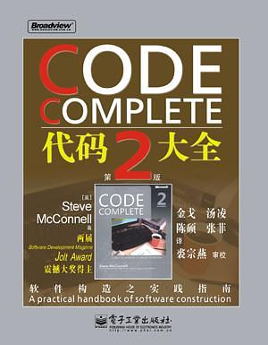

# 代码大全（第2版）

>豆瓣：[代码大全（第2版）](https://book.douban.com/subject/1477390/)
>
>ReadFree：https://readfree.me/book/1477390

## 目录 & 进度

- [ ] 第 1 章 欢迎进入软件构建的世界
- [ ] 第 2 章 用隐喻来更充分地理解软件开发
- [ ] 第 3 章 三思而后行：前期准备
- [ ] 第 4 章 关键的“构建”决策
- [ ] 第 5 章 软件构建中的设计
- [ ] 第 6 章 可以工作的类
- [ ] 第 7 章 高质量的子程序
- [ ] 第 8 章 防御式编程
- [ ] 第 9 章 伪代码编程过程
- [ ] 第 10 章 使用变量的一般事项
- [ ] 第 11 章 变量名的力量
- [ ] 第 12 章 基本数据类型
- [ ] 第 13 章 不常见的数据类型
- [ ] 第 14 章 组织直线型代码
- [ ] 第 15 章 使用条件语句
- [ ] 第 16 章 控制循环
- [ ] 第 17 章 不常见的控制结构
- [ ] 第 18 章 表驱动法
- [ ] 第 19 章 一般控制问题
- [ ] 第 20 章 软件质量概述
- [ ] 第 21 章 协同构建
- [ ] 第 22 章 开发者测试
- [ ] 第 23 章 调试
- [ ] 第 24 章 重构
- [ ] 第 25 章 代码调整策略
- [ ] 第 26 章 代码调整技术
- [ ] 第 27 章 程序规模对构建的影响
- [ ] 第 28 章 管理构建
- [ ] 第 29 章 集成
- [ ] 第 30 章 编程工具
- [ ] 第 31 章 布局与风格
- [ ] 第 32 章 自说明代码
- [ ] 第 33 章 个人性格
- [ ] 第 34 章 软件工艺的话题
- [ ] 第 35 章 何处有更多信息

## 读后感

暂无