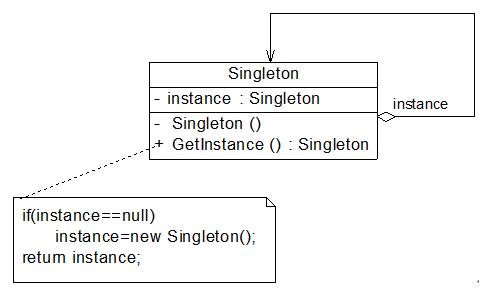
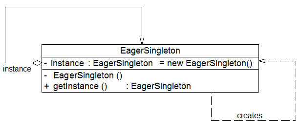
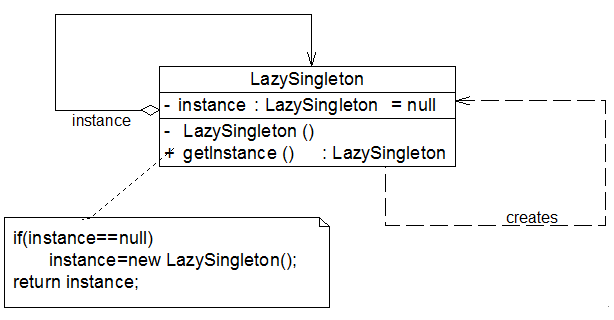

### # 单例模式概述

(1) 单例模式(Singleton Pattern)：确保某一个类只有一个实例，而且自行实例化并向整个系统提供这个实例，这个类称为单例类，它提供全局访问的方法。单例模式是一种对象创建型模式。

(2) 单例模式有三个要点：一是某个类只能有一个实例；二是它必须自行创建这个实例；三是它必须自行向整个系统提供这个实例。

(3)  单例模式是结构最简单的设计模式一，在它的核心结构中只包含一个被称为单例类的特殊类。单例模式结构如图所示：



(4) 单例模式结构图中只包含一个单例角色：

+ Singleton（单例）：在单例类的内部实现只生成一个实例，同时它提供一个静态的getInstance()工厂方法，让客户可以访问它的唯一实例；为了防止在外部对其实例化，将其构造函数设计为私有；在单例类内部定义了一个Singleton类型的静态对象，作为外部共享的唯一实例。

### # 饿汉式单例与懒汉式单例的讨论 

#### 1.饿汉式单例类 

饿汉式单例类是实现起来最简单的单例类，饿汉式单例类结构图如图所示：



从图中可以看出，由于在定义静态变量的时候实例化单例类，因此在类加载的时候就已经创建了单例对象，代码如下所示：  

```java
class EagerSingleton {   
    private static final EagerSingleton instance = new EagerSingleton();   
    private EagerSingleton() { }   

    public static EagerSingleton getInstance() {  
        return instance;   
    }     
} 
```

当类被加载时，静态变量instance会被初始化，此时类的私有构造函数会被调用，单例类的唯一实例将被创建。如果使用饿汉式单例来实现负载均衡器LoadBalancer类的设计，则不会出现创建多个单例对象的情况，可确保单例对象的唯一性。

#### 2.懒汉式单例类与线程锁定 

除了饿汉式单例，还有一种经典的懒汉式单例。懒汉式单例类结构图如图所示：



从图中可以看出，懒汉式单例在第一次调用getInstance()方法时实例化，在类加载时并不自行实例化，这种技术又称为**延迟加载(Lazy Load)**技术，即需要的时候再加载实例，为了避免多个线程同时调用getInstance()方法，我们可以使用关键字**synchronized**，代码如下所示：  

```java
class LazySingleton {   
    private static LazySingleton instance = null;   

    private LazySingleton() { }   

    synchronized public static LazySingleton getInstance() {   
        if (instance == null) {  
            instance = new LazySingleton();   
        }  
        return instance;   
    }  
}  
```

该懒汉式单例类在getInstance()方法前面增加了关键字synchronized进行线程锁，以处理多个线程同时访问的问题。但是，上述代码虽然解决了线程安全问题，但是每次调用getInstance()时都需要进行线程锁定判断，在多线程高并发访问环境中，将会导致系统性能大大降低。如何既解决线程安全问题又不影响系统性能呢？我们继续对懒汉式单例进行改进。事实上，我们无须对整个getInstance()方法进行锁定，只需对其中的代码“instance = new LazySingleton();”进行锁定即可。因此getInstance()方法可以进行如下改进： 

```java
public static LazySingleton getInstance() {   
    if (instance == null) {  
        synchronized (LazySingleton.class) {  
            instance = new LazySingleton();   
        }  
    }  
    return instance;   
}  
```

问题貌似得以解决，事实并非如此。如果使用以上代码来实现单例，还是会存在单例对象不唯一。原因如下：

假如在某一瞬间线程A和线程B都在调用getInstance()方法，此时instance对象为null值，均能通过instance == null的判断。由于实现了synchronized加锁机制，线程A进入synchronized锁定的代码中执行实例创建代码，线程B处于排队等待状态，必须等待线程A执行完毕后才可以进入synchronized锁定代码。但当A执行完毕时，线程B并不知道实例已经创建，将继续创建新的实例，导致产生多个单例对象，违背单例模式的设计思想，因此需要进行进一步改进，在synchronized中再进行一次(instance == null)判断，这种方式称为**双重检查锁定(Double-Check Locking)**。使用双重检查锁定实现的懒汉式单例类完整代码如下所示：

```java
class LazySingleton {   
    private volatile static LazySingleton instance = null;   

    private LazySingleton() { }   

    public static LazySingleton getInstance() {   
        //第一重判断  
        if (instance == null) {  
            //锁定代码块  
            synchronized (LazySingleton.class) {  
                //第二重判断  
                if (instance == null) {  
                    instance = new LazySingleton(); //创建单例实例  
                }  
            }  
        }  
        return instance;   
    }  
}  
```

需要注意的是，如果使用双重检查锁定来实现懒汉式单例类，需要在静态成员变量instance之前增加**修饰符volatile**，被volatile修饰的成员变量可以确保多个线程都能够正确处理，且该代码只能在JDK 1.5及以上版本中才能正确执行。由于volatile关键字会屏蔽Java虚拟机所做的一些代码优化，可能会导致系统运行效率降低，因此即使使用双重检查锁定来实现单例模式也不是一种完美的实现方式。 

#### 3.饿汉式单例类与懒汉式单例类比较 

(1) 饿汉式单例类在类被加载时就将自己实例化，它的优点在于无须考虑多线程访问问题，可以确保实例的唯一性；从调用速度和反应时间角度来讲，由于单例对象一开始就得以创建，因此要优于懒汉式单例。但是无论系统在运行时是否需要使用该单例对象，由于在类加载时该对象就需要创建，因此从资源利用效率角度来讲，饿汉式单例不及懒汉式单例，而且在系统加载时由于需要创建饿汉式单例对象，加载时间可能会比较长。

(2) 懒汉式单例类在第一次使用时创建，无须一直占用系统资源，实现了延迟加载，但是必须处理好多个线程同时访问的问题，特别是当单例类作为资源控制器，在实例化时必然涉及资源初始化，而资源初始化很有可能耗费大量时间，这意味着出现多线程同时首次引用此类的机率变得较大，需要通过双重检查锁定等机制进行控制，这将导致系统性能受到一定影响。

### # 一种更好的单例实现方法（静态内部类）

(1) 饿汉式单例类不能实现延迟加载，不管将来用不用始终占据内存；懒汉式单例类线程安全控制烦琐，而且性能受影响。可见，无论是饿汉式单例还是懒汉式单例都存在这样那样的问题，有没有一种方法，能够将两种单例的缺点都克服，而将两者的优点合二为一呢？答案是：Yes！下面我们来学习这种更好的被称之为**Initialization Demand Holder (IoDH)**的技术。

(2) 在IoDH中，我们在单例类中增加一个**静态(static)内部类**，在该内部类中创建单例对象，再将该单例对象通过getInstance()方法返回给外部使用，实现代码如下所示：

```java
//Initialization on Demand Holder  
class Singleton {  
    private Singleton() {  
    }  

    private static class HolderClass {  
        private final static Singleton instance = new Singleton();  
    }  

    public static Singleton getInstance() {  
        return HolderClass.instance;  
    }  

    public static void main(String args[]) {  
        Singleton s1, s2;   
        s1 = Singleton.getInstance();  
        s2 = Singleton.getInstance();  
        System.out.println(s1==s2);  
    }  
}  
```

编译并运行上述代码，运行结果为：true，即创建的单例对象s1和s2为同一对象。由于静态单例对象没有作为Singleton的成员变量直接实例化，因此类加载时不会实例化Singleton，第一次调用getInstance()时将加载内部类HolderClass，在该内部类中定义了一个static类型的变量instance，此时会首先初始化这个成员变量，由Java虚拟机来保证其线程安全性，确保该成员变量只能初始化一次。由于getInstance()方法没有任何线程锁定，因此其性能不会造成任何影响。

(3)  **通过使用IoDH，我们既可以实现延迟加载，又可以保证线程安全，不影响系统性能，不失为一种最好的Java语言单例模式实现方式**（其缺点是与编程语言本身的特性相关，很多面向对象语言不支持IoDH）。

### # 单例模式总结

单例模式作为一种目标明确、结构简单、理解容易的设计模式，在软件开发中使用频率相当高，在很多应用软件和框架中都得以广泛应用。

#### 1.主要优点

+ 单例模式提供了对唯一实例的受控访问。因为单例类封装了它的唯一实例，所以它可以严格控制客户怎样以及何时访问它。
+ 由于在系统内存中只存在一个对象，因此可以节约系统资源，对于一些需要频繁创建和销毁的对象单例模式无疑可以提高系统的性能。
+ 允许可变数目的实例。基于单例模式我们可以进行扩展，使用与单例控制相似的方法来获得指定个数的对象实例，既节省系统资源，又解决了单例单例对象共享过多有损性能的问题。

#### 2.主要缺点 

+ 由于单例模式中没有抽象层，因此单例类的扩展有很大的困难。
+ 单例类的职责过重，在一定程度上违背了“单一职责原则”。因为单例类既充当了工厂角色，提供了工厂方法，同时又充当了产品角色，包含一些业务方法，将产品的创建和产品的本身的功能融合到一起。
+ 现在很多面向对象语言(如Java、C#)的运行环境都提供了自动垃圾回收的技术，因此，如果实例化的共享对象长时间不被利用，系统会认为它是垃圾，会自动销毁并回收资源，下次利用时又将重新实例化，这将导致共享的单例对象状态的丢失。

#### 3.适用场景 

+ 系统只需要一个实例对象，如系统要求提供一个唯一的序列号生成器或资源管理器，或者需要考虑资源消耗太大而只允许创建一个对象。
+ 客户调用类的单个实例只允许使用一个公共访问点，除了该公共访问点，不能通过其他途径访问该实例。

 


