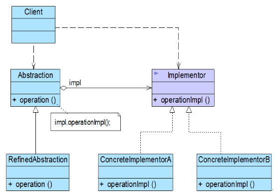
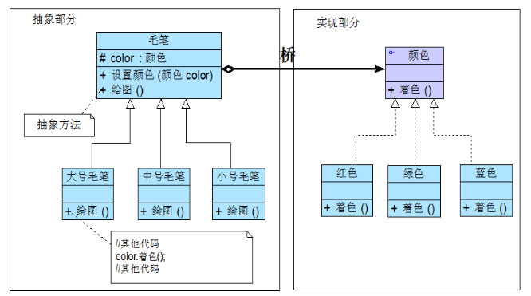
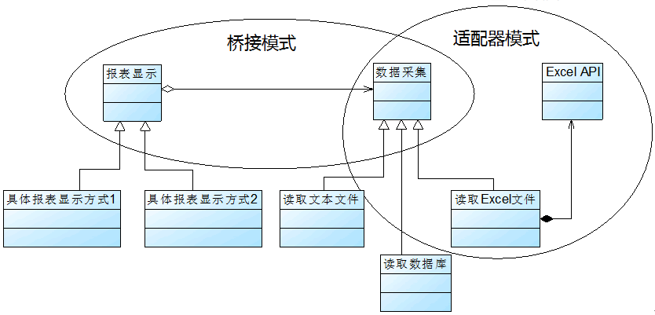

### # 桥接模式概述

(1) 桥接模式是一种很实用的结构型设计模式，如果软件系统中某个类存在两个独立变化的维度，通过该模式可以将这两个维度分离出来，使两者可以独立扩展，让系统更加符合“单一职责原则”。与多层继承方案不同，它将两个独立变化的维度设计为两个独立的继承等级结构，并且在抽象层建立一个抽象关联，该关联关系类似一条连接两个独立继承结构的桥，故名桥接模式。

(2) 桥接模式用一种巧妙的方式处理多层继承存在的问题，用抽象关联取代了传统的多层继承，将类之间的静态继承关系转换为动态的对象组合关系，使得系统更加灵活，并易于扩展，同时有效控制了系统中类的个数。桥接模式(Bridge Pattern)定义：将抽象部分与它的实现部分分离，使它们都可以独立地变化。它是一种对象结构型模式，又称为柄体(Handle and Body)模式或接口(Interface)模式。

(3) 桥接模式的结构与其名称一样，存在一条连接两个继承等级结构的桥，桥接模式结构如图所示：



(4) 在桥接模式结构图中包含如下几个角色：

+ Abstraction（抽象类）：用于定义抽象类的接口，它一般是抽象类而不是接口，其中定义了一个Implementor（实现类接口）类型的对象并可以维护该对象，它与Implementor之间具有关联关系，它既可以包含抽象业务方法，也可以包含具体业务方法。
+ RefinedAbstraction（扩充抽象类）：扩充由Abstraction定义的接口，通常情况下它不再是抽象类而是具体类，它实现了在Abstraction中声明的抽象业务方法，在RefinedAbstraction中可以调用在Implementor中定义的业务方法。
+ Implementor（实现类接口）：定义实现类的接口，这个接口不一定要与Abstraction的接口完全一致，事实上这两个接口可以完全不同，一般而言，Implementor接口仅提供基本操作，而Abstraction定义的接口可能会做更多更复杂的操作。Implementor接口对这些基本操作进行了声明，而具体实现交给其子类。通过关联关系，在Abstraction中不仅拥有自己的方法，还可以调用到Implementor中定义的方法，使用关联关系来替代继承关系。
+ ConcreteImplementor（具体实现类）：具体实现Implementor接口，在不同的ConcreteImplementor中提供基本操作的不同实现，在程序运行时，ConcreteImplementor对象将替换其父类对象，提供给抽象类具体的业务操作方法。

(5) 桥接模式是一个非常有用的模式，在桥接模式中体现了很多面向对象设计原则的思想，包括“单一职责原则”、“开闭原则”、“合成复用原则”、“里氏代换原则”、“依赖倒转原则”等。熟悉桥接模式有助于我们深入理解这些设计原则，也有助于我们形成正确的设计思想和培养良好的设计风格。

(6)  在使用桥接模式时，我们首先应该识别出一个类所具有的两个独立变化的维度，将它们设计为两个独立的继承等级结构，为两个维度都提供抽象层，并建立抽象耦合。通常情况下，我们将具有两个独立变化维度的类的一些普通业务方法和与之关系最密切的维度设计为“抽象类”层次结构（抽象部分），而将另一个维度设计为“实现类”层次结构（实现部分）。例如：对于毛笔而言，由于型号是其固有的维度，因此可以设计一个抽象的毛笔类，在该类中声明并部分实现毛笔的业务方法，而将各种型号的毛笔作为其子类；颜色是毛笔的另一个维度，由于它与毛笔之间存在一种“设置”的关系，因此我们可以提供一个抽象的颜色接口，而将具体的颜色作为实现该接口的子类。在此，型号可认为是毛笔的抽象部分，而颜色是毛笔的实现部分，结构示意图如图所示：



如果需要增加一种新型号的毛笔，只需扩展左侧的“抽象部分”，增加一个新的扩充抽象类；如果需要增加一种新的颜色，只需扩展右侧的“实现部分”，增加一个新的具体实现类。扩展非常方便，无须修改已有代码，且不会导致类的数目增长过快。

(7) 在具体编码实现时，由于在桥接模式中存在两个独立变化的维度，为了使两者之间耦合度降低，首先需要针对两个不同的维度提取抽象类和实现类接口，并建立一个抽象关联关系。对于“实现部分”维度，典型的实现类接口代码如下所示：

```java
interface Implementor {  
    public void operationImpl();  
}  
```

在实现Implementor接口的子类中实现了在该接口中声明的方法，用于定义与该维度相对应的一些具体方法。

对于另一“抽象部分”维度而言，其典型的抽象类代码如下所示：

```java
abstract class Abstraction {  
    protected Implementor impl; //定义实现类接口对象  

    public void setImpl(Implementor impl) {  
        this.impl=impl;  
    }  

    public abstract void operation();  //声明抽象业务方法  
}  
```

在抽象类Abstraction中定义了一个实现类接口类型的成员对象impl，再通过注入的方式给该对象赋值，一般将该对象的可见性定义为protected，以便在其子类中访问Implementor的方法，其子类一般称为扩充抽象类或细化抽象类(RefinedAbstraction)，典型的RefinedAbstraction类代码如下所示： 

```java
class RefinedAbstraction extends Abstraction {  
    public void operation() {  
        //业务代码  
        impl.operationImpl();  //调用实现类的方法  
        //业务代码  
    }  
} 
```

对于客户端而言，可以针对两个维度的抽象层编程，在程序运行时再动态确定两个维度的子类，动态组合对象，将两个独立变化的维度完全解耦，以便能够灵活地扩充任一维度而对另一维度不造成任何影响。

### # 适配器模式与桥接模式的联用

(1) 在软件开发中，适配器模式通常可以与桥接模式联合使用。适配器模式可以解决两个已有接口间不兼容问题，在这种情况下被适配的类往往是一个黑盒子，有时候我们不想也不能改变这个被适配的类，也不能控制其扩展。适配器模式通常用于现有系统与第三方产品功能的集成，采用增加适配器的方式将第三方类集成到系统中。桥接模式则不同，用户可以通过接口继承或类继承的方式来对系统进行扩展。

(2) 桥接模式和适配器模式用于设计的不同阶段，桥接模式用于系统的初步设计，对于存在两个独立变化维度的类可以将其分为抽象化和实现化两个角色，使它们可以分别进行变化；而在初步设计完成之后，当发现系统与已有类无法协同工作时，可以采用适配器模式。但有时候在设计初期也需要考虑适配器模式，特别是那些涉及到大量第三方应用接口的情况。

(3) 下面通过一个实例来说明适配器模式和桥接模式的联合使用：

在某系统的报表处理模块中，需要将报表显示和数据采集分开，系统可以有多种报表显示方式也可以有多种数据采集方式，如可以从文本文件中读取数据，也可以从数据库中读取数据，还可以从Excel文件中获取数据。如果需要从Excel文件中获取数据，则需要调用与Excel相关的API，而这个API是现有系统所不具备的，该API由厂商提供。使用适配器模式和桥接模式设计该模块。

在设计过程中，由于存在报表显示和数据采集两个独立变化的维度，因此可以使用桥接模式进行初步设计；为了使用Excel相关的API来进行数据采集则需要使用适配器模式。系统的完整设计中需要将两个模式联用，如图所示：



### # 桥接模式总结

桥接模式是设计Java虚拟机和实现JDBC等驱动程序的核心模式之一，应用较为广泛。在软件开发中如果一个类或一个系统有多个变化维度时，都可以尝试使用桥接模式对其进行设计。桥接模式为多维度变化的系统提供了一套完整的解决方案，并且降低了系统的复杂度。

#### 1.主要优点

(1)分离抽象接口及其实现部分。桥接模式使用“对象间的关联关系”解耦了抽象和实现之间固有的绑定关系，使得抽象和实现可以沿着各自的维度来变化。所谓抽象和实现沿着各自维度的变化，也就是说抽象和实现不再在同一个继承层次结构中，而是“子类化”它们，使它们各自都具有自己的子类，以便任何组合子类，从而获得多维度组合对象。

(2)在很多情况下，桥接模式可以取代多层继承方案，多层继承方案违背了“单一职责原则”，复用性较差，且类的个数非常多，桥接模式是比多层继承方案更好的解决方法，它极大减少了子类的个数。

(3)桥接模式提高了系统的可扩展性，在两个变化维度中任意扩展一个维度，都不需要修改原有系统，符合“开闭原则”。

#### 2.主要缺点 

(1)桥接模式的使用会增加系统的理解与设计难度，由于关联关系建立在抽象层，要求开发者一开始就针对抽象层进行设计与编程。

(2)桥接模式要求正确识别出系统中两个独立变化的维度，因此其使用范围具有一定的局限性，如何正确识别两个独立维度也需要一定的经验积累。

#### 3.适用场景 

(1)如果一个系统需要在抽象化和具体化之间增加更多的灵活性，避免在两个层次之间建立静态的继承关系，通过桥接模式可以使它们在抽象层建立一个关联关系。

(2)“抽象部分”和“实现部分”可以以继承的方式独立扩展而互不影响，在程序运行时可以动态将一个抽象化子类的对象和一个实现化子类的对象进行组合，即系统需要对抽象化角色和实现化角色进行动态耦合。

(3)一个类存在两个（或多个）独立变化的维度，且这两个（或多个）维度都需要独立进行扩展。

(4)对于那些不希望使用继承或因为多层继承导致系统类的个数急剧增加的系统，桥接模式尤为适用。

 