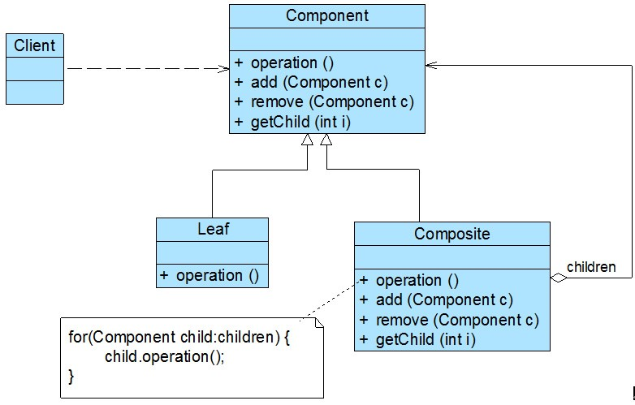
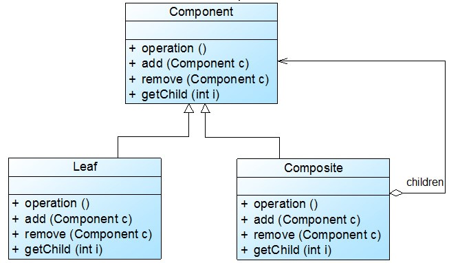
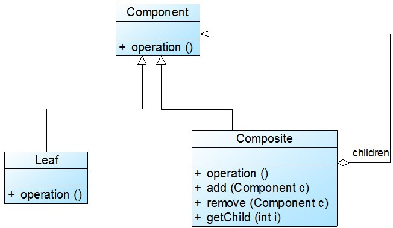
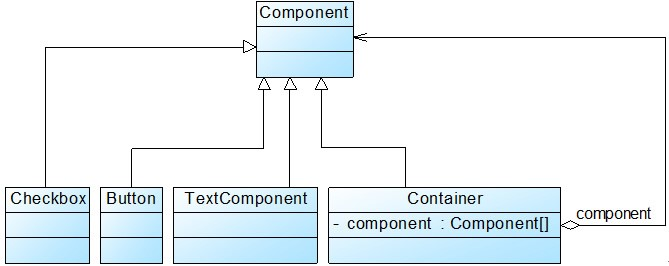

### # 组合模式概述

(1) 对于树形结构，当容器对象（如文件夹）的某一个方法被调用时，将遍历整个树形结构，寻找也包含这个方法的成员对象（可以是容器对象，也可以是叶子对象）并调用执行，牵一而动百，其中使用了递归调用的机制来对整个结构进行处理。由于容器对象和叶子对象在功能上的区别，在使用这些对象的代码中必须有区别地对待容器对象和叶子对象，而实际上大多数情况下我们希望一致地处理它们，因为对于这些对象的区别对待将会使得程序非常复杂。组合模式为解决此类问题而诞生，它可以让叶子对象和容器对象的使用具有一致性。

(2) 组合模式(Composite Pattern)定义：组合多个对象形成树形结构以表示具有“整体—部分”关系的层次结构。组合模式对单个对象（即叶子对象）和组合对象（即容器对象）的使用具有一致性，组合模式又可以称为“整体—部分”(Part-Whole)模式，它是一种对象结构型模式。

(3) 在组合模式中引入了抽象构件类Component，它是所有容器类和叶子类的公共父类，客户端针对Component进行编程。组合模式结构如图所示：



(4) 在组合模式结构图中包含如下几个角色：

+ Component（抽象构件）：它可以是接口或抽象类，为叶子构件和容器构件对象声明接口，在该角色中可以包含所有子类共有行为的声明和实现。在抽象构件中定义了访问及管理它的子构件的方法，如增加子构件、删除子构件、获取子构件等。
+ Leaf（叶子构件）：它在组合结构中表示叶子节点对象，叶子节点没有子节点，它实现了在抽象构件中定义的行为。对于那些访问及管理子构件的方法，可以通过异常等方式进行处理。
+ Composite（容器构件）：它在组合结构中表示容器节点对象，容器节点包含子节点，其子节点可以是叶子节点，也可以是容器节点，它提供一个集合用于存储子节点，实现了在抽象构件中定义的行为，包括那些访问及管理子构件的方法，在其业务方法中可以递归调用其子节点的业务方法。

(5)  **组合模式的关键是定义了一个抽象构件类，它既可以代表叶子，又可以代表容器，而客户端针对该抽象构件类进行编程，无须知道它到底表示的是叶子还是容器，可以对其进行统一处理。**同时容器对象与抽象构件类之间还建立一个聚合关联关系，在容器对象中既可以包含叶子，也可以包含容器，以此实现递归组合，形成一个树形结构。

(6) 如果不使用组合模式，客户端代码将过多地依赖于容器对象复杂的内部实现结构，容器对象内部实现结构的变化将引起客户代码的频繁变化，带来了代码维护复杂、可扩展性差等弊端。组合模式的引入将在一定程度上解决这些问题。下面通过简单的示例代码来分析组合模式的各个角色的用途和实现。对于组合模式中的抽象构件角色，其典型代码如下所示：

```java
abstract class Component {  
    public abstract void add(Component c); //增加成员  
    public abstract void remove(Component c); //删除成员  
    public abstract Component getChild(int i); //获取成员  
    public abstract void operation();  //业务方法  
}  
```

一般将抽象构件类设计为接口或抽象类，将所有子类共有方法的声明和实现放在抽象构件类中。对于客户端而言，将针对抽象构件编程，而无须关心其具体子类是容器构件还是叶子构件。

如果继承抽象构件的是叶子构件，则其典型代码如下所示：

```java
class Leaf extends Component {  
    public void add(Component c) {   
        //异常处理或错误提示   
    }     

    public void remove(Component c) {   
        //异常处理或错误提示   
    }  

    public Component getChild(int i) {   
        //异常处理或错误提示  
        return null;   
    }  

    public void operation() {  
        //叶子构件具体业务方法的实现  
    }   
}  
```

作为抽象构件类的子类，在叶子构件中需要实现在抽象构件类中声明的所有方法，包括业务方法以及管理和访问子构件的方法，但是叶子构件不能再包含子构件，因此在叶子构件中实现子构件管理和访问方法时需要提供异常处理或错误提示。当然，这无疑会给叶子构件的实现带来麻烦。

如果继承抽象构件的是容器构件，则其典型代码如下所示：

```java
class Composite extends Component {  
    private ArrayList<Component> list = new ArrayList<Component>();  

    public void add(Component c) {  
        list.add(c);  
    }  

    public void remove(Component c) {  
        list.remove(c);  
    }  

    public Component getChild(int i) {  
        return (Component)list.get(i);  
    }  

    public void operation() {  
        //容器构件具体业务方法的实现  
        //递归调用成员构件的业务方法  
        for(Object obj:list) {  
            ((Component)obj).operation();  
        }  
    }     
}  
```

在容器构件中实现了在抽象构件中声明的所有方法，既包括业务方法，也包括用于访问和管理成员子构件的方法，如add()、remove()和getChild()等方法。**需要注意的是在实现具体业务方法时，由于容器构件充当的是容器角色，包含成员构件，因此它将调用其成员构件的业务方法。在组合模式结构中，由于容器构件中仍然可以包含容器构件，因此在对容器构件进行处理时需要使用递归算法**，即在容器构件的operation()方法中递归调用其成员构件的operation()方法。

### # 透明组合模式与安全组合模式

通过引入组合模式，Sunny公司设计的杀毒软件具有良好的可扩展性，在增加新的文件类型时，无须修改现有类库代码，只需增加一个新的文件类作为AbstractFile类的子类即可，但是由于在AbstractFile中声明了大量用于管理和访问成员构件的方法，例如add()、remove()等方法，我们不得不在新增的文件类中实现这些方法，提供对应的错误提示和异常处理。为了简化代码，我们有以下两个解决方案：

**解决方案一：**将叶子构件的add()、remove()等方法的实现代码移至AbstractFile类中，由AbstractFile提供统一的默认实现，代码如下所示：

```java
//提供默认实现的抽象构件类  
abstract class AbstractFile {  
    public void add(AbstractFile file) {  
        System.out.println("对不起，不支持该方法！");  
    }  

    public void remove(AbstractFile file) {  
        System.out.println("对不起，不支持该方法！");  
    }  

    public AbstractFile getChild(int i) {  
        System.out.println("对不起，不支持该方法！");  
        return null;  
    }  

    public abstract void killVirus();  
}  
```

如果客户端代码针对抽象类AbstractFile编程，在调用文件对象的这些方法时将出现错误提示。如果不希望出现任何错误提示，我们可以在客户端定义文件对象时不使用抽象层，而直接使用具体叶子构件本身，客户端代码片段如下所示： 

```java
class Client {  
    public static void main(String args[]) {  
        //不能透明处理叶子构件  
        ImageFile file1,file2;  
        TextFile file3,file4;  
        VideoFile file5;  
        AbstractFile folder1,folder2,folder3,folder4;  
        //其他代码省略  
    }  
} 
```

这样就产生了一种不透明的使用方式，即在客户端不能全部针对抽象构件类编程，需要使用具体叶子构件类型来定义叶子对象。

**解决方案二：**除此之外，还有一种解决方法是在抽象构件AbstractFile中不声明任何用于访问和管理成员构件的方法，代码如下所示：

```java
abstract class AbstractFile {  
    public abstract void killVirus();  
}  
```

此时，由于在AbstractFile中没有声明add()、remove()等访问和管理成员的方法，其叶子构件子类无须提供实现；而且无论客户端如何定义叶子构件对象都无法调用到这些方法，不需要做任何错误和异常处理，容器构件再根据需要增加访问和管理成员的方法，但这时候也存在一个问题：客户端不得不使用容器类本身来声明容器构件对象，否则无法访问其中新增的add()、remove()等方法，如果客户端一致性地对待叶子和容器，将会导致容器构件的新增对客户端不可见，客户端代码对于容器构件无法再使用抽象构件来定义，客户端代码片段如下所示： 

```java
class Client {  
    public static void main(String args[]) {  

        AbstractFile file1,file2,file3,file4,file5;  
        Folder folder1,folder2,folder3,folder4; //不能透明处理容器构件  
        //其他代码省略  
    }  
}  
```

在使用组合模式时，根据抽象构件类的定义形式，我们可将组合模式分为透明组合模式和安全组合模式两种形式：

#### 1.透明组合模式 

透明组合模式中，抽象构件Component中声明了所有用于管理成员对象的方法，包括add()、remove()以及getChild()等方法，这样做的好处是确保所有的构件类都有相同的接口。在客户端看来，叶子对象与容器对象所提供的方法是一致的，客户端可以相同地对待所有的对象。透明组合模式也是组合模式的标准形式，虽然上面的**解决方案一**在客户端可以有不透明的实现方法，但是由于在抽象构件中包含add()、remove()等方法，因此它还是透明组合模式，透明组合模式的完整结构如图所示：



透明组合模式的缺点是不够安全，因为叶子对象和容器对象在本质上是有区别的。叶子对象不可能有下一个层次的对象，即不可能包含成员对象，因此为其提供add()、remove()以及getChild()等方法是没有意义的，这在编译阶段不会出错，但在运行阶段如果调用这些方法可能会出错（如果没有提供相应的错误处理代码）。

#### 2.安全组合模式

安全组合模式中，在抽象构件Component中没有声明任何用于管理成员对象的方法，而是在Composite类中声明并实现这些方法。这种做法是安全的，因为根本不向叶子对象提供这些管理成员对象的方法，对于叶子对象，客户端不可能调用到这些方法，这就是**解决方案二**所采用的实现方式。安全组合模式的结构如图所示：



安全组合模式的缺点是不够透明，因为叶子构件和容器构件具有不同的方法，且容器构件中那些用于管理成员对象的方法没有在抽象构件类中定义，因此客户端不能完全针对抽象编程，必须有区别地对待叶子构件和容器构件。在实际应用中，安全组合模式的使用频率也非常高，在Java AWT中使用的组合模式就是安全组合模式。 

### # 组合模式总结

组合模式使用面向对象的思想来实现树形结构的构建与处理，描述了如何将容器对象和叶子对象进行递归组合，实现简单，灵活性好。由于在软件开发中存在大量的树形结构，因此组合模式是一种使用频率较高的结构型设计模式，Java SE中的AWT和Swing包的设计就基于组合模式，在这些界面包中为用户提供了大量的容器构件（如Container）和成员构件（如Checkbox、Button和TextComponent等），其结构如图所示：



在图中，Component类是抽象构件，Checkbox、Button和TextComponent是叶子构件，而Container是容器构件，在AWT中包含的叶子构件还有很多，因为篇幅限制没有在图中一一列出。在一个容器构件中可以包含叶子构件，也可以继续包含容器构件，这些叶子构件和容器构件一起组成了复杂的GUI界面。除此以外，在XML解析、组织结构树处理、文件系统设计等领域，组合模式都得到了广泛应用。

#### 1. 主要优点 

(1) 组合模式可以清楚地定义分层次的复杂对象，表示对象的全部或部分层次，它让客户端忽略了层次的差异，方便对整个层次结构进行控制。

(2) 客户端可以一致地使用一个组合结构或其中单个对象，不必关心处理的是单个对象还是整个组合结构，简化了客户端代码。

(3) 在组合模式中增加新的容器构件和叶子构件都很方便，无须对现有类库进行任何修改，符合“开闭原则”。

(4) 组合模式为树形结构的面向对象实现提供了一种灵活的解决方案，通过叶子对象和容器对象的递归组合，可以形成复杂的树形结构，但对树形结构的控制却非常简单。

#### 2. 主要缺点 

在增加新构件时很难对容器中的构件类型进行限制。有时候我们希望一个容器中只能有某些特定类型的对象，例如在某个文件夹中只能包含文本文件，使用组合模式时，不能依赖类型系统来施加这些约束，因为它们都来自于相同的抽象层，在这种情况下，必须通过在运行时进行类型检查来实现，这个实现过程较为复杂。

#### 3. 适用场景 

(1) 在具有整体和部分的层次结构中，希望通过一种方式忽略整体与部分的差异，客户端可以一致地对待它们。

(2) 在一个使用面向对象语言开发的系统中需要处理一个树形结构。

(3) 在一个系统中能够分离出叶子对象和容器对象，而且它们的类型不固定，需要增加一些新的类型。


