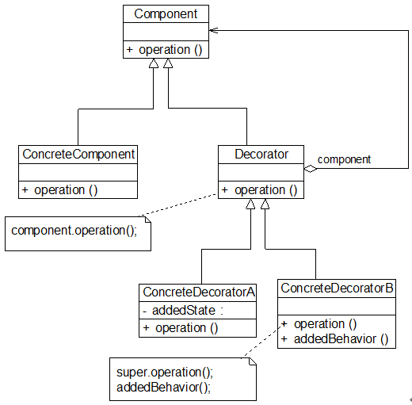
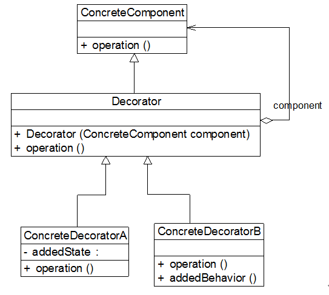

### # 装饰模式概述

(1) 装饰模式可以在不改变一个对象本身功能的基础上给对象增加额外的新行为，在现实生活中，这种情况也到处存在，例如一张照片，我们可以不改变照片本身，给它增加一个相框，使得它具有防潮的功能，而且用户可以根据需要给它增加不同类型的相框，甚至可以在一个小相框的外面再套一个大相框。

(2) 装饰模式是一种用于替代继承的技术，它通过一种无须定义子类的方式来给对象动态增加职责，使用对象之间的关联关系取代类之间的继承关系。在装饰模式中引入了装饰类，在装饰类中既可以调用待装饰的原有类的方法，还可以增加新的方法，以扩充原有类的功能。

(3) 装饰模式(Decorator Pattern)定义：动态地给一个对象增加一些额外的职责，就增加对象功能来说，装饰模式比生成子类实现更为灵活。装饰模式是一种对象结构型模式。

(4) 在装饰模式中，为了让系统具有更好的灵活性和可扩展性，我们通常会定义一个抽象装饰类，而将具体的装饰类作为它的子类，装饰模式结构如图所示：



(5) 在装饰模式结构图中包含如下几个角色：

+ Component（抽象构件）：它是具体构件和抽象装饰类的共同父类，声明了在具体构件中实现的业务方法，它的引入可以使客户端以一致的方式处理未被装饰的对象以及装饰之后的对象，实现客户端的透明操作。
+ ConcreteComponent（具体构件）：它是抽象构件类的子类，用于定义具体的构件对象，实现了在抽象构件中声明的方法，装饰器可以给它增加额外的职责（方法）。
+ Decorator（抽象装饰类）：它也是抽象构件类的子类，用于给具体构件增加职责，但是具体职责在其子类中实现。它维护一个指向抽象构件对象的引用，通过该引用可以调用装饰之前构件对象的方法，并通过其子类扩展该方法，以达到装饰的目的。
+ ConcreteDecorator（具体装饰类）：它是抽象装饰类的子类，负责向构件添加新的职责。每一个具体装饰类都定义了一些新的行为，它可以调用在抽象装饰类中定义的方法，并可以增加新的方法用以扩充对象的行为。

(6) 由于具体构件类和装饰类都实现了相同的抽象构件接口，因此装饰模式以对客户透明的方式动态地给一个对象附加上更多的责任，换言之，客户端并不会觉得对象在装饰前和装饰后有什么不同。装饰模式可以在不需要创造更多子类的情况下，将对象的功能加以扩展。

装饰模式的核心在于抽象装饰类的设计，其典型代码如下所示：

```java
class Decorator implements Component
{
       private Component component;  //维持一个对抽象构件对象的引用
       public Decorator(Component component)  //注入一个抽象构件类型的对象
       {
              this.component=component;
       }

       public void operation()
       {
              component.operation();  //调用原有业务方法
       }
}
```

在抽象装饰类Decorator中定义了一个Component类型的对象component，维持一个对抽象构件对象的引用，并可以通过构造方法或Setter方法将一个Component类型的对象注入进来，同时由于Decorator类实现了抽象构件Component接口，因此需要实现在其中声明的业务方法operation()，需要注意的是在Decorator中并未真正实现operation()方法，而只是调用原有component对象的operation()方法，它没有真正实施装饰，而是提供一个统一的接口，将具体装饰过程交给子类完成。

在Decorator的子类即具体装饰类中将继承operation()方法并根据需要进行扩展，典型的具体装饰类代码如下：

```java
class ConcreteDecorator extends Decorator {
    public ConcreteDecorator(Component  component) {
        super(component);
    }

    public void operation() {
        super.operation();  //调用原有业务方法
        addedBehavior();  //调用新增业务方法
    }
    //新增业务方法
    public  void addedBehavior() {    
        ……
    }
}
```

在具体装饰类中可以调用到抽象装饰类的operation()方法，同时可以定义新的业务方法，如addedBehavior()。

由于在抽象装饰类Decorator中注入的是Component类型的对象，因此我们可以将一个具体构件对象注入其中，再通过具体装饰类来进行装饰；此外，我们还可以将一个已经装饰过的Decorator子类的对象再注入其中进行多次装饰，从而对原有功能的多次扩展。

### # 透明装饰模式与半透明装饰模式

在实际使用过程中，由于新增行为可能需要单独调用，因此这种形式的装饰模式也经常出现，这种装饰模式被称为**半透明(Semi-transparent)装饰模式**，而标准的装饰模式是**透明(Transparent)装饰模式**。下面我们对这两种装饰模式进行较为详细的介绍：

#### 1.透明装饰模式

在透明装饰模式中，要求客户端完全针对抽象编程，装饰模式的透明性要求客户端程序不应该将对象声明为具体构件类型或具体装饰类型，而应该全部声明为抽象构件类型。对于客户端而言，具体构件对象和具体装饰对象没有任何区别。也就是应该使用如下代码：

```java
Component  c, c1; //使用抽象构件类型定义对象
c = new ConcreteComponent()；
c1 = new ConcreteDecorator (c)；
```

而不应该使用如下代码：  

```java
ConcreteComponent c; //使用具体构件类型定义对象
c = new ConcreteComponent()；
```

或 

```java
ConcreteDecorator c1; //使用具体装饰类型定义对象
c1 = new ConcreteDecorator(c)；
```

在图形界面构件库的设计方案中使用的就是透明装饰模式，在客户端中存在如下代码片段：  

```java
……
Component component,componentSB,componentBB; //全部使用抽象构件定义
component = new Window();
componentSB = new ScrollBarDecorator(component);
componentBB = new BlackBorderDecorator(componentSB);
componentBB.display();
……
```

使用抽象构件类型Component定义全部具体构件对象和具体装饰对象，客户端可以一致地使用这些对象，因此符合透明装饰模式的要求。

透明装饰模式可以让客户端透明地使用装饰之前的对象和装饰之后的对象，无须关心它们的区别，此外，还可以对一个已装饰过的对象进行多次装饰，得到更为复杂、功能更为强大的对象。在实现透明装饰模式时，要求具体装饰类的operation()方法覆盖抽象装饰类的operation()方法，除了调用原有对象的operation()外还需要调用新增的addedBehavior()方法来增加新行为。

#### 2.半透明装饰模式

透明装饰模式的设计难度较大，而且有时我们需要单独调用新增的业务方法。为了能够调用到新增方法，我们不得不用具体装饰类型来定义装饰之后的对象，而具体构件类型还是可以使用抽象构件类型来定义，这种装饰模式即为半透明装饰模式，也就是说，对于客户端而言，具体构件类型无须关心，是透明的；但是具体装饰类型必须指定，这是不透明的。如本节前面所提到的文件对象功能增加实例，为了能够调用到在Approver中新增方法approve()，客户端代码片段如下所示：

```java
……
Document  doc; //使用抽象构件类型定义
doc = new PurchaseRequest();
Approver newDoc; //使用具体装饰类型定义
newDoc = new Approver(doc);
……
```

半透明装饰模式可以给系统带来更多的灵活性，设计相对简单，使用起来也非常方便；但是其最大的缺点在于不能实现对同一个对象的多次装饰，而且客户端需要有区别地对待装饰之前的对象和装饰之后的对象。在实现半透明的装饰模式时，我们只需在具体装饰类中增加一个独立的addedBehavior()方法来封装相应的业务处理，由于客户端使用具体装饰类型来定义装饰后的对象，因此可以单独调用addedBehavior()方法来扩展系统功能。

### # 装饰模式注意事项

在使用装饰模式时，通常我们需要注意以下几个问题：

(1) 尽量保持装饰类的接口与被装饰类的接口相同，这样，对于客户端而言，无论是装饰之前的对象还是装饰之后的对象都可以一致对待。这也就是说，在可能的情况下，我们应该尽量使用透明装饰模式。

(2) 尽量保持具体构件类ConcreteComponent是一个“轻”类，也就是说不要把太多的行为放在具体构件类中，我们可以通过装饰类对其进行扩展。

(3) 如果只有一个具体构件类，那么抽象装饰类可以作为该具体构件类的直接子类。如图所示：



### # 装饰模式总结

装饰模式降低了系统的耦合度，可以动态增加或删除对象的职责，并使得需要装饰的具体构件类和具体装饰类可以独立变化，以便增加新的具体构件类和具体装饰类。在软件开发中，装饰模式应用较为广泛，例如在JavaIO中的输入流和输出流的设计、javax.swing包中一些图形界面构件功能的增强等地方都运用了装饰模式。

#### 1.主要优点 

(1) 对于扩展一个对象的功能，装饰模式比继承更加灵活性，不会导致类的个数急剧增加。

(2) 可以通过一种动态的方式来扩展一个对象的功能，通过配置文件可以在运行时选择不同的具体装饰类，从而实现不同的行为。

(3) 可以对一个对象进行多次装饰，通过使用不同的具体装饰类以及这些装饰类的排列组合，可以创造出很多不同行为的组合，得到功能更为强大的对象。

(4) 具体构件类与具体装饰类可以独立变化，用户可以根据需要增加新的具体构件类和具体装饰类，原有类库代码无须改变，符合“开闭原则”。

#### 2.主要缺点

(1) 使用装饰模式进行系统设计时将产生很多小对象，这些对象的区别在于它们之间相互连接的方式有所不同，而不是它们的类或者属性值有所不同，大量小对象的产生势必会占用更多的系统资源，在一定程序上影响程序的性能。

(2) 装饰模式提供了一种比继承更加灵活机动的解决方案，但同时也意味着比继承更加易于出错，排错也很困难，对于多次装饰的对象，调试时寻找错误可能需要逐级排查，较为繁琐。

#### 3.适用场景

(1) 在不影响其他对象的情况下，以动态、透明的方式给单个对象添加职责。

(2) 当不能采用继承的方式对系统进行扩展或者采用继承不利于系统扩展和维护时可以使用装饰模式。不能采用继承的情况主要有两类：第一类是系统中存在大量独立的扩展，为支持每一种扩展或者扩展之间的组合将产生大量的子类，使得子类数目呈爆炸性增长；第二类是因为类已定义为不能被继承（如Java语言中的final类）。