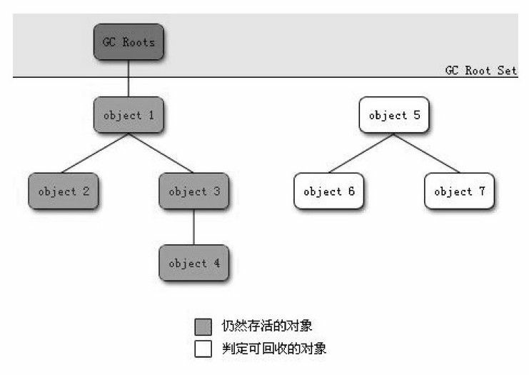
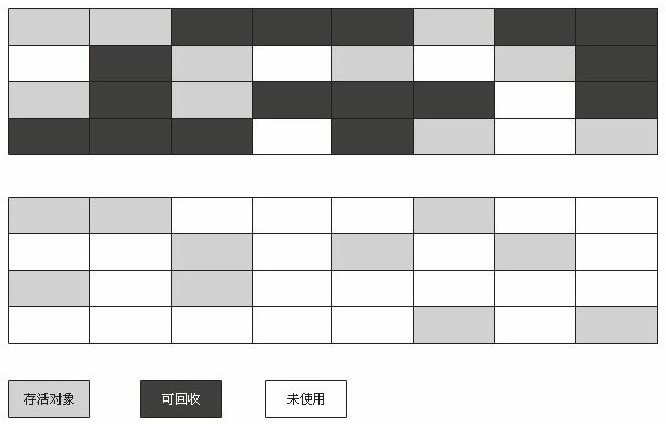
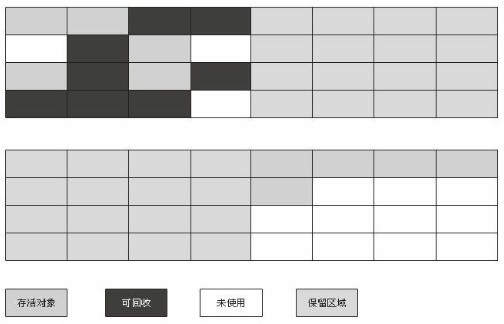
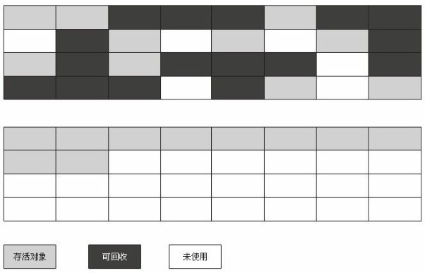

### # 对象已死吗

在堆里面存放着Java世界中几乎所有的对象实例，垃圾收集器在对堆进行回收前，第一件事情就是要确定这些对象之中哪些还“存活”着，哪些已经“死去”（即不可能再被任何途径使用的对象）。

#### 1.引用计数法

很多教科书判断对象是否存活的算法是这样的：给对象中添加一个引用计数器，每当有一个地方引用它时，计数器值就加1；当引用失效时，计数器值就减1；任何时刻计数器为0的对象就是不可能再被使用的。作者面试过很多的应届生和一些有多年工作经验的开发人员，他们对于这个问题给予的都是这个答案。

客观地说，引用计数算法（Reference Counting）的实现简单，判定效率也很高，在大部分情况下它都是一个不错的算法，也有一些比较著名的应用案例，例如微软公司的COM（Component Object Model）技术、使用ActionScript 3的FlashPlayer、Python语言和在游戏脚本领域被广泛应用的Squirrel中都使用了引用计数算法进行内存管理。但是，至少主流的Java虚拟机里面没有选用引用计数算法来管理内存，其中最主要的原因是它很难解决对象之间相互循环引用的问题。

举个简单的例子：对象objA和objB都有字段instance，赋值令objA.instance=objB及objB.instance=objA，除此之外，这两个对象再无任何引用，实际上这两个对象已经不可能再被访问，但是它们因为互相引用着对方，导致它们的引用计数都不为0，于是引用计数算法无法通知GC收集器回收它们。

#### 2.可达性分析算法

在主流的商用程序语言（Java、C#，甚至包括前面提到的古老的Lisp）的主流实现中，都是称通过**可达性分析（Reachability Analysis）来判定对象是否存活**的。这个算法的基本思路就是通过一系列的称为**“GC Roots”**的对象作为起始点，从这些节点开始向下搜索，搜索所走过的路径称为引用链（Reference Chain），当一个对象到GC Roots没有任何引用链相连（用图论的话来说，就是从GC Roots到这个对象不可达）时，则证明此对象是不可用的。如图3-1所示，对象object 5、object 6、object 7虽然互相有关联，但是它们到GC Roots是不可达的，所以它们将会被判定为是可回收的对象。

在Java语言中，可作为GC Roots的对象包括下面几种：

(1) 虚拟机栈（栈帧中的本地变量表）中引用的对象。

(2) 方法区中类静态属性引用的对象。

(3) 方法区中常量引用的对象。

(4) 本地方法栈中JNI（即一般说的Native方法）引用的对象。

#### 3.再谈引用

无论是通过引用计数算法判断对象的引用数量，还是通过可达性分析算法判断对象的引用链是否可达，判定对象是否存活都与“引用”有关。在JDK 1.2以前，Java中的引用的定义很传统：如果reference类型的数据中存储的数值代表的是另外一块内存的起始地址，就称这块内存代表着一个引用。这种定义很纯粹，但是太过狭隘，一个对象在这种定义下只有被引用或者没有被引用两种状态，对于如何描述一些“食之无味，弃之可惜”的对象就显得无能为力。我们希望能描述这样一类对象：当内存空间还足够时，则能保留在内存之中；如果内存空间在进行垃圾收集后还是非常紧张，则可以抛弃这些对象。很多系统的缓存功能都符合这样的应用场景。

在JDK 1.2之后，Java对引用的概念进行了扩充，**将引用分为强引用（Strong Reference）、软引用（Soft Reference）、弱引用（Weak Reference）、虚引用（Phantom Reference）4种，这4种引用强度依次逐渐减弱。**

**强引用**就是指在程序代码之中普遍存在的，类似“Object obj=new Object（）”这类的引用，只要强引用还存在，垃圾收集器永远不会回收掉被引用的对象。

**软引用**是用来描述一些还有用但并非必需的对象。**对于软引用关联着的对象，在系统将要发生内存溢出异常之前，将会把这些对象列进回收范围之中进行第二次回收**。如果这次回收还没有足够的内存，才会抛出内存溢出异常。在JDK 1.2之后，提供了**SoftReference类**来实现软引用。

**弱引用**也是用来描述非必需对象的，但是它的强度比软引用更弱一些，被弱引用关联的对象**只能生存到下一次垃圾收集发生之前**。当垃圾收集器工作时，无论当前内存是否足够，都会回收掉只被弱引用关联的对象。在JDK 1.2之后，提供了**WeakReference类**来实现弱引用。

**虚引用**也称为幽灵引用或者幻影引用，它是最弱的一种引用关系。一个对象是否有虚引用的存在，完全不会对其生存时间构成影响，也无法通过虚引用来取得一个对象实例。**为一个对象设置虚引用关联的唯一目的就是能在这个对象被收集器回收时收到一个系统通知****。**在JDK 1.2之后，提供了**PhantomReference类**来实现虚引用。

#### 4.生存还是死亡

即使在可达性分析算法中不可达的对象，也并非是“非死不可”的，这时候它们暂时处于“缓刑”阶段，要真正宣告一个对象死亡，至少要经历两次标记过程：如果对象在进行可达性分析后发现没有与GC Roots相连接的引用链，那它将会被第一次标记并且进行一次筛选，筛选的条件是此对象是否有必要执行finalize（）方法。当对象没有覆盖finalize（）方法，或者finalize（）方法已经被虚拟机调用过，虚拟机将这两种情况都视为“没有必要执行”。

如果这个对象被判定为有必要执行finalize（）方法，那么这个对象将会放置在一个叫做F-Queue的队列之中，并在稍后由一个由虚拟机自动建立的、低优先级的Finalizer线程去执行它。这里所谓的“执行”是指虚拟机会触发这个方法，但并不承诺会等待它运行结束，这样做的原因是，如果一个对象在finalize（）方法中执行缓慢，或者发生了死循环（更极端的情况），将很可能会导致F-Queue队列中其他对象永久处于等待，甚至导致整个内存回收系统崩溃。finalize（）方法是对象逃脱死亡命运的最后一次机会，稍后GC将对F-Queue中的对象进行第二次小规模的标记，如果对象要在finalize（）中成功拯救自己——只要重新与引用链上的任何一个对象建立关联即可，譬如把自己（this关键字）赋值给某个类变量或者对象的成员变量，那在第二次标记时它将被移除出“即将回收”的集合；如果对象这时候还没有逃脱，那基本上它就真的被回收了。

#### 5.回收方法区

很多人认为**方法区**（或者HotSpot虚拟机中的**永久代**）是没有垃圾收集的，Java虚拟机规范中确实说过可以不要求虚拟机在方法区实现垃圾收集，而且在方法区中进行垃圾收集的“性价比”一般比较低：在堆中，尤其是在新生代中，常规应用进行一次垃圾收集一般可以回收70%～95%的空间，而永久代的垃圾收集效率远低于此。

永久代的垃圾收集主要回收两部分内容：**废弃常量和无用的类**。回收废弃常量与回收Java堆中的对象非常类似。以常量池中字面量的回收为例，假如一个字符串“abc”已经进入了常量池中，但是当前系统没有任何一个String对象是叫做“abc”的，换句话说，就是没有任何String对象引用常量池中的“abc”常量，也没有其他地方引用了这个字面量，如果这时发生内存回收，而且必要的话，这个“abc”常量就会被系统清理出常量池。常量池中的其他类（接口）、方法、字段的符号引用也与此类似。

判定一个常量是否是“废弃常量”比较简单，而要判定一个类是否是“无用的类”的条件则相对苛刻许多。类需要同时满足下面3个条件才能算是“无用的类”：

(1) 该类所有的实例都已经被回收，也就是Java堆中不存在该类的任何实例。

(2) 加载该类的ClassLoader已经被回收。

(3) 该类对应的java.lang.Class对象没有在任何地方被引用，无法在任何地方通过反射访问该类的方法。

虚拟机可以对满足上述3个条件的无用类进行回收，这里说的仅仅是“可以”，而并不是和对象一样，不使用了就必然会回收。是否对类进行回收，HotSpot虚拟机提供了-Xnoclassgc参数进行控制，还可以使用-verbose：class以及-XX：+TraceClassLoading、-XX：+TraceClassUnLoading查看类加载和卸载信息，其中-verbose：class和-XX：+TraceClassLoading可以在Product版的虚拟机中使用，-XX：+TraceClassUnLoading参数需要FastDebug版的虚拟机支持。

在大量使用反射、动态代理、CGLib等ByteCode框架、动态生成JSP以及OSGi这类频繁自定义ClassLoader的场景都需要虚拟机具备类卸载的功能，以保证永久代不会溢出。

### # 垃圾收集算法

#### 1.标记-清除算法

最基础的收集算法是“标记-清除”（Mark-Sweep）算法，如同它的名字一样，算法分为“标记”和“清除”两个阶段：首先标记出所有需要回收的对象，在标记完成后统一回收所有被标记的对象，它的标记过程其实在前一节讲述对象标记判定时已经介绍过了。之所以说它是最基础的收集算法，是因为后续的收集算法都是基于这种思路并对其不足进行改进而得到的。它的主要不足有两个：一个是效率问题，标记和清除两个过程的效率都不高；另一个是空间问题，标记清除之后会产生大量不连续的内存碎片，空间碎片太多可能会导致以后在程序运行过程中需要分配较大对象时，无法找到足够的连续内存而不得不提前触发另一次垃圾收集动作。标记—清除算法的执行过程如图所示。

#### 2.复制算法

为了解决效率问题，一种称为“复制”（Copying）的收集算法出现了，它将可用内存按容量划分为大小相等的两块，每次只使用其中的一块。当这一块的内存用完了，就将还存活着的对象复制到另外一块上面，然后再把已使用过的内存空间一次清理掉。这样使得每次都是对整个半区进行内存回收，内存分配时也就不用考虑内存碎片等复杂情况，只要移动堆顶指针，按顺序分配内存即可，实现简单，运行高效。只是这种算法的代价是将内存缩小为了原来的一半，未免太高了一点。复制算法的执行过程如图所示。

现在的商业虚拟机都采用这种收集算法来回收新生代，IBM公司的专门研究表明，新生代中的对象98%是“朝生夕死”的，所以并不需要按照1:1的比例来划分内存空间，而是将内存分为一块较大的Eden空间和两块较小的Survivor空间，每次使用Eden和其中一块Survivor。当回收时，将Eden和Survivor中还存活着的对象一次性地复制到另外一块Survivor空间上，最后清理掉Eden和刚才用过的Survivor空间。HotSpot虚拟机默认Eden和Survivor的大小比例是8:1，也就是每次新生代中可用内存空间为整个新生代容量的90%（80%+10%），只有10%的内存会被“浪费”。当然，98%的对象可回收只是一般场景下的数据，我们没有办法保证每次回收都只有不多于10%的对象存活，当Survivor空间不够用时，需要依赖其他内存（这里指老年代）进行分配担保（Handle Promotion）。

内存的分配担保就好比我们去银行借款，如果我们信誉很好，在98%的情况下都能按时偿还，于是银行可能会默认我们下一次也能按时按量地偿还贷款，只需要有一个担保人能保证如果我不能还款时，可以从他的账户扣钱，那银行就认为没有风险了。内存的分配担保也一样，如果另外一块Survivor空间没有足够空间存放上一次新生代收集下来的存活对象时，这些对象将直接通过分配担保机制进入老年代。

#### 3.标记-整理算法

复制收集算法在对象存活率较高时就要进行较多的复制操作，效率将会变低。更关键的是，如果不想浪费50%的空间，就需要有额外的空间进行分配担保，以应对被使用的内存中所有对象都100%存活的极端情况，所以在老年代一般不能直接选用这种算法。

根据老年代的特点，有人提出了另外一种“标记-整理”（Mark-Compact）算法，标记过程仍然与“标记-清除”算法一样，但后续步骤不是直接对可回收对象进行清理，而是让所有存活的对象都向一端移动，然后直接清理掉端边界以外的内存，“标记-整理”算法的示意图如图所示。

### 4.分代收集算法

当前商业虚拟机的垃圾收集都采用“分代收集”（Generational Collection）算法，这种算法并没有什么新的思想，只是根据对象存活周期的不同将内存划分为几块。一般是把Java堆分为新生代和老年代，这样就可以根据各个年代的特点采用最适当的收集算法。在新生代中，每次垃圾收集时都发现有大批对象死去，只有少量存活，那就选用复制算法，只需要付出少量存活对象的复制成本就可以完成收集。而老年代中因为对象存活率高、没有额外空间对它进行分配担保，就必须使用“标记—清理”或者“标记—整理”算法来进行回收。

### # HotSpot的算法实现 

#### 1.枚举根节点

#### 2.安全点

#### 3.安全区域

### # 垃圾收集器

#### 1.G1收集器

G1是一款面向服务端应用的垃圾收集器。HotSpot开发团队赋予它的使命是（在比较长期的）未来可以替换掉JDK 1.5中发布的CMS收集器。与其他GC收集器相比，G1具备如下特点。

(1) 并行与并发：G1能充分利用多CPU、多核环境下的硬件优势，使用多个CPU（CPU或者CPU核心）来缩短Stop-The-World停顿的时间，部分其他收集器原本需要停顿Java线程执行的GC动作，G1收集器仍然可以通过并发的方式让Java程序继续执行。

(2) 分代收集：与其他收集器一样，分代概念在G1中依然得以保留。虽然G1可以不需要其他收集器配合就能独立管理整个GC堆，但它能够采用不同的方式去处理新创建的对象和已经存活了一段时间、熬过多次GC的旧对象以获取更好的收集效果。

(3) 空间整合：与CMS的“标记—清理”算法不同，G1从整体来看是基于“标记—整理”算法实现的收集器，从局部（两个Region之间）上来看是基于“复制”算法实现的，但无论如何，这两种算法都意味着G1运作期间不会产生内存空间碎片，收集后能提供规整的可用内存。这种特性有利于程序长时间运行，分配大对象时不会因为无法找到连续内存空间而提前触发下一次GC。

(4) 可预测的停顿：这是G1相对于CMS的另一大优势，降低停顿时间是G1和CMS共同的关注点，但G1除了追求低停顿外，还能建立可预测的停顿时间模型，能让使用者明确指定在一个长度为M毫秒的时间片段内，消耗在垃圾收集上的时间不得超过N毫秒，这几乎已经是实时Java（RTSJ）的垃圾收集器的特征了。

### # 内存分配与回收策略

对象的内存分配，往大方向讲，就是在堆上分配（但也可能经过JIT编译后被拆散为标量类型并间接地栈上分配），对象主要分配在新生代的Eden区上，如果启动了本地线程分配缓冲，将按线程优先在TLAB上分配。少数情况下也可能会直接分配在老年代中，分配的规则并不是百分之百固定的，其细节取决于当前使用的是哪一种垃圾收集器组合，还有虚拟机中与内存相关的参数的设置。

#### 1.对象优先在Eden分配

#### 2.大对象直接进入老年代

#### 3.长期存活的对象将进入老年代

既然虚拟机采用了分代收集的思想来管理内存，那么内存回收时就必须能识别哪些对象应放在新生代，哪些对象应放在老年代中。为了做到这点，虚拟机给每个对象定义了一个对象年龄（Age）计数器。如果对象在Eden出生并经过第一次Minor GC后仍然存活，并且能被Survivor容纳的话，将被移动到Survivor空间中，并且对象年龄设为1。对象在Survivor区中每“熬过”一次Minor GC，年龄就增加1岁，当它的年龄增加到一定程度（默认为15岁），就将会被晋升到老年代中。

#### 4.动态对象年龄判定

为了能更好地适应不同程序的内存状况，虚拟机并不是永远地要求对象的年龄必须达到了MaxTenuringThreshold才能晋升老年代，如果在Survivor空间中相同年龄所有对象大小的总和大于Survivor空间的一半，年龄大于或等于该年龄的对象就可以直接进入老年代，无须等到MaxTenuringThreshold中要求的年龄。

#### 5.空间分配担保

在发生Minor GC之前，虚拟机会先检查老年代最大可用的连续空间是否大于新生代所有对象总空间，如果这个条件成立，那么Minor GC可以确保是安全的。如果不成立，则虚拟机会查看HandlePromotionFailure设置值是否允许担保失败。如果允许，那么会继续检查老年代最大可用的连续空间是否大于历次晋升到老年代对象的平均大小，如果大于，将尝试着进行一次Minor GC，尽管这次Minor GC是有风险的；如果小于，或者HandlePromotionFailure设置不允许冒险，那这时也要改为进行一次Full GC。

下面解释一下“冒险”是冒了什么风险，前面提到过，新生代使用复制收集算法，但为了内存利用率，只使用其中一个Survivor空间来作为轮换备份，因此当出现大量对象在Minor GC后仍然存活的情况（最极端的情况就是内存回收后新生代中所有对象都存活），就需要老年代进行分配担保，把Survivor无法容纳的对象直接进入老年代。与生活中的贷款担保类似，老年代要进行这样的担保，前提是老年代本身还有容纳这些对象的剩余空间，一共有多少对象会活下来在实际完成内存回收之前是无法明确知道的，所以只好取之前每一次回收晋升到老年代对象容量的平均大小值作为经验值，与老年代的剩余空间进行比较，决定是否进行Full GC来让老年代腾出更多空间。

取平均值进行比较其实仍然是一种动态概率的手段，也就是说，如果某次Minor GC存活后的对象突增，远远高于平均值的话，依然会导致担保失败（Handle Promotion Failure）。如果出现了HandlePromotionFailure失败，那就只好在失败后重新发起一次Full GC。虽然担保失败时绕的圈子是最大的，但大部分情况下都还是会将HandlePromotionFailure开关打开，避免Full GC过于频繁。

### # 本章小结

内存回收与垃圾收集器在很多时候都是影响系统性能、并发能力的主要因素之一，虚拟机之所以提供多种不同的收集器以及提供大量的调节参数，是因为只有根据实际应用需求、实现方式选择最优的收集方式才能获取最高的性能。没有固定收集器、参数组合，也没有最优的调优方法，虚拟机也就没有什么必然的内存回收行为。因此，学习虚拟机内存知识，如果要到实践调优阶段，那么必须了解每个具体收集器的行为、优势和劣势、调节参数。

 

 