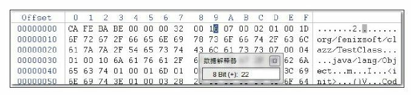

### # Class类文件的结构

Class文件是一组以8位字节为基础单位的二进制流，各个数据项目严格按照顺序紧凑地排列在Class文件之中，中间没有添加任何分隔符，这使得整个Class文件中存储的内容几乎全部是程序运行的必要数据，没有空隙存在。当遇到需要占用8位字节以上空间的数据项时，则会按照高位在前的方式分割成若干个8位字节进行存储。

根据Java虚拟机规范的规定，Class文件格式采用一种类似于C语言结构体的伪结构来存储数据，这种伪结构中只有两种数据类型：无符号数和表，后面的解析都要以这两种数据类型为基础，所以这里要先介绍这两个概念。

无符号数属于基本的数据类型，以u1、u2、u4、u8来分别代表1个字节、2个字节、4个字节和8个字节的无符号数，无符号数可以用来描述数字、索引引用、数量值或者按照UTF-8编码构成字符串值。

表是由多个无符号数或者其他表作为数据项构成的复合数据类型，所有表都习惯性地以“_info”结尾。表用于描述有层次关系的复合结构的数据，整个Class文件本质上就是一张表。

#### 1.魔数与Class文件的版本

每个Class文件的头4个字节称为魔数（Magic Number），它的唯一作用是确定这个文件是否为一个能被虚拟机接受的Class文件。很多文件存储标准中都使用魔数来进行身份识别，譬如图片格式，如gif或者jpeg等在文件头中都存有魔数。使用魔数而不是扩展名来进行识别主要是基于安全方面的考虑，因为文件扩展名可以随意地改动。文件格式的制定者可以自由地选择魔数值，只要这个魔数值还没有被广泛采用过同时又不会引起混淆即可。Class文件的魔数的获得很有“浪漫气息”，值为：0xCAFEBABE（咖啡宝贝？），这个魔数值在Java还称做“Oak”语言的时候（大约是1991年前后）就已经确定下来了。它还有一段很有趣的历史，据Java开发小组最初的关键成员Patrick Naughton所说：“我们一直在寻找一些好玩的、容易记忆的东西，选择0xCAFEBABE是因为它象征着著名咖啡品牌Peet’s Coffee中深受欢迎的Baristas咖啡”，这个魔数似乎也预示着日后“Java”这个商标名称的出现。

紧接着魔数的4个字节存储的是Class文件的版本号：第5和第6个字节是次版本号（Minor Version），第7和第8个字节是主版本号（Major Version）。Java的版本号是从45开始的，JDK 1.1之后的每个JDK大版本发布主版本号向上加1（JDK 1.0～1.1使用了45.0～45.3的版本号），高版本的JDK能向下兼容以前版本的Class文件，但不能运行以后版本的Class文件，即使文件格式并未发生任何变化，虚拟机也必须拒绝执行超过其版本号的Class文件。

#### 2.常量池

紧接着主次版本号之后的是常量池入口，常量池可以理解为Class文件之中的资源仓库，它是Class文件结构中与其他项目关联最多的数据类型，也是占用Class文件空间最大的数据项目之一，同时它还是在Class文件中第一个出现的表类型数据项目。

由于常量池中常量的数量是不固定的，所以在常量池的入口需要放置一项u2类型的数据，代表常量池容量计数值（constant_pool_count）。与Java中语言习惯不一样的是，这个容量计数是从1而不是0开始的，如图6-3所示，常量池容量（偏移地址：0x00000008）为十六进制数0x0016，即十进制的22，这就代表常量池中有21项常量，索引值范围为1～21。在Class文件格式规范制定之时，设计者将第0项常量空出来是有特殊考虑的，这样做的目的在于满足后面某些指向常量池的索引值的数据在特定情况下需要表达“不引用任何一个常量池项目”的含义，这种情况就可以把索引值置为0来表示。Class文件结构中只有常量池的容量计数是从1开始，对于其他集合类型，包括接口索引集合、字段表集合、方法表集合等的容量计数都与一般习惯相同，是从0开始的。

常量池中主要存放两大类常量：字面量（Literal）和符号引用（Symbolic References）。字面量比较接近于Java语言层面的常量概念，如文本字符串、声明为final的常量值等。而符号引用则属于编译原理方面的概念，包括了下面三类常量：

(1) 类和接口的全限定名（Fully Qualified Name）

(2) 字段的名称和描述符（Descriptor）

(3) 方法的名称和描述符

#### 3.访问标志

在常量池结束之后，紧接着的两个字节代表访问标志（access_flags），这个标志用于识别一些类或者接口层次的访问信息，包括：这个Class是类还是接口；是否定义为public类型；是否定义为abstract类型；如果是类的话，是否被声明为final等。

#### 4.类索引、父类索引与接口索引集合

类索引（this_class）和父类索引（super_class）都是一个u2类型的数据，而接口索引集合（interfaces）是一组u2类型的数据的集合，Class文件中由这三项数据来确定这个类的继承关系。类索引用于确定这个类的全限定名，父类索引用于确定这个类的父类的全限定名。由于Java语言不允许多重继承，所以父类索引只有一个，除了java.lang.Object之外，所有的Java类都有父类，因此除了java.lang.Object外，所有Java类的父类索引都不为0。接口索引集合就用来描述这个类实现了哪些接口，这些被实现的接口将按implements语句（如果这个类本身是一个接口，则应当是extends语句）后的接口顺序从左到右排列在接口索引集合中。

#### 5.字段表集合

字段表（field_info）用于描述接口或者类中声明的变量。字段（field）包括类级变量以及实例级变量，但不包括在方法内部声明的局部变量。我们可以想一想在Java中描述一个字段可以包含什么信息？可以包括的信息有：字段的作用域（public、private、protected修饰符）、是实例变量还是类变量（static修饰符）、可变性（final）、并发可见性（volatile修饰符，是否强制从主内存读写）、可否被序列化（transient修饰符）、字段数据类型（基本类型、对象、数组）、字段名称。上述这些信息中，各个修饰符都是布尔值，要么有某个修饰符，要么没有，很适合使用标志位来表示。而字段叫什么名字、字段被定义为什么数据类型，这些都是无法固定的，只能引用常量池中的常量来描述。

#### 6.方法表集合

如果理解了上一节关于字段表的内容，那本节关于方法表的内容将会变得很简单。Class文件存储格式中对方法的描述与对字段的描述几乎采用了完全一致的方式，方法表的结构如同字段表一样，依次包括了访问标志（access_flags）、名称索引（name_index）、描述符索引（descriptor_index）、属性表集合（attributes）几项。

#### 7.属性表集合

属性表（attribute_info）在前面的讲解之中已经出现过数次，在Class文件、字段表、方法表都可以携带自己的属性表集合，以用于描述某些场景专有的信息。

##### 7.1 Code属性

Java程序方法体中的代码经过Javac编译器处理后，最终变为字节码指令存储在Code属性内。Code属性出现在方法表的属性集合之中，但并非所有的方法表都必须存在这个属性，譬如接口或者抽象类中的方法就不存在Code属性。

##### 7.2 Exceptions属性

这里的Exceptions属性是在方法表中与Code属性平级的一项属性，读者不要与前面刚刚讲解完的异常表产生混淆。Exceptions属性的作用是列举出方法中可能抛出的受查异常（Checked Excepitons），也就是方法描述时在throws关键字后面列举的异常。

##### 7.3 LineNumberTable属性

LineNumberTable属性用于描述Java源码行号与字节码行号（字节码的偏移量）之间的对应关系。它并不是运行时必需的属性，但默认会生成到Class文件之中，可以在Javac中分别使用-g：none或-g：lines选项来取消或要求生成这项信息。如果选择不生成LineNumberTable属性，对程序运行产生的最主要的影响就是当抛出异常时，堆栈中将不会显示出错的行号，并且在调试程序的时候，也无法按照源码行来设置断点。

##### 7.4 LocalVariableTable属性

LocalVariableTable属性用于描述栈帧中局部变量表中的变量与Java源码中定义的变量之间的关系，它也不是运行时必需的属性，但默认会生成到Class文件之中，可以在Javac中分别使用-g：none或-g：vars选项来取消或要求生成这项信息。如果没有生成这项属性，最大的影响就是当其他人引用这个方法时，所有的参数名称都将会丢失，IDE将会使用诸如arg0、arg1之类的占位符代替原有的参数名，这对程序运行没有影响，但是会对代码编写带来较大不便，而且在调试期间无法根据参数名称从上下文中获得参数值。

##### 7.5 SourceFile属性

SourceFile属性用于记录生成这个Class文件的源码文件名称。这个属性也是可选的，可以分别使用Javac的-g：none或-g：source选项来关闭或要求生成这项信息。在Java中，对于大多数的类来说，类名和文件名是一致的，但是有一些特殊情况（如内部类）例外。如果不生成这项属性，当抛出异常时，堆栈中将不会显示出错代码所属的文件名。

##### 7.6 ConstantValue属性

ConstantValue属性的作用是通知虚拟机自动为静态变量赋值。只有被static关键字修饰的变量（类变量）才可以使用这项属性。类似“int x=123”和“static int x=123”这样的变量定义在Java程序中是非常常见的事情，但虚拟机对这两种变量赋值的方式和时刻都有所不同。对于非static类型的变量（也就是实例变量）的赋值是在实例构造器＜init＞方法中进行的；而对于类变量，则有两种方式可以选择：在类构造器＜clinit＞方法中或者使用ConstantValue属性。目前Sun Javac编译器的选择是：如果同时使用final和static来修饰一个变量（按照习惯，这里称“常量”更贴切），并且这个变量的数据类型是基本类型或者java.lang.String的话，就生成ConstantValue属性来进行初始化，如果这个变量没有被final修饰，或者并非基本类型及字符串，则将会选择在＜clinit＞方法中进行初始化。

##### 7.7 InnerClasses属性

InnerClasses属性用于记录内部类与宿主类之间的关联。如果一个类中定义了内部类，那编译器将会为它以及它所包含的内部类生成InnerClasses属性。

##### 7.8 Deprecated及Synthetic属性

Deprecated和Synthetic两个属性都属于标志类型的布尔属性，只存在有和没有的区别，没有属性值的概念。

Deprecated属性用于表示某个类、字段或者方法，已经被程序作者定为不再推荐使用，它可以通过在代码中使用@deprecated注释进行设置。

Synthetic属性代表此字段或者方法并不是由Java源码直接产生的，而是由编译器自行添加的，在JDK 1.5之后，标识一个类、字段或者方法是编译器自动产生的，也可以设置它们访问标志中的ACC_SYNTHETIC标志位，其中最典型的例子就是Bridge Method。所有由非用户代码产生的类、方法及字段都应当至少设置Synthetic属性和ACC_SYNTHETIC标志位中的一项，唯一的例外是实例构造器“＜init＞”方法和类构造器“＜clinit＞”方法。

##### 7.9 StackMapTable属性

StackMapTable属性在JDK 1.6发布后增加到了Class文件规范中，它是一个复杂的变长属性，位于Code属性的属性表中。这个属性会在虚拟机类加载的字节码验证阶段被新类型检查验证器（Type Checker）使用（见7.3.2节），目的在于代替以前比较消耗性能的基于数据流分析的类型推导验证器。

##### 7.10 Signature属性

Signature属性在JDK 1.5发布后增加到了Class文件规范之中，它是一个可选的定长属性，可以出现于类、属性表和方法表结构的属性表中。在JDK 1.5中大幅增强了Java语言的语法，在此之后，任何类、接口、初始化方法或成员的泛型签名如果包含了类型变量（Type Variables）或参数化类型（Parameterized Types），则Signature属性会为它记录泛型签名信息。之所以要专门使用这样一个属性去记录泛型类型，是因为Java语言的泛型采用的是擦除法实现的伪泛型，在字节码（Code属性）中，泛型信息编译（类型变量、参数化类型）之后都通通被擦除掉。使用擦除法的好处是实现简单（主要修改Javac编译器，虚拟机内部只做了很少的改动）、非常容易实现Backport，运行期也能够节省一些类型所占的内存空间。但坏处是运行期就无法像C#等有真泛型支持的语言那样，将泛型类型与用户定义的普通类型同等对待，例如运行期做反射时无法获得到泛型信息。Signature属性就是为了弥补这个缺陷而增设的，现在Java的反射API能够获取泛型类型，最终的数据来源也就是这个属性。

##### 7.11 BootstrapMethods属性

BootstrapMethods属性在JDK 1.7发布后增加到了Class文件规范之中，它是一个复杂的变长属性，位于类文件的属性表中。这个属性用于保存invokedynamic指令引用的引导方法限定符。

 