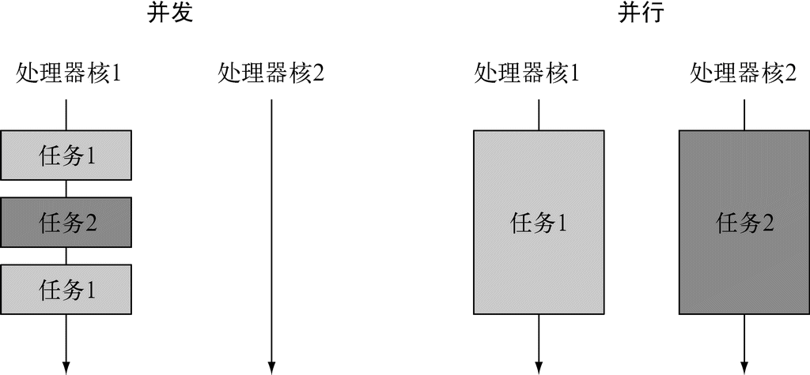
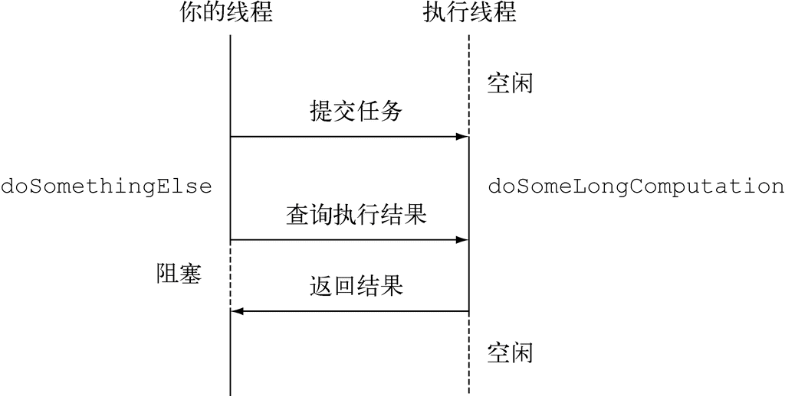
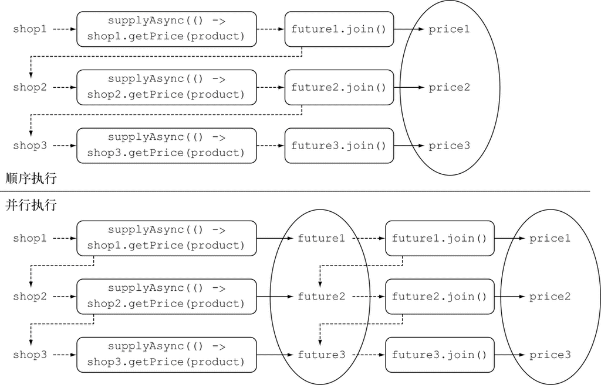
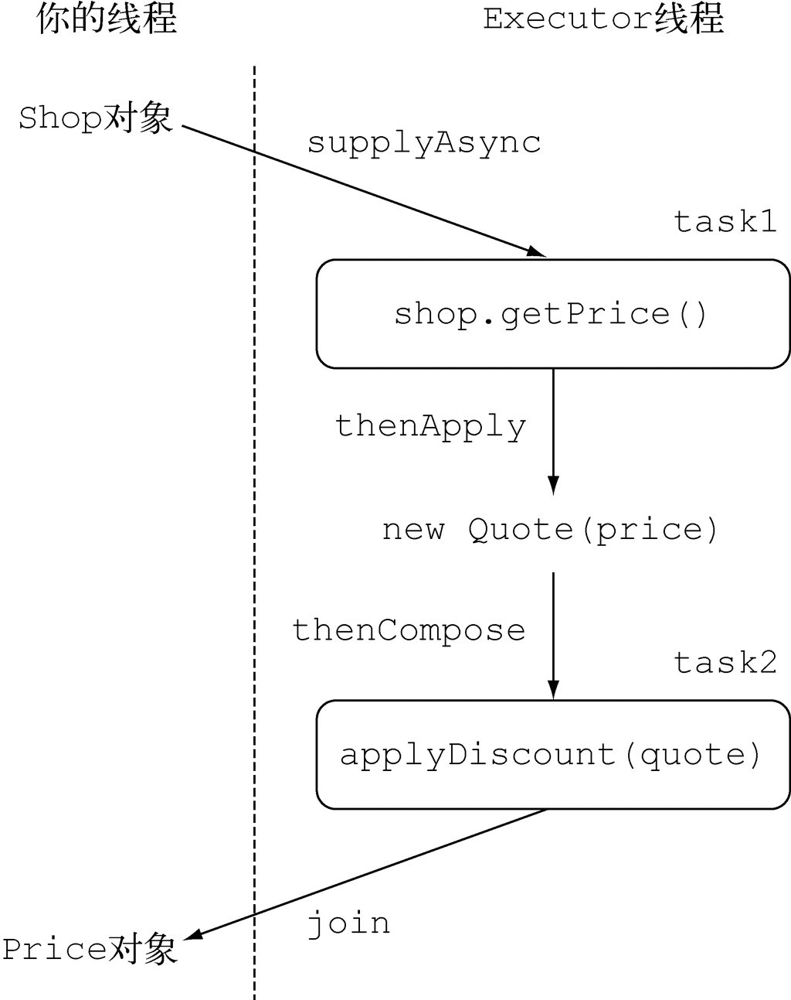

**并发和并行** 



### 11.1 Future接口

Future接口在Java 5中被引入，设计初衷是对将来某个时刻会发生的结果进行建模。它建模了一种异步计算，返回一个执行运算结果的引用，当运算结束后，这个引用被返回给调用方。在Future中触发那些潜在耗时的操作把调用线程解放出来，让它能继续执行其他有价值的工作，不再需要呆呆等待耗时的操作完成。Future的另一个优点是它比更底层的Thread更易用。要使用Future，通常你只需要将耗时的操作封装在一个Callable对象中，再将它提交g给ExecutorService，就万事大吉了。

使用Future以异步的方式执行一个耗时的操作

```java
ExecutorService executor = Executors.newCachedThreadPool();    ←─创建Executor-Service，通过它你可以向线程池提交任务
Future<Double> future = executor.submit(new Callable<Double>() {    ←─向Executor-Service提交一个Callable对象
        public Double call() {
            return doSomeLongComputation();    ←─以异步方式在新的线程中执行耗时的操作
        }});
doSomethingElse();    ←─异步操作进行的同时，你可以做其他的事情

try {
    Double result = future.get(1, TimeUnit.SECONDS);    ←─获取异步操作的结果，如果最终被阻塞，无法得到结果，那么在最多等待1秒钟之后退出
} catch (ExecutionException ee) {
    // 计算抛出一个异常
} catch (InterruptedException ie) {
    // 当前线程在等待过程中被中断
} catch (TimeoutException te) {
    // 在Future对象完成之前超过已过期
}
```



#### 11.1.1 Future接口的局限性

道Future接口提供了方法来检测异步计算是否已经结束（使用isDone方法），等待异步操作结束，以及获取计算的结果。但是这些特性还不足以编写简洁的并发代码。比如，我们很难表述Future结果之间的依赖性以及下面这些：

(1) 将两个异步计算合并为一个——这两个异步计算之间相互独立，同时第二个又依赖于第一个的结果。

(2) 等待Future集合中的所有任务都完成。 

(3) 仅等待Future集合中最快结束的任务完成（有可能因为它们试图通过不同的方式计算同一个值），并返回它的结果。

(4) 通过编程方式完成一个Future任务的执行（即以手工设定异步操作结果的方式）。

(5) 应对Future的完成事件（即当Future的完成事件发生时会收到通知，并能使用Future计算的结果进行下一步的操作，不只是简单地阻塞等待操作的结果）。

#### 11.1.2 使用CompletableFuture构建异步应用

新的CompletableFuture类（它实现了Future接口）会利用Java 8的新特性以更直观的方式将上述需求都变为可能。Stream和CompletableFuture的设计都遵循了类似的模式：它们都使用了Lambda表达式以及流水线的思想。CompletableFuture和Future的关系就跟Stream和Collection的关系一样。

**同步API与异步API**

同步API其实只是对传统方法调用的另一种称呼：你调用了某个方法，调用方在被调用方运行的过程中会等待，被调用方运行结束返回，调用方取得被调用方的返回值并继续运行。即使调用方和被调用方在不同的线程中运行，调用方还是需要等待被调用方结束运行，这就是阻塞式调用这个名词的由来。

与此相反，异步API会直接返回，或者至少在被调用方计算完成之前，将它剩余的计算任务交给另一个线程去做，该线程和调用方是异步的——这就是非阻塞式调用的由来。执行剩余计算任务的线程会将它的计算结果返回给调用方。返回的方式要么是通过回调函数，要么是由调用方再次执行一个“等待，直到计算完成”的方法调用。这种方式的计算在I/O系统程序设计中非常常见：你发起了一次磁盘访问，这次访问和你的其他计算操作是异步的，你完成其他的任务时，磁盘块的数据可能还没载入到内存，你只需要等待数据的载入完成。

### 11.2 实现异步API

#### 11.2.1 将同步方法装换为异步方法

```java
public Future<Double> getPriceAsync(String product) {
    CompletableFuture<Double> futurePrice = new CompletableFuture<>();
    new Thread( () -> {                  ←─创建CompletableFuture对象，它会包含计算的结果
                double price = calculatePrice(product);    ←─在另一个线程中以异步方式执行计算
                futurePrice.complete(price);    ←─需长时间计算的任务结束并得出结果时，设置Future的返回值
    }).start();
    return futurePrice;    ←─无需等待还没结束的计算，直接返回Future对象
}

// 使用异步API
Shop shop = new Shop("BestShop");
long start = System.nanoTime();
Future<Double> futurePrice = shop.getPriceAsync("my favorite product");    ←─查询商店，试图取得商品的价格
long invocationTime = ((System.nanoTime() - start) / 1_000_000);
System.out.println("Invocation returned after " + invocationTime
                                                + " msecs");
// 执行更多任务，比如查询其他商店
doSomethingElse();
// 在计算商品价格的同时
try {
    double price = futurePrice.get();    ←─从Future对象中读取价格，如果价格未知，会发生阻塞
    System.out.printf("Price is %.2f%n", price);
} catch (Exception e) {
    throw new RuntimeException(e);
}
long retrievalTime = ((System.nanoTime() - start) / 1_000_000);
System.out.println("Price returned after " + retrievalTime + " msecs");
```

这段代码中，客户向商店查询了某种商品的价格。由于商店提供了异步API，该次调用立刻返回了一个Future对象，通过该对象客户可以在将来的某个时刻取得商品的价格。这种方式下，客户在进行商品价格查询的同时，还能执行一些其他的任务，比如查询其他家商店中商品的价格，不会呆呆地阻塞在那里等待第一家商店返回请求的结果。最后，如果所有有意义的工作都已经完成，客户所有要执行的工作都依赖于商品价格时，再调用Future的get方法。执行了这个操作后，客户要么获得Future中封装的值（如果异步任务已经完成），要么发生阻塞，直到该异步任务完成，期望的值能够访问。

#### 11.2.2 错误处理

如果没有意外，我们目前开发的代码工作得很正常。但是，如果价格计算过程中产生了错误会怎样呢？非常不幸，这种情况下你会得到一个相当糟糕的结果：用于提示错误的异常会被限制在试图计算商品价格的当前线程的范围内，最终会杀死该线程，而这会导致等待get方法返回结果的客户端永久地被阻塞。

客户端可以使用重载版本的get方法，它使用一个超时参数来避免发生这样的情况。这是一种值得推荐的做法，你应该尽量在你的代码中添加超时判断的逻辑，避免发生类似的问题。使用这种方法至少能防止程序永久地等待下去，超时发生时，程序会得到通知发生了TimeoutException。不过，也因为如此，你不会有机会发现计算商品价格的线程内到底发生了什么问题才引发了这样的失效。为了让客户端能了解商店无法提供请求商品价格的原因，你需要使用CompletableFuture的completeExceptionally方法将导致CompletableFuture内发生问题的异常抛出。

```java
public Future<Double> getPriceAsync(String product) {
    CompletableFuture<Double> futurePrice = new CompletableFuture<>();
    new Thread( () -> {
                try {
                    double price = calculatePrice(product);
                    futurePrice.complete(price);    ←─如果价格计算正常结束，完成Future操作并设置商品价格
                } catch (Exception ex) {
                    futurePrice.completeExceptionally(ex);    ←─否则就抛出导致失败的异常，完成这次Future操作
                }
    }).start();
    return futurePrice;
}
```

客户端现在会收到一个ExecutionException异常，该异常接收了一个包含失败原因的Exception参数。

**使用工厂方法supplyAsync创建CompletableFuture**

CompletableFuture类自身提供了大量精巧的工厂方法，使用这些方法能更容易地完成整个流程，还不用担心实现的细节。

```java
// 使用工厂方法supplyAsync创建CompletableFuture对象
public Future<Double> getPriceAsync(String product) {
    return CompletableFuture.supplyAsync(() -> calculatePrice(product));
}
```

supplyAsync方法接受一个生产者（Supplier）作为参数，返回一个CompletableFuture对象，该对象完成异步执行后会读取调用生产者方法的返回值。生产者方法会交由ForkJoinPool池中的某个执行线程（Executor）运行，但是也可以使用supplyAsync方法的重载版本，传递第二个参数指定不同的执行线程执行生产者方法。

### 11.3 让你的代码免受阻塞之苦

#### 11.3.1 使用并行流对请求进行并行操作

```java
List<Shop> shops = Arrays.asList(new Shop("BestPrice"),
                                 new Shop("LetsSaveBig"),
                                 new Shop("MyFavoriteShop"),
                                 new Shop("BuyItAll"));

public List<String> findPrices(String product) {
 return shops.stream()
     .map(shop -> String.format("%s price is %.2f",shop.getName(), shop.getPrice(product)))
     .collect(toList());
}

[BestPrice price is 123.26, LetsSaveBig price is 169.47, MyFavoriteShop price
     is 214.13, BuyItAll price is 184.74]
Done in 4032 msecs

// 改善方法是使用并行流来避免顺序计算
public List<String> findPrices(String product) {
  return shops.parallelStream()          ←─使用并行流并行地从不同的商店获取价格
     .map(shop -> String.format("%s price is %.2f",shop.getName(), shop.getPrice(product)))
     .collect(toList());
}

[BestPrice price is 123.26, LetsSaveBig price is 169.47, MyFavoriteShop price
     is 214.13, BuyItAll price is 184.74]
Done in 1180 msecs
```

#### 11.3.2 使用CompletableFuture发起异步请求

可以使用工厂方法supplyAsync创建CompletableFuture对象：

```java
List<CompletableFuture<String>> priceFutures =
        shops.stream()
        .map(shop -> CompletableFuture.supplyAsync(
             () -> String.format("%s price is %.2f",
             shop.getName(), shop.getPrice(product))))
        .collect(toList());
```

使用这种方式，会得到一个List<CompletableFuture\<String>>，列表中的每个CompletableFuture对象在计算完成后都包含商店的String类型的名称。但是，由于用CompletableFutures实现的findPrices方法要求返回一个List\<String>，需要等待所有的future执行完毕，将其包含的值抽取出来，填充到列表中才能返回。

为了实现这个效果，可以向最初的List<CompletableFuture\<String>>施加第二个map操作，对List中的所有future对象执行join操作，一个接一个地等待它们运行结束。注意CompletableFuture类中的join方法和Future接口中的get有相同的含义，并且也声明在Future接口中，它们唯一的不同是join不会抛出任何检测到的异常。

```java
public List<String> findPrices(String product) {
    List<CompletableFuture<String>> priceFutures =
            shops.stream()
            .map(shop -> CompletableFuture.supplyAsync(    ←─使用CompletableFuture以异步方式计算每种商品的价格
                         () -> shop.getName() + " price is " +
                               shop.getPrice(product)))
            .collect(Collectors.toList());

    return priceFutures.stream()
            .map(CompletableFuture::join)    ←─等待所有异步操作结束
            .collect(toList());
}
```

这里使用了两个不同的Stream流水线，而不是在同一个处理流的流水线上一个接一个地放置两个map操作——这其实是有缘由的。考虑流操作之间的延迟特性，如果在单一流水线中处理流，发向不同商家的请求只能以同步、顺序执行的方式才会成功。因此，每个创建CompletableFuture对象只能在前一个操作结束之后执行查询指定商家的动作、通知join方法返回计算结果。 



#### 11.3.3 寻找更好的方案

并行流版本和CompletableFuture版本看起来不相伯仲，究其原因都一样：它们内部采用的是同样的通用线程池，默认都使用固定数目的线程，具体线程数取决于Runtime.getRuntime().availableProcessors()的返回值。然而，CompletableFuture具有一定的优势，因为它允许你对执行器（Executor）进行配置，尤其是线程池的大小，让它以更适合应用需求的方式进行配置，满足程序的要求，而这是并行流API无法提供的。

#### 11.3.4 使用定制的执行器

**调整线程池的大小**

《Java并发编程实战》（http://mng.bz/979c）一书中，Brian Goetz和合著者们为线程池大小的优化提供了不少中肯的建议。这非常重要，如果线程池中线程的数量过多，最终它们会竞争稀缺的处理器和内存资源，浪费大量的时间在上下文切换上。反之，如果线程的数目过少，正如你的应用所面临的情况，处理器的一些核可能就无法充分利用。Brian Goetz建议，线程池大小与处理器的利用率之比可以使用下面的公式进行估算：

**Nthreads = NCPU \* UCPU * (1 + W/C)** 

其中：

+ NCPU是处理器的核的数目，可以通过Runtime.getRuntime().availableProcessors()得到
+ UCPU是期望的CPU利用率（该值应该介于0和1之间）
+ W/C是等待时间与计算时间的比率

你的应用99%的时间都在等待商店的响应，所以估算出的W/C比率为100。这意味着如果你期望的CPU利用率是100%，你需要创建一个拥有400个线程的线程池。实际操作中，如果你创建的线程数比商店的数目更多，反而是一种浪费，因为这样做之后，你线程池中的有些线程根本没有机会被使用。出于这种考虑，我们建议你将执行器使用的线程数，与你需要查询的商店数目设定为同一个值，这样每个商店都应该对应一个服务线程。不过，为了避免发生由于商店的数目过多导致服务器超负荷而崩溃，你还是需要设置一个上限，比如100个线程。

```java
// 为“最优价格查询器”应用定制的执行器
private final Executor executor =
        Executors.newFixedThreadPool(Math.min(shops.size(), 100),    ←─创建一个线程池，线程池中线程的数目为100和商店数目二者中较小的一个值
                                     new ThreadFactory() {
            public Thread newThread(Runnable r) {
                Thread t = new Thread(r);
                t.setDaemon(true);    ←─使用守护线程——这种方式不会阻止程序的关停
                return t;
            }
});
```

这里创建的是一个由**守护线程**构成的线程池。Java程序无法终止或者退出一个正在运行中的线程，所以最后剩下的那个线程会由于一直等待无法发生的事件而引发问题。与此相反，如果将线程标记为守护进程，意味着程序退出时它也会被回收。这二者之间没有性能上的差异。现在，可以将执行器作为第二个参数传递给supplyAsync工厂方法了。比如，可以按照下面的方式创建一个可查询指定商品价格的CompletableFuture对象： 

```java
CompletableFuture.supplyAsync(() -> shop.getName() + " price is " +
                                    shop.getPrice(product), executor);
```

改进之后，使用CompletableFuture方案的程序处理5个商店仅耗时1021秒，处理9个商店时耗时1022秒。一般而言，这种状态会一直持续，直到商店的数目达到阈值400。

**并行——使用流还是CompletableFutures？**

(1) 如果你进行的是计算密集型的操作，并且没有I/O，那么推荐使用Stream接口，因为实现简单，同时效率也可能是最高的（如果所有的线程都是计算密集型的，那就没有必要创建比处理器核数更多的线程）。

(2) 反之，如果你并行的工作单元还涉及等待I/O的操作（包括网络连接等待），那么使用CompletableFuture灵活性更好，你可以像前文讨论的那样，依据等待/计算，或者W/C的比率设定需要使用的线程数。这种情况不使用并行流的另一个原因是，处理流的流水线中如果发生I/O等待，流的延迟特性会让我们很难判断到底什么时候触发了等待。

### 11.4 对多个异步任务进行流水线操作

#### 11.4.1 实现折扣服务

#### 11.4.2 使用Discount服务

#### 11.4.3 构造同步和异步操作 

使用CompletableFuture实现findPrices方法

```java
public List<String> findPrices(String product) {
    List<CompletableFuture<String>> priceFutures =
        shops.stream()
             .map(shop -> CompletableFuture.supplyAsync(    ←─以异步方式取得每个shop中指定产品的原始价格
                                   () -> shop.getPrice(product), executor))
             .map(future -> future.thenApply(Quote::parse))    ←─Quote对象存在时，对其返回的值进行转换
             .map(future -> future.thenCompose(quote ->    ←─使用另一个异步任务构造期望的Future，申请折扣
                         CompletableFuture.supplyAsync(
                           () -> Discount.applyDiscount(quote), executor)))
                .collect(toList());

    return priceFutures.stream()
            .map(CompletableFuture::join)    ←─等待流中的所有Future执行完毕，并提取各自的返回值
            .collect(toList());
}
```



#### 11.4.4 将两个CompletableFuture对象整合起来，无论它们是否存在依赖

#### 11.4.5 对Future和CompletableFuture的回顾

### 11.5 响应CompletableFuture的complete事件

#### 11.5.1 对最佳价格查询器应用的优化

#### 11.5.2 付诸实践

### 11.6 小结

(1) 执行比较耗时的操作时，尤其是那些依赖一个或多个远程服务的操作，使用异步任务可以改善程序的性能，加快程序的响应速度。

(2) 你应该尽可能地为客户提供异步API。使用CompletableFuture类提供的特性，你能够轻松地实现这一目标。 

(3) CompletableFuture类还提供了异常管理的机制，让你有机会抛出/管理异步任务执行中发生的异常。

(4) 将同步API的调用封装到一个CompletableFuture中，你能够以异步的方式使用其结果。

(5) 如果异步任务之间相互独立，或者它们之间某一些的结果是另一些的输入，你可以将这些异步任务构造或者合并成一个。

(6) 你可以为CompletableFuture注册一个回调函数，在Future执行完毕或者它们计算的结果可用时，针对性地执行一些程序。

(7) 你可以决定在什么时候结束程序的运行，是等待由CompletableFuture对象构成的列表中所有的对象都执行完毕，还是只要其中任何一个首先完成就中止程序的运行。

 


