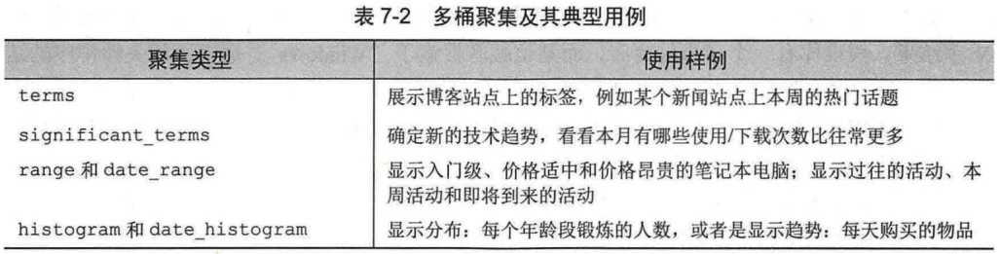

# 第07章 使用聚集来探索数据

## 7.1 理解聚集的具体结构

### 7.1.1 理解聚集请求的结构

```json
// 使用 terms 聚集来获取流行的标签
POST http://localhost:9200/get-together/_doc/_search
{
    // aggregations 表明，这是该请求的聚集部分
	"aggregations": {
        // 指定聚集得嘛名字
		"top_tags": {
            // 指定聚集类型为词条
			"terms": {
                // 未经分析的逐字字段，例将“big data”作为一个词，
                // 而不是“big”和“data”两个词条
				"field": "tags.verbatim",
                "size": 10
			}
		}
	}
}
// 响应
{
    ....
    "aggregations": {
        "top_tags": {
            "doc_count_error_upper_bound": 0,
            "sum_other_doc_count": 6,
            "buckets": [
                {
                    "key": "big data",
                    "doc_count": 3
                },
                {
                    "key": "open source",
                    "doc_count": 3
                },
                {
                    "key": "denver",
                    "doc_count": 2
                },
                {
                    "key": "elasticsearch",
                    "doc_count": 2
                },
                {
                    "key": "lucene",
                    "doc_count": 2
                },
                {
                    "key": "solr",
                    "doc_count": 2
                },
                {
                    "key": "apache lucene",
                    "doc_count": 1
                },
                {
                    "key": "clojure",
                    "doc_count": 1
                },
                {
                    "key": "cloud computing",
                    "doc_count": 1
                },
                {
                    "key": "data visualization",
                    "doc_count": 1
                }
            ]
        }
    }
}
```

### 7.1.2 运行在查询结果上的聚集

```json
// 获取 Denver 分组中最流行的标签
POST http://localhost:9200/get-together/_doc/_search
{
    "query": {
		"match": {
			"location_group": "Denver"
		}
	},
	"aggregations": {
		"top_tags": {
			"terms": {
				"field": "tags.verbatim"
			}
		}
	}
}
```

### 7.1.3 过滤器和聚集

```json
// 使用过滤器获取 Denver 分组中最流行的标签
POST http://localhost:9200/get-together/_doc/_search
{
	"query": {
		"bool": {
			"filter": {
				"term": {
					"location_group": "denver"
				}
			}
		}
	},
	"aggregations": {
		"top_tags": {
			"terms": {
				"field": "tags.verbatim"
			}
		}
	}
}

// 使用后过滤器，使查询和聚集操作相对独立
POST http://localhost:9200/get-together/_doc/_search
{
	"post_filter": {
		"term": {
			"location_group": "denver"
		}
	},
	"aggregations": {
		"top_tags": {
			"terms": {
				"field": "tags.verbatim"
			}
		}
	}
}
```

## 7.3 多桶型聚集

### 7.3.1 terms 聚集

```json
// 根据名称来排列标签桶
POST http://localhost:9200/get-together/_doc/_search
{
	"aggregations": {
		"tags": {
			"terms": {
				"field": "tags.verbatim",
				"order": {
                    // 排序的标准（每个桶的词条）和顺序（升序）
					"_term": "asc"
				}
			}
		}
	},
	"size": 0
}

// 响应
{
    "took": 98,
    "timed_out": false,
    "_shards": {
        "total": 2,
        "successful": 2,
        "skipped": 0,
        "failed": 0
    },
    "hits": {
        "total": 20,
        "max_score": 0,
        "hits": []
    },
    "aggregations": {
        "tags": {
            "doc_count_error_upper_bound": 0,
            "sum_other_doc_count": 10,
            "buckets": [
                {
                    "key": "apache lucene",
                    "doc_count": 1
                },
                {
                    "key": "big data",
                    "doc_count": 3
                },
                {
                    "key": "clojure",
                    "doc_count": 1
                },
                {
                    "key": "cloud computing",
                    "doc_count": 1
                },
                {
                    "key": "data visualization",
                    "doc_count": 1
                },
                {
                    "key": "denver",
                    "doc_count": 2
                },
                {
                    "key": "elasticsearch",
                    "doc_count": 2
                },
                {
                    "key": "enterprise search",
                    "doc_count": 1
                },
                {
                    "key": "functional programming",
                    "doc_count": 1
                },
                {
                    "key": "hadoop",
                    "doc_count": 1
                }
            ]
        }
    }
}
```



## 7.4 嵌套聚集

### 7.4.3 使用单桶聚集

默认情况下，Elasticsearch 在查询结果上运行聚集。如果想要改变这种默认行为，需要使用单桶聚集。