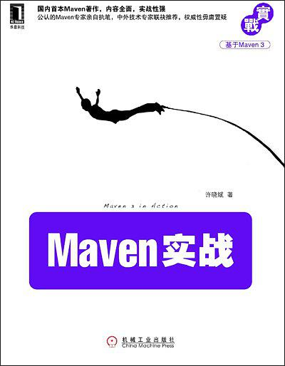

## Maven实战

> 记录学习**Maven**的历程，方便以后查阅，参考自书籍[《Maven实战》](https://book.douban.com/subject/5345682/)，部分内容根据**Maven**最新版`Apache Maven 3.5.3 `进行了更新。
>
> 下载链接：<http://readfree.me/book/5345682/>

## 目录

+ [第01章-本章内容](第01章-本章内容.md )
+ [第02章-Maven的安装和配置](第02章-Maven的安装和配置.md )
+ [第03章-Maven使用入门](第03章-Maven使用入门.md )
+ [第04章-背景案例](第04章-背景案例.md )
+ [第05章-坐标和依赖](第05章-坐标和依赖.md)
+ [第06章-仓库](第06章-仓库.md )
+ [第07章-生命周期和插件](第07章-生命周期和插件.md)
+ [第08章-聚合与继承](第08章-聚合与继承.md)
+ [第09章-使用Nexus创建私服](第09章-使用Nexus创建私服.md)
+ [第10章-使用Maven进行测试](第10章-使用Maven进行测试.md)
+ [第11章-使用Hudson进行持续集成](第11章-使用Hudson进行持续集成.md)
+ [第12章-使用Maven构建Web应用](第12章-使用Maven构建Web应用.md)
+ [第13章-版本管理](第13章-版本管理.md)
+ [第14章-灵活的构建](第14章-灵活的构建.md)
+ [第15章-生成项目站点](第15章-生成项目站点.md)
+ [第16章-m2eclipse](第16章-m2eclipse.md)
+ [第17章-编写Maven插件](第17章-编写Maven插件.md)
+ [第18章-Archetype](第18章-Archetype.md)
+ [附录A-POM元素参考](附录A-POM元素参考.md)
+ [附录B-Settings元素参考](附录B-Settings元素参考.md)
+ [附录C-常用插件列表](附录C-常用插件列表.md)

