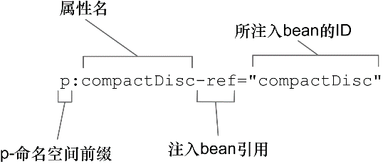

### 2.1 Spring配置的可选方案

当描述bean如何进行装配时，Spring具有非常大的灵活性，它提供了三种主要的装配机制：

+ 在XML中进行显式配置。
+ 在Java中进行显式配置。（比XML配置更好）
+ 隐式的bean发现机制和自动装配。（尽量采用）

### 2.2 自动化装配bean 

Spring从两个角度来实现自动化装配：

+ 组件扫描（component scanning）：Spring会自动发现应用上下文中所创建的bean。
+ 自动装配（autowiring）：Spring自动满足bean之间的依赖。

#### 2.2.1 创建可被发现的bean

CompactDisc接口在Java中定义了CD的概念：

```java
package com.angus.stereo.autoconfig;

public interface CompactDisc {
    void play();
}
```

带有@Component注解的CompactDisc实现类SgtPeppers：

```java
package com.angus.stereo.autoconfig;
import org.springframework.stereotype.Component;

@Component // @Component注解表明该类会作为组件类，并告知Spring要为这个类创建bean。
public class SgtPeppers implements CompactDisc {

    private String title = "Sgt. Pepper's Lonely Hearts Club Band";
    private String artist = "The Beatles";

    @Override
    public void play() {
        System.out.println("Playing " + title + " by " + artist);
    }
}
```

组件扫描默认是不启用的。我们还需要显式配置一下Spring，从而命令它去寻找带有@Component注解的类，并为其创建bean：

```java
package com.angus.stereo.autoconfig;
import org.springframework.context.annotation.ComponentScan;
import org.springframework.context.annotation.Configuration;

// @Configuration注解表明这是一个配置类，该类应该包含在Spring应用上下文中如何创建bean的细节；
@Configuration 
// @ComponentScan注解能够在Spring中启用组件扫描。如果没有其他配置的话，默认会扫描与配置类所在的包及子包。 
@ComponentScan 
public class CDPlayerConfig {
}
```

也可以是使用XML来启用组件扫描：

```xml
<?xml version="1.0" encoding="UTF-8"?>
<beans xmlns="http://www.springframework.org/schema/beans"
       xmlns:xsi="http://www.w3.org/2001/XMLSchema-instance"
       xmlns:context="http://www.springframework.org/schema/context"
       xsi:schemaLocation="http://www.springframework.org/schema/beans http://www.springframework.org/schema/beans/spring-beans.xsd http://www.springframework.org/schema/context http://www.springframework.org/schema/context/spring-context.xsd">

    <context:component-scan base-package="com.angus.stereo.autoconfig"/>
    
</beans>
```

为了测试组件扫描的功能，我们创建一个简单的JUnit测试，它会创建Spring上下文，并判断CompactDisc是不是真的创建出来了：

```java
package com.angus.stereo.autoconfig;
import org.junit.Test;
import org.junit.runner.RunWith;
import org.springframework.beans.factory.annotation.Autowired;
import org.springframework.test.context.ContextConfiguration;
import org.springframework.test.context.junit4.SpringJUnit4ClassRunner;
import static org.junit.Assert.assertNotNull;

// 使用了SpringJUnit4ClassRunner，以便在测试时自动创建Spring的应用上下文
@RunWith(SpringJUnit4ClassRunner.class)
// 注解@ContextConfiguration会告诉它需要在CDPlayerConfig中加载配置
@ContextConfiguration(classes = CDPlayerConfig.class) 
public class CDplayerTest {

    @Autowired // 添加@Autowired注解，以便将CompactDisc注入到测试代码中
    private CompactDisc cd;  // Spring能够发现CompactDisc类，自动在Spring上下文中将其创建为bean并将其注入到测试代码之中。

    @Test
    public void cdShoudleNotNull() {
        assertNotNull(cd);
    }

}
```

#### 2.2.2 为组件扫描的bean命名

Spring应用上下文中所有的bean都会给定一个ID。在前面的例子中，这个bean所给定的ID为sgtPeppers，也就是将类名的第一个字母变为小写。

如果想为这个bean设置不同的ID，比如说lonelyHeartsClub，那么需要将SgtPeppers类的@Component注解配置为如下所示：

```java
@Component("lonelyHeartsClub") // 可以用@Named注解替代，但是不推荐
public class SgtPeppers implements CompactDisc {
    ...
}
```

#### 2.2.3 设置组件扫描的基础包

想要将配置类放在单独的包中，使其与其他的应用代码区分开来。此时需要做的就是在@ComponentScan的value属性中指明待扫描的包名称：

```java
@Configuration
@ComponentScan("com.angus.stereo.autoconfig")
public class CDPlayerConfig {
    ...
}
```

若想更加清晰地表明所设置的是基础包，可以通过basePackages属性进行配置： 

```java
@Configuration
@ComponentScan(basePackages = "com.angus.stereo.autoconfig")
public class CDPlayerConfig {
    ...
}

// 还可以指定多个基础包
@Configuration
@ComponentScan(basePackages = {"com.angus.stereo.autoconfig.soundsystem", "com.angus.stereo.autoconfig.musicsystem"})
public class CDPlayerConfig {
    ...
}
```

除了将包设置为简单的String类型之外，@ComponentScan还提供了另外一种更为安全的方法，那就是将其指定为待扫描包中所包含的类或接口： 

```java
@Configuration
@ComponentScan(basePackageClasses = {CompactDisc.class,...})
public class CDPlayerConfig {
    ...
}
```

#### 2.2.4 通过为bean添加注解实现自动装配

简单来说，自动装配就是让Spring自动满足bean依赖的一种方法，在满足依赖的过程中，会在Spring应用上下文中寻找匹配某个bean需求的其他bean。为了声明要进行自动装配，我们可以借助Spring的@Autowired注解。

```java
package com.angus.stereo.autoconfig;
import org.springframework.beans.factory.annotation.Autowired;
import org.springframework.stereotype.Component;

@Component
public class CDPlayer implements MediaPlayer {

    private CompactDisc cd;

    // @Autowired注解表明当Spring创建CDPlayerbean的时候，
    // 会通过这个构造器来进行实例化并且会传入一个CompactDisc类型的bean
    @Autowired
    public CDPlayer(CompactDisc cd){
        this.cd = cd;
    }

    public void play() {
        cd.play();
    }
}

```

@Autowired注解不仅能够用在构造器上，还能用在属性的Setter或其他方法上：

```java
@Autowired
public void setCd(CompactDisc cd) {
    this.cd = cd;
}

@Autowired
public void insertDisc(CompactDisc cd) {
    this.cd = cd;
}
```

如果没有匹配的bean，在应用上下文创建的时候，Spring会抛出一个异常。为了避免异常的出现，可以将@Autowired的required属性设置为false：

```java
// 将required属性设置为false时，如果没有匹配的bean的话，Spring将会让这个bean处于未装配的状态 
@Autowired(required = false) 
```

#### 2.2.5 验证自动装配

```java
package com.angus.stereo.autoconfig;
import org.junit.Rule;
import org.junit.Test;
import org.junit.runner.RunWith;
import org.junit.contrib.java.lang.system.StandardOutputStreamLog;
import org.springframework.beans.factory.annotation.Autowired;
import org.springframework.test.context.ContextConfiguration;
import org.springframework.test.context.junit4.SpringJUnit4ClassRunner;
import static org.junit.Assert.assertEquals;
import static org.junit.Assert.assertNotNull;

@RunWith(SpringJUnit4ClassRunner.class)
@ContextConfiguration(classes=CDPlayerConfig.class)
public class CDPlayerTest {

    // 该样例中使用了StandardOutputStreamLog，
    // 这是来源于System Rules库的一个JUnit规则，该规则能够基于控制台的输出编写断言
    @Rule
    public final StandardOutputStreamLog log = new StandardOutputStreamLog();

    @Autowired
    private MediaPlayer player;

    @Autowired
    private CompactDisc cd;

    @Test
    public void cdShouldNotBeNull() {
        assertNotNull(cd);
    }

    @Test
    public void play() {
        player.play();
        assertEquals(
                "Playing Sgt. Pepper's Lonely Hearts Club Band by The Beatles\r\n",
                log.getLog());
    }
}
```

### 2.3 通过Java代码装配bean

在此前的基础上，在CDPlayerConfig类中去掉了ComponentScan注解，关掉注解扫描，使用显式配置。在进行显式配置时，JavaConfig是更好的方案，因为它更为强大、类型安全并且对重构友好。

在概念上，JavaConfig与应用程序中的业务逻辑和领域代码是不同的，它不应该包含任何业务逻辑，也不应该侵入到业务逻辑代码之中。尽管不是必须的，但通常会将JavaConfig放到单独的包中。

#### 2.3.1 创建配置类

```java
package com.angus.stereo.autoconfig;
import org.springframework.context.annotation.Configuration;

// @Configuration注解表明这是一个配置类，其包含在Spring应用上下文中如何创建bean的细节
@Configuration 
public class CDPlayerConfig {
    
}
```

#### 2.3.2 声明简单的bean

要在JavaConfig中声明bean，需要编写一个方法，这个方法会创建所需类型的实例，然后给这个方法添加@Bean注解：

```java
package com.angus.stereo.autoconfig;
import org.springframework.context.annotation.Bean;
import org.springframework.context.annotation.Configuration;

@Configuration
public class CDPlayerConfig {

    // @Bean注解会告诉Spring这个方法将会返回一个对象，该对象要注册为Spring应用上下文中的bean
    @Bean
    public CompactDisc sgtPeppers(){
        return new SgtPeppers(); // 方法体中包含了最终产生bean实例的逻辑
    }
}
```

#### 2.3.3  借助JavaConfig实现注入

在JavaConfig中装配bean的最简单方式就是引用创建bean的方法：

```java
@Bean
public CDPlayer cdPlayer(){
    // 因为sgtPeppers()方法上添加了@Bean注解，Spring将会拦截所有对它的调用，
    // 并确保直接返回Spring所创建的bean，而不是每次都对其进行实际的调用
    return new CDPlayer(sgtPeppers());
}
```

还有一种理解起来更为简单的方式：

```java
@Bean
public CDPlayer cdPlayer(CompactDisc compactDisc){
    return new CDPlayer(compactDisc);
}
```

### 2.4 通过XML装配bean

在装配bean的时候，还有一种可选方案，尽管这种方案可能不太合乎大家的心意，但是它在Spring中已经有很长的历史了。在Spring刚刚出现的时候，XML是描述配置的主要方式。鉴于已经存在那么多基于XML的Spring配置，所以理解如何在Spring中使用XML还是很重要的。

#### 2.4.1 创建XML配置规范

在使用XML为Spring装配bean之前，需要创建一个新的配置规范。这意味着要创建一个XML文件，并且要以\<beans>元素为根。最为简单的Spring XML配置如下所示：

```xml
<?xml version="1.0" encoding="UTF-8"?>
<!-- <beans>是该模式中的一个元素，它是所有Spring配置文件的根元素 -->
<beans xmlns="http://www.springframework.org/schema/beans"
       xmlns:xsi="http://www.w3.org/2001/XMLSchema-instance"
       xmlns:context="http://www.springframework.org/schema/context"
       xsi:schemaLocation="http://www.springframework.org/schema/beans 
                           http://www.springframework.org/schema/beans/spring-beans.xsd http://www.springframework.org/schema/context 
                           http://www.springframework.org/schema/context/spring-context.xsd">
    ...
</beans>
```

#### 2.4.2 声明一个简单的\<bean>

要在基于XML的Spring配置中声明一个bean，要使用spring-beans模式中的另外一个元素：\<bean>

```xml
<!-- <bean>元素类似于JavaConfig中的@Bean注解 -->
<!-- 因为没有明确给定ID，所以这个bean将会根据全限定类名来进行命名，
     在本例中，bean的ID将会是“soundsystem.SgtPeppers#0” -->
<bean class="com.angus.stereo.xmlconfig.SgtPeppers"/>

<!-- 更好的办法是借助id属性，为每个bean设置一个名字 -->
<bean id="compactDisc" class="com.angus.stereo.xmlconfig.SgtPeppers"/>
```

#### 2.4.3 借助构造器注入初始化bean

在Spring XML配置中，只有一种声明bean的方式：使用\<bean>元素并指定class属性。Spring会从这里获取必要的信息来创建bean。

在XML中声明DI时，会有多种可选的配置方案和风格。具体到构造器注入，有两种基本的配置方案可供选择：

+ \<constructor-arg>元素
+ 使用Spring 3.0所引入的c-命名空间

两者的区别在很大程度就是是否冗长烦琐。可以看到，\<constructor-arg>元素比使用c-命名空间会更加冗长，从而导致XML更加难以读懂。另外，有些事情\<constructor-arg>可以做到，但是使用c-命名空间却无法实现。

**构造器注入bean引用**

使用\<constructor-arg>元素实现构造器注入引用：

```java
<?xml version="1.0" encoding="UTF-8"?>
<beans xmlns="http://www.springframework.org/schema/beans"
       xmlns:xsi="http://www.w3.org/2001/XMLSchema-instance"
       xsi:schemaLocation="http://www.springframework.org/schema/beans http://www.springframework.org/schema/beans/spring-beans.xsd">

    <bean id="compactDisc" class="com.angus.stereo.xmlconfig.SgtPeppers"/>

    <bean id="cdPlayer" class="com.angus.stereo.xmlconfig.CDPlayer" > 
        <constructor-arg ref="compactDisc"/>
    </bean>
    
</beans>
```

使用c-命名空间：

```xml
<?xml version="1.0" encoding="UTF-8"?>
<!-- 添加了c命名空间 -->
<beans xmlns="http://www.springframework.org/schema/beans"
       xmlns:xsi="http://www.w3.org/2001/XMLSchema-instance"
       xmlns:c="http://www.springframework.org/schema/c"
       xsi:schemaLocation="http://www.springframework.org/schema/beans http://www.springframework.org/schema/beans/spring-beans.xsd">

    <bean id="compactDisc" class="com.angus.stereo.xmlconfig.SgtPeppers"/>
    
    <bean id="cdPlayer" class="com.angus.stereo.xmlconfig.CDPlayer" c:cd-ref="compactDisc"/>

</beans>
```

这里使用了c-命名空间来声明构造器参数，它作为\<bean>元素的一个属性，其构成如下：


也可以使用索引来指代构造器参数：

```xml
<!-- 以下划线开头是因为XML不允许数字作为属性的第一个字符 -->
<bean id="cdPlayer" class="com.angus.stereo.xmlconfig.CDPlayer" c:_0-ref="compactDisc"/>
```

 **将字面量注入到构造器中** 

创建CompactDisc的一个新实现，用于实现字面量（文本）值的注入：

```java
package com.angus.stereo.xmlconfig;

public class BlankDisc implements CompactDisc {

    private String title;
    private String artist;

    public BlankDisc(String title, String artist) {
        this.title = title;
        this.artist = artist;
    }

    public void play() {
        System.out.println("Playing " + title + " by " + artist);
    }

}
```

实现字面量值的注入：

```xml
<!-- <constructor-arg>元素实现 -->
<bean id="compactDisc" class="com.angus.stereo.xmlconfig.BlankDisc">
    <constructor-arg value="Sgt. Pepper's Lonely Hearts Club Band"/>
    <constructor-arg value="The Beatles"/>
</bean>

<!-- c-命名空间实现（使用索引） -->
<bean id="compactDisc" class="com.angus.stereo.xmlconfig.BlankDisc" 
      c:title="Sgt. Pepper's Lonely Hearts Club Band" 
      c:artist="The Beatles"/>
<bean id="compactDisc" class="com.angus.stereo.xmlconfig.BlankDisc" 
      c:_0="Sgt. Pepper's Lonely Hearts Club Band" 
      c:_1="The Beatles"/>
```

**装配集合**

构造器参数中含有集合时，c-命名空间将无法使用：

```java
package com.angus.stereo.xmlconfig.collections;

import java.util.List;

import com.angus.stereo.xmlconfig.CompactDisc;

public class BlankDisc implements CompactDisc {

    private String title;
    private String artist;
    private List<String> tracks;

    public BlankDisc(String title, String artist, List<String> tracks) {
        this.title = title;
        this.artist = artist;
        this.tracks = tracks;
    }

    public void play() {
        System.out.println("Playing " + title + " by " + artist);
        for (String track : tracks) {
            System.out.println("-Track: " + track);
        }
    }

}
```

在声明该BlankDisc的bean时，必须为其提供一个磁道列表：

```xml
<!-- 可以通过下面的方法为tracks参数传递null -->
<bean id="compactDisc" class="com.angus.stereo.xmlconfig.collections.BlankDisc">
    <constructor-arg value="Sgt. Pepper's Lonely Hearts Club Band"/>
    <constructor-arg value="The Beatles"/>
    <constructor-arg><null/></constructor-arg>
</bean>

<!-- 最好的解决方法是为其提供一个列表 -->
<bean id="compactDisc" class="com.angus.stereo.xmlconfig.collections.BlankDisc">
    <constructor-arg value="Sgt. Pepper's Lonely Hearts Club Band"/>
    <constructor-arg value="The Beatles"/>
    <constructor-arg>
        <!-- 除<list>元素之外，还可以是<array>、<set>、<map>等 -->
        <list>
            <!-- 与之类似，当列表中包含的元素是引用变量时，也可以使用<ref>元素来代替<value> -->
            <value>Sgt. Pepper's Lonely Hearts Club Band</value>
            <value>With a Little Help from My Friends</value>
            <value>Lucy in the Sky with Diamonds</value>
            <value>Getting Better</value>
            <value>Fixing a Hole</value>
            <value>She's Leaving Home</value>
            <value>Being for the Benefit of Mr. Kite!</value>
            <value>Within You Without You</value>
            <value>When I'm Sixty-Four</value>
            <value>Lovely Rita</value>
            <value>Good Morning Good Morning</value>
            <value>Sgt. Pepper's Lonely Hearts Club Band (Reprise)</value>
            <value>A Day in the Life</value>
        </list>
    </constructor-arg>
</bean>
```

#### 2.4.4 设置属性

对CDPlayer进行修改，查看Spring XML实现属性注入：

```java
package com.angus.stereo.xmlconfig;

import org.springframework.beans.factory.annotation.Autowired;

public class CDPlayer implements MediaPlayer {
    private CompactDisc compactDisc;

    // 将compactDisc更改为setter方法注入
    @Autowired
    public void setCompactDisc(CompactDisc compactDisc) {
        this.compactDisc = compactDisc;
    }

    public void play() {
        compactDisc.play();
    }
}
```

修改XML，实现属性注入：

```xml
<bean id="cdPlayer" class="com.angus.stereo.xmlconfig.CDPlayer">
    <!-- <property>元素为属性的Setter方法所提供的功能与<constructor-arg>元素为构造器所提供的功能是一样的 -->
    <!-- 在本例中，它引用了ID为compactDisc的bean（通过ref属性），并将其注入到compactDisc属性中（通过setCompactDisc()方法） -->
    <property name="compactDisc" ref="compactDisc"/>
</bean>
```

Spring为\<constructor-arg>元素提供了c-命名空间作为替代方案，与之类似，Spring提供了更加简洁的p-命名空间，作为\<property>元素的替代方案：

```xml
<?xml version="1.0" encoding="UTF-8"?>
<!-- 添加了p-命名空间 -->
<beans xmlns="http://www.springframework.org/schema/beans"
       xmlns:xsi="http://www.w3.org/2001/XMLSchema-instance"
       xmlns:c="http://www.springframework.org/schema/c"
       xmlns:p="http://www.springframework.org/schema/p"
       xsi:schemaLocation="http://www.springframework.org/schema/beans http://www.springframework.org/schema/beans/spring-beans.xsd">
    
    <bean id="compactDisc" class="com.angus.stereo.xmlconfig.BlankDisc"
          c:title="Sgt. Pepper's Lonely Hearts Club Band"
          c:artist="The Beatles"/>

    <bean id="cdPlayer" class="com.angus.stereo.xmlconfig.CDPlayer" p:compactDisc-ref="compactDisc"/>

</beans>
```

p-命名空间中属性所遵循的命名约定与c-命名空间中的属性类似：



**将字面量注入到属性中**

属性也可以注入字面量，这与构造器参数非常类似。新的BlankDisc类如下所示：

```java
package com.angus.stereo.xmlconfig.collections;

import java.util.List;

import com.angus.stereo.xmlconfig.CompactDisc;

public class BlankDisc implements CompactDisc {

    private String title;
    private String artist;
    private List<String> tracks;

    public void setTitle(String title) {
        this.title = title;
    }

    public void setArtist(String artist) {
        this.artist = artist;
    }

    public void setTracks(List<String> tracks) {
        this.tracks = tracks;
    }

    public void play() {
        System.out.println("Playing " + title + " by " + artist);
        for (String track : tracks) {
            System.out.println("-Track: " + track);
        }
    }
}
```

实现字面量属性注入：

```xml
<bean id="reallyBlankDisc" class="com.angus.stereo.xmlconfig.properties.BlankDisc">
    <property name="title" value="Sgt. Pepper's Lonely Hearts Club Band"/>
    <property name="artist" value="The Beatles"/>
    <property name="tracks">
        <list>
            <value>Sgt. Pepper's Lonely Hearts Club Band</value>
            <value>With a Little Help from My Friends</value>
            <value>Lucy in the Sky with Diamonds</value>
            <value>Getting Better</value>
            <value>Fixing a Hole</value>
            <value>She's Leaving Home</value>
            <value>Being for the Benefit of Mr. Kite!</value>
            <value>Within You Without You</value>
            <value>When I'm Sixty-Four</value>
            <value>Lovely Rita</value>
            <value>Good Morning Good Morning</value>
            <value>Sgt. Pepper's Lonely Hearts Club Band (Reprise)</value>
            <value>A Day in the Life</value>
        </list>
    </property>
</bean>
```

不能使用p-命名空间来装配集合，没有便利的方式使用p-命名空间来指定一个值（或bean引用）的列表。但是，我们可以使用Spring util-命名空间中的一些功能来简化BlankDiscbean：

```xml
<?xml version="1.0" encoding="UTF-8"?>
<!-- 添加util-命名空间，辅助p-命名空间 -->
<beans xmlns="http://www.springframework.org/schema/beans"
       xmlns:xsi="http://www.w3.org/2001/XMLSchema-instance"
       xmlns:c="http://www.springframework.org/schema/c"
       xmlns:p="http://www.springframework.org/schema/p" 
       xmlns:util="http://www.springframework.org/schema/util"
       xsi:schemaLocation="http://www.springframework.org/schema/beans http://www.springframework.org/schema/beans/spring-beans.xsd http://www.springframework.org/schema/util http://www.springframework.org/schema/util/spring-util.xsd">

    <util:list id="trackList">
        <value>Sgt. Pepper's Lonely Hearts Club Band</value>
        <value>With a Little Help from My Friends</value>
        <value>Lucy in the Sky with Diamonds</value>
        <value>Getting Better</value>
        <value>Fixing a Hole</value>
        <value>She's Leaving Home</value>
        <value>Being for the Benefit of Mr. Kite!</value>
        <value>Within You Without You</value>
        <value>When I'm Sixty-Four</value>
        <value>Lovely Rita</value>
        <value>Good Morning Good Morning</value>
        <value>Sgt. Pepper's Lonely Hearts Club Band (Reprise)</value>
        <value>A Day in the Life</value>
    </util:list>

    <bean id="reallyBlankDisc" class="com.angus.stereo.xmlconfig.properties.BlankDisc"
          p:title="Sgt. Pepper's Lonely Hearts Club Band"
          p:artist="The Beatles"
          p:tracks-ref="trackList"/>

</beans>
```

util-命名空间提供的所有元素：

| 元素               | 描述                                               |
| :----------------- | :------------------------------------------------- |
| util:constant      | 引用某个类型的public static域，并将其暴露为bean    |
| util:list          | 创建一个java.util.List类型的bean，其中包含值或引用 |
| util:map           | 创建一个java.util.Map类型的bean，其中包含值或引用  |
| util:properties    | 创建一个java.util.Properties类型的bean             |
| util:property-path | 创建一个java.util.Properties类型的bean             |
| util:set           | 创建一个java.util.Set类型的bean，其中包含值或引用  |

### 2.5 导入和混合配置

在典型的Spring应用中，可能会同时使用自动化和显式配置。这些配置方案都不是互斥的，尽可以将JavaConfig的组件扫描和自动装配以及XML配置混合在一起。

#### 2.5.1 在JavaConfig中引用XML配置

假设CDPlayerConfig已经变得有些笨重，故而将BlankDisc从CDPlayerConfig拆分出来，定义到它自己的CDConfig类：

```java
package soundsystem;

import org.springframework.context.annotation.Bean;
import org.springframework.context.annotation.Configuration;

@Configuration
public class CDConfig {
  @Bean
  public CompactDisc compactDisc() {
    return new SgtPeppers();
  }
}
```

需要有一种方式将这两个类组合在一起。一种方法就是在CDPlayerConfig中使用@Import注解导入CDConfig：

```java
package soundsystem;

import org.springframework.context.annotation.Bean;
import org.springframework.context.annotation.Configuration;
import org.springframework.context.annotation.Import;

@Configuration
@Import(CDConfig.class)
public class CDPlayerConfig {

    @Bean
    public CDPlayer cdPlayer(CompactDisc compactDisc) {
        return new CDPlayer(compactDisc);
    }

}
```

或者采用一个更好的方法，创建一个更高级别的SoundSystemConfig，在这个类中使用@Import将两个配置类组合在一起：

```java
package soundsystem;

import org.springframework.context.annotation.Configuration;
import org.springframework.context.annotation.Import;
import org.springframework.context.annotation.ImportResource;

@Configuration
@Import({CDPlayerConfig.class, CDConfig.class})
public class SoundSystemConfig {

}
```

假设希望通过XML来配置BlankDisc：

```xml
<?xml version="1.0" encoding="UTF-8"?>
<beans xmlns="http://www.springframework.org/schema/beans"
       xmlns:xsi="http://www.w3.org/2001/XMLSchema-instance" xmlns:c="http://www.springframework.org/schema/c"
       xsi:schemaLocation="http://www.springframework.org/schema/beans http://www.springframework.org/schema/beans/spring-beans.xsd">

    <bean id="compactDisc"
          class="soundsystem.BlankDisc"
          c:_0="Sgt. Pepper's Lonely Hearts Club Band"
          c:_1="The Beatles">
        <constructor-arg>
            <list>
                <value>Sgt. Pepper's Lonely Hearts Club Band</value>
                <value>With a Little Help from My Friends</value>
                <value>Lucy in the Sky with Diamonds</value>
                <value>Getting Better</value>
                <value>Fixing a Hole</value>
                <!-- ...other tracks omitted for brevity... -->
            </list>
        </constructor-arg>
    </bean>

</beans>
```

假设BlankDisc定义在名为cd-config.xml的文件中，该文件位于根类路径下，那么可以修改SoundSystemConfig，让它使用@ImportResource注解，让Spring同时加载它和其他基于Java的配置：

```java
package soundsystem;

import org.springframework.context.annotation.Configuration;
import org.springframework.context.annotation.Import;
import org.springframework.context.annotation.ImportResource;

// 配置在JavaConfig中的CDPlayer以及配置在XML中BlankDisc都会被加载到Spring容器之中
@Configuration
@Import(CDPlayerConfig.class)
@ImportResource("classpath:cd-config.xml")
public class SoundSystemConfig {

}
```

#### 2.5.2 在XML配置中引用JavaConfig

为了将JavaConfig类导入到XML配置中，可以这样声明bean：

```xml
<?xml version="1.0" encoding="UTF-8"?>
<beans xmlns="http://www.springframework.org/schema/beans"
       xmlns:xsi="http://www.w3.org/2001/XMLSchema-instance"
       xmlns:c="http://www.springframework.org/schema/c"
       xsi:schemaLocation="http://www.springframework.org/schema/beans http://www.springframework.org/schema/beans/spring-beans.xsd">

    <!-- CDConfig中配置了cdPlayer所需要的compactDisc bean -->
    <bean class="soundsystem.CDConfig"/>

    <bean id="cdPlayer" class="soundsystem.CDPlayer" c:cd-ref="compactDisc"/>

</beans>
```

类似地，还可以创建一个更高层次的配置文件（根配置，root configuration），这个文件不声明任何的bean，只是负责将两个或更多的配置组合起来：

```xml
<?xml version="1.0" encoding="UTF-8"?>
<beans xmlns="http://www.springframework.org/schema/beans"
       xmlns:xsi="http://www.w3.org/2001/XMLSchema-instance"
       xsi:schemaLocation="http://www.springframework.org/schema/beans http://www.springframework.org/schema/beans/spring-beans.xsd">

    <!-- JavaConfig -->
    <bean class="soundsystem.CDConfig"/>
    <!-- XMLConfig -->
    <import resource="cdplayer-config.xml"/>

</beans>
```

### 2.6 小结

Spring框架的核心是Spring容器。容器负责管理应用中组件的生命周期，它会创建这些组件并保证它们的依赖能够得到满足，这样的话，组件才能完成预定的任务。

Spring中装配bean的三种主要方式：自动化配置、基于Java的显式配置以及基于XML的显式配置。

尽可能使用自动化配置，以避免显式配置所带来的维护成本。如果确实需要显式配置Spring的话，应该优先选择基于Java的配置，它比基于XML的配置更加强大、类型安全并且易于重构。


