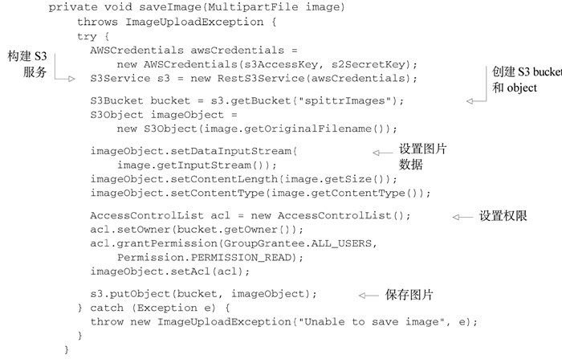
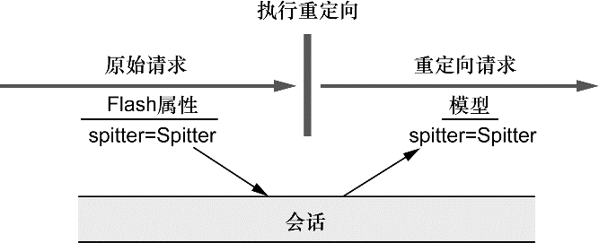

### 7.1 Spring MVC配置的替代方案

#### 7.1.1 自定义DispatcherServlet配置

在AbstractAnnotationConfigDispatcherServletInitializer将DispatcherServlet注册到Servlet容器中之后，就会调用customizeRegistration()，并将Servlet注册后得到的ServletRegistration.Dynamic传递进来。通过重载customizeRegistration()方法，可以对DispatcherServlet进行额外的配置。

例如，如果计划使用Servlet 3.0对multipart配置的支持，那么需要使用DispatcherServlet的registration来启用multipart请求。可以重载customizeRegistration()方法来设置MultipartConfigElement，如下所示：

```java
public class SpittrWebAppInitializer extends AbstractAnnotationConfigDispatcherServletInitializer {
	...
    @Override
    protected void customizeRegistration(ServletRegistration.Dynamic registration) {
        // 设置了对multipart的支持，将上传文件的临时存储目录设置在“/tmp/spittr/uploads”
        registration.setMultipartConfig(new MultipartConfigElement("/tmp/spittr/uploads"));
    }
}
```

借助customizeRegistration()方法中的ServletRegistration.Dynamic，能够完成多项任务，包括通过调用setLoadOnStartup()设置load-on-startup优先级，通过setInitParameter()设置初始化参数，通过调用setMultipartConfig()配置Servlet 3.0对multipart的支持。

#### 7.1.2 添加其他的Servlet和Filter

基于Java的初始化器（initializer）的一个好处就在于可以定义任意数量的初始化器类。因此，如果想往Web容器中注册其他组件的话，只需创建一个新的初始化器就可以了。最简单的方式就是实现Spring的WebApplicationInitializer接口。

通过实现WebApplicationInitializer来注册Servlet：

```java
public class MyServletInitializer implements WebApplicationInitializer {
    @Override
    public void onStartup(ServletContext servletContext) throws ServletException {
        // 注册Servlet
        ServletRegistration.Dynamic myServlet = servletContext.addServlet("myServlet", MyServlet.class);
        // 映射Servlet
        myServlet.addMapping("/custome/*")；
    }
}
```

注册Filter的WebApplicationInitializer：

```java
@Override
public void onStartup(ServletContext servletContext) throws ServletException {
    FilterRegistration.Dynamic filter = servletContext.addFilter("myFilter", MyFilter.class);
    filter.addMappingForUrlPatterns(null, false, "/custom/*");
}
```

如果只是注册Filter，并且该Filter只会映射到DispatcherServlet上的话，那么在AbstractAnnotationConfigDispatcherServletInitializer中还有一种快捷方式。

为了注册Filter并将其映射到DispatcherServlet，所需要做的仅仅是重载AbstractAnnotationConfigDispatcherServletInitializer的getServletFilters()方法：

```java
public class MyWebApplicationInitializer extends AbstractAnnotationConfigDispatcherServletInitializer {
    ...
    @Override
    protected Filter[] getServletFilters() {
        // 在这里没有必要声明它的映射路径，
        // getServletFilters()方法返回的所有Filter都会映射到DispatcherServlet上
        return new Filter[]{new MyFilter()};
    }
}
```

#### 7.1.3 在web.xml中声明DispatcherServlet

在典型的Spring MVC应用中，会需要DispatcherServlet和ContextLoader Listener。AbstractAnnotationConfigDispatcherServletInitializer会自动注册它们，但是如果需要在web.xml中注册的话，那就需要手动来完成这项任务。

在web.xml中搭建Spring MVC：

```xml
<?xml version="1.0" encoding="UTF-8"?>
<web-app xmlns="http://xmlns.jcp.org/xml/ns/javaee"
         xmlns:xsi="http://www.w3.org/2001/XMLSchema-instance"
         xsi:schemaLocation="http://xmlns.jcp.org/xml/ns/javaee http://xmlns.jcp.org/xml/ns/javaee/web-app_4_0.xsd"
         version="4.0">
    
    <!-- 设置根上下文配置文件位置 -->
    <context-param>
        <param-name>contextConfigLocation</param-name>
        <param-value>/WEB-INF/spring/root-context.xml</param-value>
    </context-param>

    <!-- 注册ContextLoaderListener -->
    <listener>
        <listener-class>org.springframework.web.context.ContextLoaderListener</listener-class>
    </listener>

    <!-- 注册DispatcherServlet -->
    <servlet>
        <servlet-name>appServlet</servlet-name>
        <servlet-class>org.springframework.web.servlet.DispatcherServlet</servlet-class>
        <load-on-startup>1</load-on-startup>
    </servlet>

    <!-- 将DispatcherServlet映射到"/" -->
    <servlet-mapping>
        <servlet-name>appServlet</servlet-name>
        <url-pattern>/</url-pattern>
    </servlet-mapping>

</web-app>
```

ContextLoaderListener和DispatcherServlet各自都会加载一个Spring应用上下文。上下文参数contextConfigLocation指定了一个XML文件的地址，这个文件定义了根应用上下文，它会被ContextLoaderListener加载。

DispatcherServlet会根据Servlet的名字找到一个文件，并基于该文件加载应用上下文。在上述程序中，Servlet的名字是appServlet，因此DispatcherServlet会从“/WEB-INF/appServlet-context.xml”文件中加载其应用上下文。如果希望指定DispatcherServlet配置文件的位置的话，那么可以在Servlet上指定一个contextConfigLocation初始化参数：

```xml
<servlet>
    <servlet-name>appServlet</servlet-name>
    <servlet-class>org.springframework.web.servlet.DispatcherServlet</servlet-class>
    <init-param>
        <param-name>contextConfigLocation</param-name>
        <param-value>/WEB-INF/spring/appServlet/servlet-context.xml</param-value>
    </init-param>
    <load-on-startup>1</load-on-startup>
</servlet>
```

要在Spring MVC中使用基于Java的配置，我们需要告诉DispatcherServlet和ContextLoaderListener使用AnnotationConfigWebApplicationContext，这是一个WebApplicationContext的实现类，它会加载Java配置类，而不是使用XML。

设置web.xml使用基于Java的配置：

```xml
<?xml version="1.0" encoding="UTF-8"?>
<web-app xmlns="http://xmlns.jcp.org/xml/ns/javaee"
         xmlns:xsi="http://www.w3.org/2001/XMLSchema-instance"
         xsi:schemaLocation="http://xmlns.jcp.org/xml/ns/javaee http://xmlns.jcp.org/xml/ns/javaee/web-app_4_0.xsd"
         version="4.0">
    
    <!-- 使用Java配置 -->
    <context-param>
        <param-name>contextClass</param-name>
        <param-value>org.springframework.web.context.support.AnnotationConfigWebApplicationContext</param-value>
    </context-param>
	<!-- 指定根配置类 -->
    <context-param>
        <param-name>contextConfigLocation</param-name>
        <param-value>com.myapp.config.RootConfig</param-value>
    </context-param>

    <listener>
        <listener-class>org.springframework.web.context.ContextLoaderListener</listener-class>
    </listener>

    <servlet>
        <servlet-name>appServlet</servlet-name>
        <servlet-class>org.springframework.web.servlet.DispatcherServlet</servlet-class>
        <!-- 使用Java配置 -->
        <init-param>
            <param-name>contextClass</param-name>
            <param-value>org.springframework.web.context.support.AnnotationConfigWebApplicationContext</param-value>
        </init-param>
        <!-- 指定DispatcherServlet配置类 -->
        <init-param>
            <param-name>contextConfigLocation</param-name>
            <param-value>com.myapp.config.WebConfig</param-value>
        </init-param>
        <load-on-startup>1</load-on-startup>
    </servlet>

    <servlet-mapping>
        <servlet-name>appServlet</servlet-name>
        <url-pattern>/</url-pattern>
    </servlet-mapping>

</web-app>
```

### 7.2 处理multipart形式的数据

multipart格式的数据会将一个表单拆分为多个部分（part），每个部分对应一个输入域。在一般的表单输入域中，它所对应的部分中会放置文本型数据，但是如果上传文件的话，它所对应的部分可以是二进制。

#### 7.2.1 配置multipart解析器

DispatcherServlet并没有实现任何解析multipart请求数据的功能。它将该任务委托给了Spring中MultipartResolver策略接口的实现，通过这个实现类来解析multipart请求中的内容。从Spring 3.1开始，Spring内置了两个MultipartResolver的实现：

+ CommonsMultipartResolver：使用Jakarta Commons FileUpload解析multipart请求；
+ StandardServletMultipartResolver：依赖于Servlet 3.0对multipart请求的支持（始于Spring 3.1，更好）。

**使用Servlet 3.0解析multipart请求**

兼容Servlet 3.0的StandardServletMultipartResolver没有构造器参数，也没有要设置的属性。这样，在Spring应用上下文中，将其声明为bean就会非常简单，如下所示：

```java
@Bean
public MultipartResolver multipartResolver() {
    return new StandardServletMultipartResolver();
}
```

如果采用Servlet初始化类的方式来配置DispatcherServlet的话，这个初始化类应该已经实现了WebApplicationInitializer，那就可以在Servlet registration上调用setMultipartConfig()方法，传入一个MultipartConfigElement实例，从而对StandardServletMultipartResolver进行配置。

如果配置DispatcherServlet的Servlet初始化类继承了Abstract AnnotationConfigDispatcherServletInitializer或AbstractDispatcherServletInitializer的话，可以通过重载customizeRegistration()方法（它会得到一个Dynamic作为参数）来配置multipart的具体细节：

```java
@Override
protected void customizeRegistration(ServletRegistration.Dynamic registration) {
    // 最基本的DispatcherServlet multipart配置，将临时路径设置为"/tmp/spittr/uploads"
    // 使用是只有一个参数的MultipartConfigElement构造器，
    // 这个参数指定的是文件系统中的一个绝对目录，上传文件将会临时写入该目录中
    registration.setMultipartConfig(new MultipartConfigElement("/tmp/spittr/uploads"));
}
```

除了临时路径的位置，其他的构造器所能接受的参数如下：

+ 上传文件的最大容量（以字节为单位）。默认是没有限制的。
+ 整个multipart请求的最大容量（以字节为单位），不会关心有多少个part以及每个part的大小。默认是没有限制的。
+ 在上传的过程中，如果文件大小达到了一个指定最大容量（以字节为单位），将会写入到临时文件路径中。默认值为0，也就是所有上传的文件都会写入到磁盘上。

例如，假设想限制文件的大小不超过2MB，整个请求不超过4MB，而且所有的文件都要写到磁盘中。下面的代码使用MultipartConfigElement设置了这些临界值：

```java
@Override
protected void customizeRegistration(ServletRegistration.Dynamic registration) {
    registration.setMultipartConfig(
        new MultipartConfigElement("/tmp/spittr/uploads",2097152, 4194304, 0));
}
```

如果使用web.xml来配置MultipartConfigElement的话，那么可以使用\<servlet>中的\<multipart-config>元素：

```xml
<servlet>
    <servlet-name>appServlet</servlet-name>
    <servlet-class>org.springframework.web.servlet.DispatcherServlet</servlet-class>
    <load-on-startup>1</load-on-startup>
    <!-- <multipart-config>的默认值与MultipartConfigElement相同 -->
    <multipart-config>
        <!-- 与MultipartConfigElement一样，必须要配置的是<location>-->
        <location>/tmp/spittr/uploads</location>
        <max-file-size>2097152</max-file-size>
        <max-request-size>4194304</max-request-size>
    </multipart-config>
</servlet>
```

**配置Jakarta Commons FileUpload multipart解析器**

常来讲，StandardServletMultipartResolver会是最佳的选择，但是如果需要将应用部署到非Servlet 3.0的容器中，那么就得需要替代的方案。Spring内置了CommonsMultipartResolver，可以作为StandardServletMultipartResolver的替代方案。

将CommonsMultipartResolver声明为Spring bean的最简单方式如下：

```java
@Bean
public MultipartResolver multipartResolver(){
    return new CommonsMultipartResolver();
}
```

与StandardServletMultipartResolver有所不同，CommonsMultipart-Resolver不会强制要求设置临时文件路径。默认情况下，这个路径就是Servlet容器的临时目录。不过，通过设置uploadTempDir属性，可以将其指定为一个不同的位置：

```java
@Bean
public MultipartResolver multipartResolver() throws IOException {
    CommonsMultipartResolver multipartResolver = new CommonsMultipartResolver();
    // 设置uploadTempDir属性，指定临时文件路径
    multipartResolver.setUploadTempDir(new FileSystemResource("/tmp/spittr/uploads"));
    // 指定最大的文件容量设置为2MB
    multipartResolver.setMaxUploadSize(2097152);
    // 指定最大的内存大小设置为0字节，即文件直接写到磁盘中
    multipartResolver.setMaxInMemorySize(0);
    return multipartResolver;
}
```

#### 7.2.2 处理multipart请求

接下来需要编写控制器方法来接收上传的文件，要实现这一点，最常见的方式就是在某个控制器方法参数上添加@RequestPart注解。

假设允许用户在注册Spittr应用的时候上传一张图片，那么需要修改表单，以允许用户选择要上传的图片，同时还需要修改SpitterController 中的processRegistration()方法来接收上传的图片。如下的代码片段来源于Thymeleaf注册表单视图（registrationForm.html），着重强调了表单所需的修改：

```html
<!-- <form>标签现在将enctype属性设置为multipart/form-data，
     这会告诉浏览器以multipart数据的形式提交表单，
     而不是以表单数据的形式进行提交；
     在multipart中，每个输入域都会对应一个part -->
<form method="POST" th:object="${spitter}" enctype="multipart/form-data">
    ...
    <label>Profile Picture</label>
    <!-- accept属性用来将文件类型限制为JPEG、PNG以及GIF图片 -->
    <!-- 根据其name属性，图片数据将会发送到multipart请求中的profilePicture part之中 -->
    <input type="file" name="profilePicture" accept="image/jpeg,image/png,image/gif"/>
    ...
</form>
```

现在，需要修改processRegistration()方法，使其能够接受上传的图片。其中一种方式是添加byte数组参数，并为其添加@RequestPart注解。如下为示例：

```java
// 当注册表单提交的时候，profilePicture属性将会给定一个byte数组，
// 这个数组中包含了请求中对应part的数据（通过@RequestPart指定）
@RequestMapping(value = "/register", method = RequestMethod.POST)
public String processRegistration(
    @RequestPart("profilePicture") byte[] profilePicture, 
    @Valid Spitter spitter, 
    Errors errors) {
    ...
}

```

**接受MultipartFile**

使用上传文件的原始byte比较简单但是功能有限。因此，Spring还提供了MultipartFile接口，它为处理multipart数据提供了内容更为丰富的对象。

```java
package org.springframework.web.multipart;
import java.io.File;
import java.io.IOException;
import java.io.InputStream;

public interface MultipartFile {
	String getName();
	String getOriginalFilename();
	String getContentType();
	boolean isEmpty();
	long getSize();
	byte[] getBytes() throws IOException;
	InputStream getInputStream() throws IOException;
	void transferTo(File dest) throws IOException, IllegalStateException;
}
```

MultipartFile提供了获取上传文件byte的方式，但是它所提供的功能并不仅限于此，还能获得原始的文件名、大小以及内容类型。它还提供了一个InputStream，用来将文件数据以流的方式进行读取。除此之外，MultipartFile还提供了一个便利的transferTo()方法，它能够帮助将上传的文件写入到文件系统中。

```java
@RequestMapping(value = "/register", method = RequestMethod.POST)
    public String processRegistration(
        @RequestPart("profilePicture") MultipartFile profilePicture, 
        @Valid Spitter spitter, 
        Errors errors) throws IOException {
        ...
        profilePicture.transferTo(new File("/data/spittr/" + profilePicture.getOriginalFilename()));
        ...
    }
```

**将文件保存到Amazon S3中**

将文件保存到本地文件系统中是非常简单的，但是这需要对这些文件进行管理。确保有足够的空间，确保当出现硬件故障时，文件进行了备份，还需要在集群的多个服务器之间处理这些图片文件的同步。

另外一种方案就是让别人来负责处理这些事情。多加几行代码，就能将图片保存到云端



**以Part的形式接受上传的文件**

如果需要将应用部署到Servlet 3.0的容器中，那么会有MultipartFile的一个替代方案。Spring MVC也能接受javax.servlet.http.Part作为控制器方法的参数。如果使用Part来替换MultipartFile的话，那么processRegistration()的方法签名将会变成如下的形式：

```java
@RequestMapping(value = "/register", method = RequestMethod.POST)
public String processRegistration(
    @RequestPart("profilePicture") Part profilePicture, 
    @Valid Spitter spitter, 
    Errors errors) throws IOException {
    ...
}
```

就主体来言，Part接口与MultipartFile并没有太大的差别。

```java
package javax.servlet.http;
import java.io.IOException;
import java.io.InputStream;
import java.util.Collection;

public interface Part {
    InputStream getInputStream() throws IOException;
    String getContentType();
    String getName();
    String getSubmittedFileName();
    long getSize();
    void write(String var1) throws IOException;
    void delete() throws IOException;
    String getHeader(String var1);
    Collection<String> getHeaders(String var1);
    Collection<String> getHeaderNames();
}
```

值得一提的是，如果在编写控制器方法的时候，通过Part参数的形式接受文件上传，那么就没有必要配置MultipartResolver了。只有使用MultipartFile的时候，才需要MultipartResolver。

### 7.3 处理异常

Spring提供了多种方式将异常转换为响应：

+ 特定的Spring异常会自动映射为指定的HTTP状态码；
+ 异常上可以添加@ResponseStatus注解，从而将其映射为某一个HTTP状态码；
+ 在方法上可以添加@ExceptionHandler注解，使其用来处理异常。

#### 7.3.1 将异常映射为HTTP状态码

在默认情况下，Spring会将自身的一些异常自动转换为合适的状态码：

| Spring异常                              | HTTP状态码                   |
| --------------------------------------- | ---------------------------- |
| BindException                           | 400 - Bad Request            |
| ConversionNotSupportedException         | 500 - Internal Server Error  |
| HttpMediaTypeNotAcceptableException     | 406 - Not Acceptable         |
| HttpMediaTypeNotSupportedException      | 415 - Unsupported Media Type |
| HttpMessageNotReadableException         | 400 - Bad Request            |
| HttpMessageNotWritableException         | 500 - Internal Server Error  |
| HttpRequestMethodNotSupportedException  | 405 - Method Not Allowed     |
| MethodArgumentNotValidException         | 400 - Bad Request            |
| MissingServletRequestParameterException | 400 - Bad Request            |
| MissingServletRequestPartException      | 400 - Bad Request            |
| NoSuchRequestHandlingMethodException    | 404 - Not Found              |
| TypeMismatchException                   | 400 - Bad Request            |

异常一般会由Spring自身抛出，作为DispatcherServlet处理过程中或执行校验时出现问题的结果。例如，如果DispatcherServlet无法找到适合处理请求的控制器方法，那么将会抛出NoSuchRequestHandlingMethodException异常，最终的结果就是产生404状态码的响应（Not Found）。

而对于应用所抛出的异常，Spring提供了一种机制，能够通过@ResponseStatus注解将异常映射为HTTP状态码。

例如，SpittleController中如下的请求处理方法，它可能会产生HTTP 404状态（但目前还没有实现）：

```java
@RequestMapping(value = "/{spittleId}", method = RequestMethod.GET)
public String spittle(@PathVariable(value = "spittleId") long spittleId, Model model) {
    // 从SpittleRepository中，通过ID检索Spittle对象
    Spittle spittle = spittleRepository.findOne(spittleId);
    // 如果findOne()方法返回null的话，那么将会抛出SpittleNotFoundException异常
    if (spittle == null) {
        throw new SpittleNotFoundException();
    }
    model.addAttribute(spittle);
    return "spittle";
}
```

SpittleNotFoundException就是一个简单的运行时异常：

```java
package spittr.web;

public class SpittleNotFoundException extends RuntimeException {
}
```

如果调用spittle()方法来处理请求，并且给定ID获取到的结果为空，那么SpittleNotFoundException（默认）将会产生500状态码（Internal Server Error）的响应。可以通过映射SpittleNotFoundException对这种默认行为进行变更。

当抛出SpittleNotFoundException异常时，这是一种请求资源没有找到的场景。如果资源没有找到的话，HTTP状态码404是最为精确的响应状态码。所以，要使用@ResponseStatus注解将SpittleNotFoundException映射为HTTP状态码404：

```java
package spittr.web;
import org.springframework.http.HttpStatus;
import org.springframework.web.bind.annotation.ResponseStatus;

// 将异常映射为HTTP状态码404，原因是"Spittle Not Found"
@ResponseStatus(value = HttpStatus.NOT_FOUND, reason = "Spittle Not Found")
public class SpittleNotFoundException extends RuntimeException {
}
```

#### 7.3.2 编写异常处理的方法

如果想在响应中不仅要包括状态码，还要包含所产生的错误。此时，就不能将异常视为HTTP错误了，而是要按照处理请求的方式来处理异常。

假设用户试图创建的Spittle与已创建的Spittle文本完全相同，那么SpittleRepository的save()方法将会抛出DuplicateSpittleException异常。这意味着SpittleController的saveSpittle()方法可能需要处理这个异常：

```java
@RequestMapping(method=RequestMethod.POST)
public String saveSpittle(SpittleForm form, Model model) {
    try {
        spittleRepository.save(
            new Spittle(null, form.getMessage(), new Date(), 
                        form.getLongitude(), form.getLatitude()));
        return "redirect:/spittles";
    } catch (DuplicateSpittleException e) { // 捕获异常
        return "error/duplicate";
    }
}
```

但是这个方法有些复杂。如果能让saveSpittle()方法只关注正确的路径，而让其他方法处理异常的话，那么它就能简单一些。

首先，将saveSpittle()方法中的异常处理方法剥离掉：

```java
// saveSpittle()方法简单了许多，因为它只关注成功保存Spittle的情况，
// 所以只有一个执行路径，很容易理解（和测试）
@RequestMapping(method=RequestMethod.POST)
public String saveSpittle(SpittleForm form, Model model) {
    spittleRepository.save(
        new Spittle(null, form.getMessage(), new Date(), 
                    form.getLongitude(), form.getLatitude()));
    return "redirect:/spittles";
}
```

其次，为SpittleController添加一个新的方法，它会处理抛出DuplicateSpittleException的情况：

```java
// 添加了@ExceptionHandler注解，
// 当抛出DuplicateSpittleException异常的时候，将会委托该方法来处理
// 对于@ExceptionHandler注解标注的方法来说，它能处理同一个控制器中所有处理器方法所抛出的异常
@ExceptionHandler(DuplicateSpittleException.class)
public String handleNotFound(){
    // 返回的是一个String，这与处理请求的方法是一致的，
    // 指定了要渲染的逻辑视图名，它能够告诉用户他正在试图创建一条重复的条目
    return "error/duplicate";  
}
```

### 7.4 为控制器添加通知

如果要在多个控制器中处理异常，那@ExceptionHandler注解所标注的方法是很有用的。不过为了避免重复，可以创建一个基础的控制器类，所有控制器类要扩展这个类，从而继承通用的@ExceptionHandler方法。

Spring 3.2为这类问题引入了一个新的解决方案：控制器通知。控制器通知（controller advice）是任意带有@ControllerAdvice注解的类，这个类会包含一个或多个如下类型的方法：

+ @ExceptionHandler注解标注的方法；
+ @InitBinder注解标注的方法；
+ @ModelAttribute注解标注的方法。

在带有@ControllerAdvice注解的类中，以上所述的这些方法会运用到整个应用程序所有控制器中带有@RequestMapping注解的方法上。@ControllerAdvice注解本身已经使用了@Component，因此@ControllerAdvice注解所标注的类将会自动被组件扫描获取到。

@ControllerAdvice最为实用的一个场景就是将所有的@ExceptionHandler方法收集到一个类中，这样所有控制器的异常就能在一个地方进行一致的处理：

```java
package spittr.web;
import org.springframework.web.bind.annotation.ControllerAdvice;
import org.springframework.web.bind.annotation.ExceptionHandler;

// 定义控制器通知类
@ControllerAdvice 
public class AppWideExceptionHandler {

    // 定义异常处理方法
    // 现在，任意的控制器方法抛出了DuplicateSpittleException，
    // 都会调用这个duplicateSpittleHandler()方法来处理异常
    @ExceptionHandler(DuplicateSpittleException.class)
    public String duplicateSpittle(){
        // 返回"error/duplicate"作为逻辑视图名，将会被渲染为一个自定义的错误页面
        return "error/duplicate";
    }
}
```

### 7.5 跨重定向请求传递数据

在控制器方法返回的视图名称中，借助了“redirect:”前缀来实现重定向。当控制器方法返回的String值以"redirect:"开头的话，那么这个String不是用来查找视图的，而是用来指导浏览器进行重定向的路径。

对于重定向来说，模型并不能用来传递数据（在新的请求属性中，没有任何的模型数据，这个请求必须要自己计算数据。）。但是也有一些其他方案，能够从发起重定向的方法传递数据给处理重定向方法中：

+ 使用URL模板以路径变量和/或查询参数的形式传递数据；
+ 通过flash属性发送数据。

#### 7.5.1 通过URL模板进行重定向

通过路径变量和查询参数传递数据看起来非常简单。但是，当构建URL或SQL查询语句的时候，使用String连接是很危险的。

```java
return "redirect:/spitter/" + spitter.getUsername();
```

除了连接String的方式来构建重定向URL，Spring还提供了使用模板的方式来定义重定向URL。

```java
@RequestMapping(value = "/register", method = RequestMethod.POST)
public String processRegistration(Model model, Spitter spitter) throws IOException {
    spitterRepository.save(spitter);
    model.addAttribute("username", spitter.getUsername());
    // username作为占位符填充到了URL模板中，而不是直接连接到重定向String中，
    // 所以username中所有的不安全字符都会进行转义
    return "redirect:/spitter/{username}";
}
```

除此之外，模型中所有其他的原始类型值都可以添加到URL中作为查询参数：

```java
@RequestMapping(value = "/register", method = RequestMethod.POST)
public String processRegistration(Model model, Spitter spitter) throws IOException {
    spitterRepository.save(spitter);
    model.addAttribute("username", spitter.getUsername());
    // 因为模型中的spitterId属性没有匹配重定向URL中的任何占位符，
    // 所以它会自动以查询参数的形式附加到重定向URL上
    // 最后的到的结果类似"/spitter/angus?spitterId=42"
    model.addAttribute("spittleId", spitter.getId());
    return "redirect:/spitter/{username}";
}
```

#### 7.5.2 使用flash属性

假设要发送实际的Spitter对象，正如之前所说，模型数据最终是以请求参数的形式复制到请求中的，当重定向发生的时候，这些数据就会丢失。因此，需要将Spitter对象放到一个位置，使其能够在重定向的过程中存活下来。

Spring认为将跨重定向存活的数据放到会话中是一个很不错的方式。并且，Spring认为并不需要管理这些数据，它提供了将数据发送为flash属性（flash attribute）的功能。按照定义，flash属性会一直携带这些数据直到下一次请求，然后才会消失。

Spring提供了通过RedirectAttributes设置flash属性的方法，这是Spring 3.1引入的Model的一个子接口。RedirectAttributes提供了Model的所有功能，除此之外，还有几个方法是用来设置flash属性的。

```java
@RequestMapping(value = "/register", method = RequestMethod.POST)
public String processRegistration(Spitter spitter, RedirectAttributes model) throws IOException {
    spitterRepository.save(spitter);
    model.addAttribute("username", spitter.getUsername());
    // 调用RedirectAttributes的addFlashAttribute()方法，将spittr作为key，Spittr对象作为值，
    // 也可以不设置key参数，让key根据值的类型自行推断得出（这里会推断为"spittr"）
    model.addFlashAttribute("spittr", spitter);
    return "redirect:/spitter/{username}";
}
```

在重定向执行之前，所有的flash属性都会复制到会话（Session）中。在重定向后，存在会话中的flash属性会被取出，并从会话转移到模型之中。处理重定向的方法就能从模型中访问Spitter对象了，就像获取其他的模型对象一样。



为了完成flash属性的流程，如下展现了更新版本的showSpitterProfile()方法，在从数据库中查找之前，它会首先从模型中检查Spitter对象：

```java
@RequestMapping(value = "/{username}", method = RequestMethod.GET)
public String showSpitterProfile(@PathVariable String username, Model model) {
    // 检查是否存有key为spitter的model属性
    if (!model.containsAttribute("spittr")) {
        // 如果模型中不包含spitter属性的话，
        // 那么showSpitterProfile()才会从Repository中查找Spitter，并将其存放到模型中
        Spitter spitter = spitterRepository.findByUsername(username);
        model.addAttribute(spitter);
    }
    return "profile";
}
```

### 7.6 小结

Spring MVC的环境搭建有多种可选方案。在本章中，首先介绍了搭建Spring MVC中DispatcherServlet和ContextLoaderListener的多种方式。还了解了如何调整DispatcherServlet的注册功能以及如何注册自定义的Servlet和Filter。如果需要将应用部署到更老的应用服务器上，本章还介绍了如何使用web.xml声明DispatcherServlet和ContextLoaderListener。

然后，介绍了如何处理Spring MVC控制器所抛出的异常，可以将异常处理的代码抽取到单独的方法中。为了采用一致的方式处理通用的任务，包括在应用的所有控制器中处理异常，Spring 3.2引入了@ControllerAdvice，它所创建的类能够将控制器的通用行为抽取到同一个地方。

最后，是如何跨重定向传递数据，包括Spring对flash属性（类似于模型的属性）的支持，其能在重定向后存活下来。这样的话，就能采用非常恰当的方式为POST请求执行一个重定向回应，而且能够将处理POST请求时的模型数据传递过来，然后在重定向后使用或展现这些模型数据。


