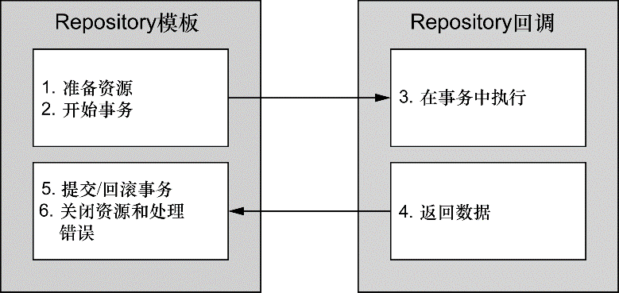

### 10.1 Spring的数据访问哲学

为了避免持久化的逻辑分散到应用的各个组件中，最好将数据访问的功能放到一个或多个专注于此项任务的组件中。这样的组件通常称为数据访问对象（data access object，DAO）或Repository。

为了避免应用与特定的数据访问策略耦合在一起，编写良好的Repository应该以接口的方式暴露功能。


服务对象通过接口来访问Repository。这样做会有几个好处：

+ 它使得服务对象易于测试，因为它们不再与特定的数据访问实现绑定在一起。实际上，可以为这些数据访问接口创建mock实现，这样无需连接数据库就能测试服务对象，而且会显著提升单元测试的效率并排除因数据不一致所造成的测试失败。
+ 此外，数据访问层是以持久化技术无关的方式来进行访问的。持久化方式的选择独立于Repository，同时只有数据访问相关的方法才通过接口进行暴露。这可以实现灵活的设计，并且切换持久化框架对应用程序其他部分所带来的影响最小。

#### 10.1.1 了解Spring的数据访问异常体系

在使用JDBC的过程中，如果不强制捕获SQLException的话，几乎无法使用JDBC做任何事情。SQLException表示在尝试访问数据库的时出现了问题，但是这个异常却没有告哪里出错了以及如何进行处理。可能导致抛出SQLException的常见问题包括：

+ 应用程序无法连接数据库；
+ 要执行的查询存在语法错误；
+ 查询中所使用的表和/或列不存在；
+ 试图插入或更新的数据违反了数据库约束。

**Spring所提供的平台无关的持久化异常**

不同于JDBC，Spring提供了多个数据访问异常，分别描述了它们抛出时所对应的问题，且与特定的持久化框架无关（不用关心所选择的持久化方案）：

| JDBC异常                                                     | Spring的数据访问异常                                         |
| ------------------------------------------------------------ | ------------------------------------------------------------ |
| BatchUpdateException<br/>DataTruncation<br/>SQLException<br/>SQLWarning | BadSqlGrammarException<br/>CannotAcquireLockException<br/>CannotSerializeTransactionException<br/>CannotGetJdbcConnectionException<br/>CleanupFailureDataAccessException<br/>ConcurrencyFailureException<br/>DataAccessException<br/>DataAccessResourceFailureException<br/>DataIntegrityViolationException<br/>DataRetrievalFailureException<br/>DataSourceLookupApiUsageException<br/>DeadlockLoserDataAccessException<br/>DuplicateKeyException<br/>EmptyResultDataAccessException<br/>IncorrectResultSizeDataAccessException<br/>IncorrectUpdateSemanticsDataAccessException<br/>InvalidDataAccessApiUsageException<br/>InvalidDataAccessResourceUsageException<br/>InvalidResultSetAccessException<br/>JdbcUpdateAffectedIncorrectNumberOfRowsException<br/>LbRetrievalFailureException |
| BatchUpdateException<br/>DataTruncation<br/>SQLException<br/>SQLWarning | NonTransientDataAccessResourceException<br/>OptimisticLockingFailureException<br/>PermissionDeniedDataAccessException<br/>PessimisticLockingFailureException<br/>QueryTimeoutException<br/>RecoverableDataAccessException<br/>SQLWarningException<br/>SqlXmlFeatureNotImplementedException<br/>TransientDataAccessException<br/>TransientDataAccessResourceException<br/>TypeMismatchDataAccessException<br/>UncategorizedDataAccessException<br/>UncategorizedSQLException |

**看！不用写catch代码块**

这些异常都继承自DataAccessException。DataAccessException的特殊之处在于它是一个非检查型异常。换句话说，没有必要捕获Spring所抛出的数据访问异常。DataAccessException只是Sping处理检查型异常和非检查型异常哲学的一个范例。Spring认为触发异常的很多问题是不能在catch代码块中修复的。

#### 10.1.2 数据访问模块

Spring在数据访问中采用模板方法模式。故而不管使用什么样的技术，都需要一些特定的数据访问步骤。

Spring将数据访问过程中固定的和可变的部分明确划分为两个不同的类：模板（template）和回调（callback）。模板管理过程中固定的部分，而回调处理自定义的数据访问代码。



如图，Spring的模板类处理数据访问的固定部分——事务控制、管理资源以及处理异常。同时，应用程序相关的数据访问——语句、绑定参数以及整理结果集——在回调的实现中处理。事实证明，这是一个优雅的架构，用户只需关心自己的数据访问逻辑即可。

针对不同的持久化平台，Spring提供了多个可选的模板：

| 模板类（org.springframework.*）                 | 用途                                                   |
| ----------------------------------------------- | ------------------------------------------------------ |
| jca.cci.core.CciTemplate                        | JCA CCI连接                                            |
| jdbc.core.JdbcTemplate                          | JDBC连接                                               |
| jdbc.core.namedparam.NamedParameterJdbcTemplate | 支持命名参数的JDBC连接                                 |
| jdbc.core.simple.SimpleJdbcTemplate             | 通过Java 5简化后的JDBC连接（Spring 3.1中已经废弃）     |
| orm.hibernate3.HibernateTemplate                | Hibernate 3.x以上的Session                             |
| orm.ibatis.SqlMapClientTemplate                 | iBATIS SqlMap客户端                                    |
| orm.jdo.JdoTemplate                             | Java数据对象（Java Data Object）实现                   |
| orm.jpa.JpaTemplate                             | Java持久化API（Java Persistence API，JPA）的实体管理器 |

### 10.2 配置数据源

无论选择Spring的哪种数据访问方式，都需要配置一个数据源的引用。Spring提供了在Spring上下文中配置数据源bean的多种方式，包括：

+ 通过JDBC驱动程序定义的数据源；
+ 通过JNDI查找的数据源；
+ 连接池的数据源。

#### 10.2.1 使用JNDI数据源

Spring应用程序经常部署在Java EE应用服务器中，如WebSphere、JBoss或甚至像Tomcat这样的Web容器中。这些服务器允许配置通过JNDI获取数据源。这种配置的好处在于数据源完全可以在应用程序之外进行管理，这样应用程序只需在访问数据库的时候查找数据源就可以了。另外，在应用服务器中管理的数据源通常以池的方式组织，从而具备更好的性能，并且还支持系统管理员对其进行热切换。

利用Spring，可以像使用Spring bean那样配置JNDI中数据源的引用并将其装配到需要的类中。位于jee命名空间下的\<jee:jndi-lookup>元素可以用于检索JNDI中的任何对象（包括数据源）并将其作为Spring的bean。例如，如果应用程序的数据源配置在JNDI中，可以使用\<jee:jndi-lookup>元素将其装配到Spring中，如下所示：

```xml
<!-- jndi-name属性用于指定JNDI中资源的名称，
     如果只设置了jndi-name属性，那么就会根据指定的名称查找数据源 -->
<!-- 如果应用程序运行在Java应用服务器中，需要将resource-ref属性设置为true，
     这样给定的jndi-name将会自动添加"java:comp/env/"前缀 -->
<jee:jndi-lookup id="dataSource" jndi-name="/jdbc/SpittrDS" resource-ref="true" />
```

使用Java配置的话，可以借助JndiObjectFactoryBean从JNDI中查找DataSource：

```java
@Bean
public JndiObjectFactoryBean dataSource() {
    JndiObjectFactoryBean jndiObjectFB = new JndiObjectFactoryBean();
    jndiObjectFB.setJndiName("jdbc/SpittrDS");
    jndiObjectFB.serResourceRef(true);
    jndiObjectFB.setProxyInterface(javax.sql.DataSource.class);
    return jndiObjectFB;
}
```

#### 10.2.2 使用数据源连接池

如果不能从JNDI中查找数据源，那么下一个选择就是直接在Spring中配置数据源连接池。尽管Spring并没有提供数据源连接池实现，但是有多项可用的方案，包括如下开源的实现：

+ Apache Commons DBCP (http://jakarta.apache.org/commons/dbcp)
+ c3p0 (http://sourceforge.net/projects/c3p0/) 
+ BoneCP (http://jolbox.com/) 

这些连接池中的大多数都能配置为Spring的数据源，在一定程度上与Spring自带的DriverManagerDataSource或SingleConnectionDataSource很类似。如下就是配置DBCP BasicDataSource的方式：

```xml
<!-- 前四个属性是配置BasicDataSource所必需的 -->
<!-- 属性driverClassName指定了JDBC驱动类的全限定类名，在这里我们配置的是H2数据库的数据源；
     属性url用于设置数据库的JDBC URL；
     最后，username和password用于在连接数据库时进行认证 -->
<bean id="dataSource" class="org.apache.commons.dbcp.BasicDataSource"
      p:diverClassName="org.h2.Driver"
      p:url="jdbc:h2:tcp://localhost/-/spittr"
      p:username="root"
      p:password="123456"
      p:initialSize="5"
      p:maxActive="10"/>
```

若是Java配置的话，连接池形式的DataSourcebean可以声明如下：

```java
@Bean
public BasicDataSource dataSource() {
    BasicDataSource ds= new BasicDataSource();
    ds.setDiverClassName("org.h2.Driver");
    ds.setUrl("jdbc:h2:tcp://localhost/-/spittr");
    ds.setUserName("root");
    ds.setPassword("123456");
    // 连接池启动时会创建5个连接
    // 需要的时候，允许BasicDataSource创建新的连接，但是最大连接为10
    ds.setInitialSize(5);
    ds.setMaxActive(10);
    return ds;
}
```

DBCP BasicDataSource最有用的一些池配置属性：

| 池配置属性                 | 所指定的内容                                                 |
| -------------------------- | ------------------------------------------------------------ |
| initialSize                | 池启动时创建的连接数量                                       |
| maxActive                  | 同一时间可从池中分配的最多连接数。如果设置为0，表示无限制    |
| maxIdle                    | 池里不会被释放的最多空闲连接数。如果设置为0，表示无限制      |
| maxOpenPreparedStatements  | 在同一时间能够从语句池中分配的预处理语句（prepared statement）的最大数量。如果设置为0，表示无限制 |
| maxWait                    | 在抛出异常之前，池等待连接回收的最大时间（当没有可用连接时）。如果设置为-1，表示无限等待 |
| minEvictableIdleTimeMillis | 连接在池中保持空闲而不被回收的最大时间                       |
| minIdle                    | 在不创建新连接的情况下，池中保持空闲的最小连接数             |
| poolPreparedStatements     | 是否对预处理语句（prepared statement）进行池管理（布尔值）   |

#### 10.2.3 基于JDBC驱动的数据源

在Spring中，通过JDBC驱动定义数据源是最简单的配置方式。Spring提供了三个这样的数据源类（均位于org.springframework.jdbc.datasource包中）供选择：

+ DriverManagerDataSource：在每个连接请求时都会返回一个新建的连接。与DBCP的BasicDataSource不同，由DriverManagerDataSource提供的连接并没有进行池化管理；
+ SimpleDriverDataSource：与DriverManagerDataSource的工作方式类似，但是它直接使用JDBC驱动，来解决在特定环境下的类加载问题，这样的环境包括OSGi容器；
+ SimpleDriverDataSource：与DriverManagerDataSource的工作方式类似，但是它直接使用JDBC驱动，来解决在特定环境下的类加载问题，这样的环境包括OSGi容器；

以上这些数据源的配置与DBCPBasicDataSource的配置类似。如下就是配置DriverManagerDataSource的方法：

```java
@Bean
public DataSource datasource() {
    DriverManagerDataSource ds = new DriverManagerDataSource();
    ds.setDiverClassName("org.h2.Driver");
    ds.setUrl("jdbc:h2:tcp://localhost/-/spittr");
    ds.setUserName("root");
    ds.setPassword("123456");
    return ds;
}
```

使用XML的话，DriverManagerDataSource可以按照如下的方式配置：

```xml
<bean id="dataSource" class="org.springframework.jdbc.datasource.DriverManagerDataSource"
      p:diverClassName="org.h2.Driver"
      p:url="jdbc:h2:tcp://localhost/-/spittr"
      p:username="root"
      p:password="123456"/>
```

#### 10.2.4 使用嵌入式的数据源

嵌入式数据库（embedded database）作为应用的一部分运行，而不是应用连接的独立数据库服务器。对于开发和测试来讲，嵌入式数据库都是很好的可选方案。这是因为每次重启应用或运行测试的时候，都能够重新填充测试数据。

Spring的jdbc命名空间能够简化嵌入式数据库的配置。如下的程序清单展现了如何使用jdbc命名空间来配置嵌入式的H2数据库，它会预先加载一组测试数据：

```xml
<?xml version="1.0" encoding="UTF-8"?>
<beans xmlns="http://www.springframework.org/schema/beans"
       xmlns:xsi="http://www.w3.org/2001/XMLSchema-instance"
       xmlns:jdbc="http://www.springframework.org/schema/jdbc"
       xsi:schemaLocation="http://www.springframework.org/schema/beans 
                           http://www.springframework.org/schema/beans/spring-beans.xsd 
                           http://www.springframework.org/schema/jdbc 
                           http://www.springframework.org/schema/jdbc/spring-jdbc.xsd">

    <!-- <jdbc:embedded-database>的type属性设置为H2，
         表明嵌入式数据库是H2数据库（要确保H2位于应用的类路径下） -->
    <jdbc:embedded-database id="dataSource" type="H2">
        <!-- 可以配置多个<jdbc:script>元素来搭建数据库 -->
        <!-- 第一个引用了schema.sql，它包含了在数据库中创建表的SQL -->
        <jdbc:script location="classpath:jdbc/schema.sql"/>
        <!-- 第二个引用了test-data.sql，用来将测试数据填充到数据库中 -->
        <jdbc:script location="classpath:jdbc/test-data.sql"/>

    </jdbc:embedded-database>

</beans>
```

如果使用Java来配置嵌入式数据库时，不会像jdbc命名空间那么简便，可以使用EmbeddedDatabaseBuilder来构建DataSource：

```java
@Bean
public DataSource dataSource() {
    return new EmbeddedDatabaseBuilder()
        .setTyepe(EmbeddedDatabaseType.H2)
        .addScript("classpath:schemal.sql")
        .addScript("classpath:test-data.sql")
        .build();
}
```

#### 10.2.5 使用profile选择数据源

通过Spring的profile特性，可以在运行时选择数据源，这取决于哪一个profile处于激活状态：

```java
package com.angus.spittr.config;
import org.apache.commons.dbcp.BasicDataSource;
import javax.sql.DataSource;
import org.springframework.context.annotation.Bean;
import org.springframework.context.annotation.Configuration;
import org.springframework.context.annotation.Profile;
import org.springframework.jdbc.datasource.embedded.EmbeddedDatabaseBuilder;
import org.springframework.jdbc.datasource.embedded.EmbeddedDatabaseType;
import org.springframework.jndi.JndiObjectFactoryBean;
@Configuration
public class DataSourceConfiguration {
    // 开发环境下的数据源
    @Profile("development")
    @Bean
    public DataSource embeddedDataSource() {
        return new EmbeddedDatabaseBuilder()
            .setType(EmbeddedDatabaseType.H2)
            .addScript("classpath:schema.sql")
            .addScript("classpath:test-data.sql")
            .build();
    }
    // QA环节的数据源
    @Profile("qa")
    @Bean
    public DataSource Data() {
        BasicDataSource ds = new BasicDataSource();
        ds.setDriverClassName("org.h2.Driver");
        ds.setUrl("jdbc:h2:tcp://localhost/~/spitter");
        ds.setUsername("sa");
        ds.setPassword("");
        ds.setInitialSize(5);
        ds.setMaxActive(10);
        return ds;
    }
    // 生产环境数据源
    @Profile("production")
    @Bean
    public DataSource dataSource() {
        JndiObjectFactoryBean jndiObjectFactoryBean = new JndiObjectFactoryBean();
        jndiObjectFactoryBean.setJndiName("jdbc/SpittrDS");
        jndiObjectFactoryBean.setResourceRef(true);
        jndiObjectFactoryBean.setProxyInterface(javax.sql.DataSource.class);
        return (DataSource) jndiObjectFactoryBean.getObject();
    }
}
```

借助XML配置，基于profile选择数据源：

```xml
<?xml version="1.0" encoding="UTF-8"?> 
<beans xmlns="http://www.springframework.org/schema/beans"
       xmlns:xsi="http://www.w3.org/2001/XMLSchema-instance"
       xmlns:jdbc="http://www.springframework.org/schema/jdbc"
       xmlns:jee="http://www.springframework.org/schema/jee"
       xmlns:p="http://www.springframework.org/schema/p"
       xsi:schemaLocation="http://www.springframework.org/schema/jdbc
                           http://www.springframework.org/schema/jdbc/spring-jdbc-3.1.xsd
                           http://www.springframework.org/schema/jee
                           http://www.springframework.org/schema/jee/spring-jee-3.1.xsd
                           http://www.springframework.org/schema/beans
                           http://www.springframework.org/schema/beans/spring-beans.xsd">
    <!-- 开发环境下的数据源 -->
    <beans profile="development">
        <jdbc:embedded-database id="dataSource" type="H2"> 
            <jdbc:script location="com/angus/spittr/db/jdbc/schema.sql"/> 
            <jdbc:script location="com/angusa/spittr/db/jdbc/test-data.sql"/> 
        </jdbc:embedded-database> 
    </beans>
    <!-- QA环节的数据源 -->
    <beans profile="qa">
        <bean id="dataSource" class="org.apache.commons.dbcp.BasicDataSource"
              p:driverClassName="org.h2.Driver"
              p:url="jdbc:h2:tcp://localhost/~/spitter"
              p:username="sa"
              p:password=""
              p:initialSize="5"
              p:maxActive="10" /> 
    </beans>
    <!-- 生产环境数据源 -->
    <beans profile="production">
        <jee:jndi-lookup id="dataSource"
                         jndi-name="/jdbc/SpitterDS"
                         resource-ref="true" /> 
    </beans>
</beans>
```

### 10.3 在Spring中使用JDBC

#### 10.3.1 应对失控的JDBC代码

如果使用JDBC所提供的直接操作数据库的API，需要负责处理与数据库访问相关的所有事情，其中包含管理数据库资源和处理异常。JDBC要求必须正确地管理连接和语句，并以某种方式处理可能抛出的SQLException异常。

实际上，这些样板代码是非常重要的。清理资源和处理错误确保了数据访问的健壮性。如果没有它们的话，就不会发现错误而且资源也会处于打开的状态，这将会导致意外的代码和资源泄露。不仅需要这些代码，而且还要保证它是正确的。基于这样的原因，故而需要框架来保证这些代码只写一次而且是正确的。

#### 10.3.2 使用JDBC模板

Spring的JDBC框架承担了资源管理和异常处理的工作，从而简化了JDBC代码，只需编写从数据库读写数据的必需代码。Spring为JDBC提供了三个模板类供选择：

+ JdbcTemplate：最基本的Spring JDBC模板，这个模板支持简单的JDBC数据库访问功能以及基于索引参数的查询；
+ NamedParameterJdbcTemplate：使用该模板类执行查询时可以将值以命名参数的形式绑定到SQL中，而不是使用简单的索引参数； 
+ ~~SimpleJdbcTemplate~~：该模板类利用Java 5的一些特性如自动装箱、泛型以及可变参数列表来简化JDBC模板的使用。（已废弃，其特性已转移到JdbcTemplate）

**使用JdbcTemplate来插入数据**

为了让JdbcTemplate正常工作，只需要为其设置DataSource就可以了，这使得在Spring中配置JdbcTemplate非常容易，如下面的@Bean方法所示：

```java
@Bean
public JdbcTemplate jdbcTemplate(DataSource dataSource) {
    return new JdbcTemplate(dataSource);
}
```

现在，可以将jdbcTemplate装配到Repository中并使用它来访问数据库。例如，SpitterRepository使用了JdbcTemplate：

```java
// JdbcSpitterRepository类使用@Repository注解，其将会在组件扫描时自动创建
// 当然，可以用注解@Bean替换
@Repository
public class JdbcSpitterRepository implements SpitterRepository {

    private JdbcOperations jdbc;
    // 也可以替换为@Inject注解，用于自动注入JdbcOperations对象；
    // JdbcOperations是一个接口，定义了JdbcTemplate所实现的操作，
    // 通过注入JdbcOperations，而不是具体的JdbcTemplate，
    // 能够保证JdbcSpitterRepository通过JdbcOperations接口达到与JdbcTemplate保持松耦合。
    @Autowired 
    public JdbcSpitterRepository(JdbcOperations jdbc) {
        this.jdbc = jdbc;
    }
    ...
}
```

在Repository中具备可用的JdbcTemplate后，可以极大地简化程序的addSpitter()方法：

```java
// 样板代码已经放在模板类中，使得业务逻辑更清晰
// 因为Spring的数据访问异常都是运行时异常，所以不必在addSpitter()方法中进行捕获
public Spitter addSpitter(Spitter spitter) {
    jdbc.update(
        "insert into Spitter (username, password, first_name, last_name, email)" +
        " values (?, ?, ?, ?, ?)",
        spitter.getUsername(),
        spitter.getPassword(),
        spitter.getFirstName(),
        spitter.getLastName(),
        spitter.getEmail());
}
```

**使用JdbcTemplate来读取数据**

JdbcTemplate也简化了数据的读取操作。新版本的findOne()方法使用了JdbcTemplate的回调，实现根据ID查询Spitter，并将结果集映射为Spitter对象：

```java
private static final String SELECT_SPITTER = "select id, username, password, fullname, email, updateByEmail from Spitter";

// 查询Spitter
public Spitter findOne(long id) {
    // 将查询结果映射到对象
    // queryForObject()方法有三个参数：
    //    String对象，包含了要从数据库中查找数据的SQL，
    //    RowMapper对象，用来从ResultSet中提取数据并构建域对象（本例中为Spitter），
    //    可变参数列表，列出了要绑定到查询上的索引参数值
    return jdbcTemplate.queryForObject(
        SELECT_SPITTER + " where id=?", new SpitterRowMapper(), id);
}

// 绑定参数
// SpitterRowMapper实现了RowMapper接口，对于查询返回的每一行数据，
// JdbcTemplate将会调用RowMapper的mapRow()方法，并传入一个ResultSet和包含行号的整数
private static final class SpitterRowMapper implements RowMapper<Spitter> {
    public Spitter mapRow(ResultSet rs, int rowNum) throws SQLException {
        long id = rs.getLong("id");
        String username = rs.getString("username");
        String password = rs.getString("password");
        String fullName = rs.getString("fullname");
        String email = rs.getString("email");
        boolean updateByEmail = rs.getBoolean("updateByEmail");
        return new Spitter(id, username, password, fullName, email, updateByEmail);
    }		
}
```

**在JdbcTemplate中使用Java 8的Lambda表达式**

因为RowMapper接口只声明了addRow()这一个方法，因此它完全符合函数式接口（functional interface）的标准：

```java
public Spitter findOne(long id) {
    return jdbcOperations.queryForObject(
        SELECT_SPITTER_BY_ID,
        (rs, rowNum) -> {
            return new Spitter(
                rs.getLong("id"),
                rs.getString("username"),
                rs.getString("password"),
                rs.getString("fullName"),
                rs.getString("email"),
                rs.getBoolean("updateByEmail"));
        },
        id);
}
```

还可以使用Java 8的方法引用，在单独的方法中定义映射逻辑：

```java
public Spitter findOne(long id) {
    return jdbcOperations.queryForObject(
        SELECT_SPITTER_BY_ID, this::mapSpitter, id);
}
private Spitter mapSpitter(ResultSet rs, int row) throws SQLException {
    return new Spitter(
        rs.getLong("id"),
        rs.getString("username"),
        rs.getString("password"),
        rs.getString("fullName"),
        rs.getString("email"),
        rs.getBoolean("updateByEmail"));
}
```

**使用命名参数**

命名参数可以赋予SQL中的每个参数一个明确的名字，在绑定值到查询语句的时候就通过该名字来引用参数。例如，假设SQL_INSERT_SPITTER查询语句是这样定义的：

```java
private static final String SQL_INSERT_SPITTER =
    "insert into spitter (username, password, fullname) " +
    "values (:username, :password, :fullname)";
```

使用命名参数查询，可以按照名字来绑定值，绑定值的顺序就不重要了。如果查询语句发生了变化导致参数的顺序与之前不一致，不需要修改绑定的代码。

NamedParameterJdbcTemplate是一个特殊的JDBC模板类，它支持使用命名参数。在Spring中，NamedParameterJdbcTemplate的声明方式与常规的JdbcTemplate几乎完全相同：

```java
@Bean
public NamedParameterJdbcTemplate jdbcTemplate(DataSource dataSource) {
    return new NamedParameterJdbcTemplate(dataSource);
}
```

使用Spring JDBC模板的命名参数功能：

```java
private static final String INSERT_SPITTER =
    "insert into Spitter " +
    " (username, password, fullname, email, updateByEmail) " +
    "values " +
    " (:username, :password, :fullname, :email, :updateByEmail)";
public void addSpitter(Spitter spitter) {
    // 命名参数通过Map类进行绑定
    Map<String, Object> paramMap = new HashMap<String, Object>();
    paramMap.put("username", spitter.getUsername());
    paramMap.put("password", spitter.getPass  word());
    paramMap.put("fullname", spitter.getFullName());
    paramMap.put("email", spitter.getEmail());
    paramMap.put("updateByEmail", spitter.isUpdateByEmail());
    jdbcOperations.update(INSERT_SPITTER, paramMap);
}
```

### 10.4 小结

在Java中，JDBC是与关系型数据库交互的最基本方式。但是按照规范，JDBC有些太笨重了。Spring能够解除使用JDBC中的大多数痛苦，包括消除样板式代码、简化JDBC异常处理，用户所需要做的仅仅是关注要执行的SQL语句。

在本章中，介绍了Spring对数据持久化的支持，以及Spring为JDBC所提供的基于模板的抽象，它能够极大地简化JDBC的使用。


​                                                                                    


