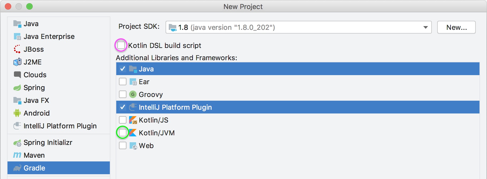

# IDEA 插件开发指南

> 实际上就是官网文档的翻译啊喂 (#`O′)
>
> https://jetbrains.org/intellij/sdk/docs/intro/welcome.html


# 快速开始

这部分覆盖了使用 *IntelliJ 平台* 进行工作的基础，带你熟悉工作环境、项目结构和常用的 API 组件。

- [IntelliJ 平台插件的主要类型 ](https://jetbrains.org/intellij/sdk/docs/basics/types_of_plugins.html)
- [创建第一款插件](https://jetbrains.org/intellij/sdk/docs/basics/getting_started.html)
- [插件结构](https://jetbrains.org/intellij/sdk/docs/basics/plugin_structure.html)
- [为插件开发者准备的 Kotlin 指南](https://jetbrains.org/intellij/sdk/docs/tutorials/kotlin.html)
- [IDE 开发实例](https://jetbrains.org/intellij/sdk/docs/basics/ide_development_instance.html)
- [插件开发 FAQ](https://jetbrains.org/intellij/sdk/docs/basics/faq.html)


# 插件的主要类型

基于 *IntelliJ 平台* 的产品可以通过添加插件进行修改和调整以实现定制目的，所有可下载的插件都可以在 [JetBrains 插件库](https://plugins.jetbrains.com/)中找到

最常见的插件类型包括：

- UI 主题
- 自定义语言支持
- 框架集成
- 工具集成
- 用户界面附加组件


## UI 主题

[UI 主题](https://jetbrains.org/intellij/sdk/docs/reference_guide/ui_themes/themes_intro.html)允许设计者自定义 IDE 内置 UI 元素的外观：

- 替换图标
- 更改图标和 UI 控件的颜色
- 修改 UI 控件的边框和插图
- 提供自定义的编辑器方案
- 添加背景图片

[可供下载的 UI 主题](https://plugins.jetbrains.com/search?headline=164-theme&tags=Theme)说明了这些创造的可能性。


## 自定义语言支持

自定义语言支持提供了使用特定编程语言的基本功能，其中包括：

- 文件类型识别
- 词法分析
- 语法高亮
- 格式化
- 代码洞察（code insight）和代码补全（code completion）
- 检查和快速修复
- 意图动作（intention actions）

获取该主题更多信息请参阅[自定义语言支持教程](https://jetbrains.org/intellij/sdk/docs/tutorials/custom_language_support_tutorial.html)。


## 框架集成

框架集成包括为给定框架的典型特征增强代码洞察（code insight）特性，以及直接从 IDE 使用框架特定的功能选项，有时还包含自定义语法或 DSL（领域特定语言）支持元素。

- 特定代码洞察性（Special code insight）
- 直接访问框架特定功能

参考框架集成示例 [Struts 2 插件](https://github.com/JetBrains/intellij-plugins/tree/master/struts2) 


## 工具集成

工具集成允许直接从 IDE 操作第三方工具和组件而无需切换环境，这意味着：

- 附加操作的实现
- 相关的 UI 组件
- 外部资源访问

可参考示例 [Gerrit 集成插件](https://plugins.jetbrains.com/plugin/7272?pr=idea)


## 用户界面附加组件

这类插件会对 IDE 的标准用户界面进行各种更改。一些新增组件是交互式的，并提供新的功能，而另一些则仅限于可视化修改。[随机背景插件](https://plugins.jetbrains.com/plugin/9692-random-background)可以作为一个例子。


# 代码示例

<https://github.com/JetBrains/intellij-sdk-code-samples>


# 创建第一款插件

本文档将帮助你开始为 *IntelliJ 平台* 开发插件。可以使用 [IntelliJ IDEA Community Edition](https://www.jetbrains.com/idea/download/) 或 [IntelliJ IDEA Ultimate](https://www.jetbrains.com/idea/download/) 作为IDE（强烈推荐使用最新的可用版本），两者都包含完整的插件开发工具集。需要更熟悉 *IntelliJ IDEA*，请参考 [IntelliJ IDEA 网站的帮助](https://www.jetbrains.com/idea/help/)。

有三种支持构建插件的工作流。新项目推荐[使用 GitHub 模板](https://jetbrains.org/intellij/sdk/docs/basics/getting_started.html#using-github-template)或[使用 Gradle ](https://jetbrains.org/intellij/sdk/docs/basics/getting_started.html#using-gradle)从头开始创建。旧的插件 DevKit 工作流仍支持现有的项目。

> 如果新插件基于Scala，可以使用专用的 SBT 插件 [sbt-idea-plugin](https://github.com/JetBrains/sbt-idea-plugin)。

Gradle 工作流程具有以下优点：

- 源码集、模块和项目的表现形式是可移植的
- 任何规模或复杂程度的项目通常都需要构建管理脚本，Gradle 天然支持
- 容易获得 Gradle 一般主题的教学资料、文档和社区帮助

为 IntelliJ IDEA 针对 IntelliJ 平台插件开发而生的 Gradle 插件：

- 更改插件目标更加方便，因为它们都是在 `build.gradle` 中完成的：

    - 切换目标 IntelliJ 平台（IDE）的版本
    - 更改基于 IntelliJ 平台的目标 IDE，例如，从 IntelliJ IDEA 更改为 PyCharm
    - 针对 JetBrains 运行时的其他版本运行插件
- Gradle 已与持续集成系统和 [JetBrains 插件库](https://plugins.jetbrains.com/)完全集成，因此可以轻松定制和扩展构建及发布过程。
- 内置 `plugin.xml` 和插件分布结构的验证任务，与 [JetBrains 插件库](https://plugins.jetbrains.com/)中的检查相同


## 使用 GitHub 模板

- [使用 GitHub 模板开发插件](https://jetbrains.org/intellij/sdk/docs/tutorials/github_template.html)


## 使用 Gradle

- 使用 Gradle 开发插件
  - [从 Gradle 开始](https://jetbrains.org/intellij/sdk/docs/tutorials/build_system/prerequisites.html)
  - [配置 Gradle 项目](https://jetbrains.org/intellij/sdk/docs/tutorials/build_system/gradle_guide.html)
  - [使用 Gradle 发布插件](https://jetbrains.org/intellij/sdk/docs/tutorials/build_system/deployment.html)


## 使用 DevKit

- 使用 DevKit 开发插件
  - [设置开发环境](https://jetbrains.org/intellij/sdk/docs/basics/getting_started/setting_up_environment.html)
  - [创建插件项目](https://jetbrains.org/intellij/sdk/docs/basics/getting_started/creating_plugin_project.html)
  - [创建 Action](https://jetbrains.org/intellij/sdk/docs/tutorials/action_system/working_with_custom_actions.html)
  - [运行和调试插件](https://jetbrains.org/intellij/sdk/docs/basics/getting_started/running_and_debugging_a_plugin.html)
  - [部署插件](https://jetbrains.org/intellij/sdk/docs/basics/getting_started/deploying_plugin.html)
  - [发布插件](https://jetbrains.org/intellij/sdk/docs/basics/getting_started/publishing_plugin.html)


# Building Plugins with Gradle

The [gradle-intellij-plugin](https://github.com/JetBrains/gradle-intellij-plugin) Gradle plugin is the recommended solution for building IntelliJ plugins. The plugin takes care of the dependencies of your plugin project - both the base IDE and other plugin dependencies.

[IntelliJ Platform Plugin Template](https://github.com/JetBrains/intellij-platform-plugin-template) makes it easier to create and maintain your IDE plugins, having the Gradle plugin already integrated and CI covered with GitHub Actions.

If a new plugin will be Scala-based, a dedicated SBT plugin [sbt-idea-plugin](https://github.com/JetBrains/sbt-idea-plugin) is available.

The gradle-intellij-plugin provides tasks to run the IDE with your plugin and to publish your plugin to the [JetBrains Plugins Repository](https://plugins.jetbrains.com/). To make sure that your plugin is not affected by [API changes](https://jetbrains.org/intellij/sdk/docs/reference_guide/api_changes_list.html), which may happen between major releases of the platform, you can quickly build your plugin against many versions of the base IDE.

When adding additional repositories to your Gradle build script, always use HTTPS protocol.

Please make sure to always upgrade to the latest version of `gradle-intellij-plugin`. Follow releases on [GitHub](https://github.com/JetBrains/gradle-intellij-plugin/releases).

Below are a series of guides to developing and deploying Gradle-based IntelliJ Platform Plugins:

- [Getting Started with Gradle](https://jetbrains.org/intellij/sdk/docs/tutorials/build_system/prerequisites.html)
- [Configuring Gradle Projects](https://jetbrains.org/intellij/sdk/docs/tutorials/build_system/gradle_guide.html)
- [Publishing Plugins with Gradle](https://jetbrains.org/intellij/sdk/docs/tutorials/build_system/deployment.html)


# Getting Started with Gradle

Gradle is the preferred solution for creating IntelliJ Platform plugins. The IntelliJ IDEA Ultimate and Community editions bundle the necessary plugins to support Gradle-based development. These IntelliJ IDEA plugins are *Gradle* and *Plugin DevKit*, which are enabled by default. To verify these plugins are installed and enabled, see the help section about [Managing Plugins](https://www.jetbrains.com/help/idea/managing-plugins.html).

[IntelliJ Platform Plugin Template](https://github.com/JetBrains/intellij-platform-plugin-template) makes it easier to create and maintain your IDE plugins, having the Gradle plugin already integrated and CI covered with GitHub Actions.

When adding additional repositories to your Gradle build script, always use HTTPS protocol.

- Creating a Gradle-Based IntelliJ Platform Plugin with New Project Wizard
  - [New Project Configuration Screen](https://jetbrains.org/intellij/sdk/docs/tutorials/build_system/prerequisites.html#new-project-configuration-screen)
  - [Project Naming/Artifact Coordinates Screen](https://jetbrains.org/intellij/sdk/docs/tutorials/build_system/prerequisites.html#project-namingartifact-coordinates-screen)
  - Components of a Wizard-Generated Gradle IntelliJ Platform Plugin
    - [Plugin Gradle Properties and Plugin Configuration File Elements](https://jetbrains.org/intellij/sdk/docs/tutorials/build_system/prerequisites.html#plugin-gradle-properties-and-plugin-configuration-file-elements)
- [Adding Gradle Support to an Existing DevKit-Based IntelliJ Platform Plugin](https://jetbrains.org/intellij/sdk/docs/tutorials/build_system/prerequisites.html#adding-gradle-support-to-an-existing-devkit-based-intellij-platform-plugin)
- Running a Simple Gradle-Based IntelliJ Platform Plugin
  - [Adding Code to the Project](https://jetbrains.org/intellij/sdk/docs/tutorials/build_system/prerequisites.html#adding-code-to-the-project)
  - [Executing the Plugin](https://jetbrains.org/intellij/sdk/docs/tutorials/build_system/prerequisites.html#executing-the-plugin)


## Creating a Gradle-Based IntelliJ Platform Plugin with New Project Wizard

Creating new Gradle-based IntelliJ Platform plugin projects is performed using the [New Project Wizard](https://www.jetbrains.com/help/idea/gradle.html#project_create_gradle). The Wizard creates all the necessary project files based on a few template inputs.

Before creating a new Gradle project, familiarize yourself with the help topic [Creating a new Gradle project](https://www.jetbrains.com/help/idea/getting-started-with-gradle.html#create_gradle_project), which is a tutorial for creating general Gradle projects in IntelliJ IDEA. This page emphasizes the steps in the process of creating IntelliJ Platform plugin projects that are Gradle-based.

Please note that Gradle 6.1 has a [known bug](https://github.com/gradle/gradle/issues/11966) that prevents using it for developing plugins, please upgrade to 6.1.1 or later.

Launch the [New Project Wizard](https://www.jetbrains.com/help/idea/gradle.html#project_create_gradle). It guides you through the Gradle project creation process with two screens.


### New Project Configuration Screen

On the first screen, the type of project is configured:

- From the *project type* pane on the left, choose *Gradle*.
- Specify the *Project SDK* based on the **Java 8** JDK. This SDK will be the default JRE used to run Gradle, and the JDK version used to compile the plugin Java sources.
- In the *Additional Libraries and Frameworks* panel, select *Java* and *IntelliJ Platform Plugin*. These settings will be used for the remainder of this tutorial.

Optionally:

- To include support for the Kotlin language in the plugin, check the *Kotlin/JVM* box (circled in green below). This option can be selected with or without the *Java* language. See [Kotlin for Plugin Developers](https://jetbrains.org/intellij/sdk/docs/tutorials/kotlin.html) for more information.
- To create the `build.gradle` file as a Kotlin build script (`build.gradle.kts`) rather than Groovy, check the *Kotlin DSL build script* box (circled in magenta below).

Then click *Next*:




### Project Naming/Artifact Coordinates Screen

Expand the *Artifact Coordinates* section and specify a [GroupId, ArtifactId, and Version](https://www.jetbrains.com/help/idea/gradle.html#project_create_gradle) using [Maven naming](https://maven.apache.org/guides/mini/guide-naming-conventions.html) conventions.

- *GroupId* is typically a Java package name, and it is used for the Gradle property `project.group` value in the project’s `build.gradle` file. For this example, enter `com.your.company`.
- *ArtifactId* is the default name of the project JAR file (without version). It is also used for the Gradle property `rootProject.name` value in the project’s `settings.gradle` file. For this example, enter `my_gradle_plugin`.
- *Version* is used for the Gradle property `project.version` value in the `build.gradle` file. For this example, enter `1.0`.

The *Name* field is synced automatically with the specified *ArtifactId*.

Specify the path for the new project in *Location* and click *Finish* to continue and generate the project.


### Components of a Wizard-Generated Gradle IntelliJ Platform Plugin

For the [example](https://jetbrains.org/intellij/sdk/docs/tutorials/build_system/prerequisites.html#creating-a-gradle-based-intellij-platform-plugin-with-new-project-wizard) `my_gradle_plugin`, the New Project Wizard creates the following directory content:

`my_gradle_plugin ├── build.gradle ├── gradle │   └── wrapper │       ├── gradle-wrapper.jar │       └── gradle-wrapper.properties ├── gradlew ├── gradlew.bat ├── settings.gradle └── src    ├── main    │   ├── java    │   └── resources    │       └── META-INF    │           └── plugin.xml    └── test        ├── java        └── resources `Copy

- The default IntelliJ Platform `build.gradle` file (see next paragraph).
- The Gradle Wrapper files, and in particular the `gradle-wrapper.properties` file, which specifies the version of the Gradle to be used to build the plugin. If needed, the IntelliJ IDEA Gradle plugin downloads the version of the Gradle specified in this file.
- The `settings.gradle` file, containing a definition of the `rootProject.name`.
- The `META-INF` directory under the default `main` [SourceSet](https://docs.gradle.org/current/userguide/java_plugin.html#sec:java_project_layout) contains the plugin [configuration file](https://jetbrains.org/intellij/sdk/docs/basics/plugin_structure/plugin_configuration_file.html).

The generated `my_gradle_plugin` project `build.gradle` file:

`plugins {    id 'java'    id 'org.jetbrains.intellij' version '0.5.0' } group 'com.your.company' version '1.0' sourceCompatibility = 1.8 repositories {    mavenCentral() } dependencies {    testImplementation group: 'junit', name: 'junit', version: '4.12' } // See https://github.com/JetBrains/gradle-intellij-plugin/ intellij {    version '2020.1' } patchPluginXml {    changeNotes """      Add change notes here.       most HTML tags may be used""" } `Copy

- Two plugins to Gradle are explicitly declared:
  - The [Gradle Java](https://docs.gradle.org/current/userguide/java_plugin.html) plugin.
  - The [gradle-intellij-plugin](https://github.com/JetBrains/gradle-intellij-plugin/).
- The *GroupId* from the Wizard [Project Naming/Artifact Coordinates Screen](https://jetbrains.org/intellij/sdk/docs/tutorials/build_system/prerequisites.html#project-namingartifact-coordinates-screen) is the `project.group` value.
- The *Version* from the Wizard [Project Naming/Artifact Coordinates Screen](https://jetbrains.org/intellij/sdk/docs/tutorials/build_system/prerequisites.html#project-namingartifact-coordinates-screen) is the `project.version` value.
- The `sourceCompatibility` line is injected to enforce using Java 8 JDK to compile Java sources.
- The only comment in the file is a link to the [README.md](https://github.com/JetBrains/gradle-intellij-plugin/blob/master/README.md) for the gradle-intellij-plugin, which is a reference for its configuration DSL.
- The value of the Setup DSL attribute `intellij.version` specifies the version of the IntelliJ Platform to be used to build the plugin. It defaults to the version of IntelliJ IDEA that was used to run the New Project Wizard.
- The value of the Patching DSL attribute `patchPluginXml.changeNotes` is set to a place holder text.


#### Plugin Gradle Properties and Plugin Configuration File Elements

The Gradle properties `rootProject.name` and `project.group` will not, in general, match the respective [plugin configuration file](https://jetbrains.org/intellij/sdk/docs/basics/plugin_structure/plugin_configuration_file.html) `plugin.xml` elements `` and ``. There is no IntelliJ Platform-related reason they should as they serve different functions.

The `` element (used as the plugin’s display name) is often the same as `rootProject.name`, but it can be more explanatory.

The `` value must be a unique identifier over all plugins, typically a concatenation of the specified *GroupId* and *ArtifactId*. Please note that it is impossible to change the `` of a published plugin without losing automatic updates for existing installations.


## Adding Gradle Support to an Existing DevKit-Based IntelliJ Platform Plugin

Converting a [DevKit-based](https://jetbrains.org/intellij/sdk/docs/basics/getting_started/using_dev_kit.html) plugin project to a Gradle-based plugin project can be done using the New Project Wizard to create a Gradle-based project around the existing DevKit-based project:

- Ensure the directory containing the DevKit-based IntelliJ Platform plugin project can be fully recovered if necessary.

- Delete all the artifacts of the DevKit-based project:

  - `.idea` directory
  - `[modulename].iml` file
  - `out` directory

- Arrange the existing source files within the project directory in the Gradle [SourceSet](https://docs.gradle.org/current/userguide/java_plugin.html#sec:java_project_layout) format.

- Use the New Project Wizard as though creating a [new Gradle project](https://jetbrains.org/intellij/sdk/docs/tutorials/build_system/prerequisites.html#creating-a-gradle-based-intellij-platform-plugin-with-new-project-wizard) from scratch.

- On the

   

  Project Naming/Artifact Coordinates Screen

   

  set the values to:

  - *GroupId* to the existing package in the initial source set.
  - *ArtifactId* to the name of the existing plugin.
  - *Version* to the same as the existing plugin.
  - *Name* to the name of the existing plugin. (It should be pre-filled from the *ArtifactId*)
  - Set the *Location* to the directory of the existing plugin.

- Click *Finish* to create the new Gradle-based plugin.

- [Add more modules](https://www.jetbrains.com/help/idea/gradle.html#gradle_add_module) using Gradle [*Source Sets*](https://www.jetbrains.com/help/idea/gradle.html#gradle_source_sets) as needed.


## Running a Simple Gradle-Based IntelliJ Platform Plugin

Gradle projects are run from the IDE’s Gradle Tool window.


### Adding Code to the Project

Before running [`my_gradle_project`](https://jetbrains.org/intellij/sdk/docs/tutorials/build_system/prerequisites.html#components-of-a-wizard-generated-gradle-intellij-platform-plugin), some code can be added to provide simple functionality. See the [Creating Actions](https://jetbrains.org/intellij/sdk/docs/tutorials/action_system/working_with_custom_actions.html) tutorial for step-by-step instructions for adding a menu action.


### Executing the Plugin

Open the Gradle tool window and search for the `runIde` task:

- If it’s not in the list, hit the [Refresh](https://www.jetbrains.com/help/idea/jetgradle-tool-window.html#1eeec055) button at the top of the Gradle window.
- Or [Create a new Gradle Run Configuration](https://www.jetbrains.com/help/idea/create-run-debug-configuration-gradle-tasks.html).


Double-click on the *runIde* task to execute it. See the IntelliJ IDEA help for more information about [Working with Gradle tasks](https://www.jetbrains.com/help/idea/gradle.html#96bba6c3).

Finally, when `my_gradle_plugin` launches in the IDE development instance, there should be a new menu under the **Tools** menu.


# Configuring Gradle Projects

This page serves as a guide to the Gradle-based plugin configuration for *IntelliJ Platform* projects. The IntelliJ IDEA Ultimate and Community editions bundle the *Gradle* and *Plugin DevKit* plugins to support Gradle-based development.

The [Getting Started with Gradle](https://jetbrains.org/intellij/sdk/docs/tutorials/build_system/prerequisites.html) page provides a tutorial for creating Gradle-based IntelliJ Platform plugins. It may be useful to review the IntelliJ Platform page, particularly the description of versioning in the [Open Source](https://jetbrains.org/intellij/sdk/docs/intro/intellij_platform.html#open-source) section.

When adding additional repositories to your Gradle build script, always use HTTPS protocol.

- [Overview of the Gradle Plugin](https://jetbrains.org/intellij/sdk/docs/tutorials/build_system/gradle_guide.html#overview-of-the-gradle-plugin)
- Guide to Configuring Gradle Plugin Functionality
  - Configuring the Gradle Plugin for Building IntelliJ Platform Plugin Projects
    - [IntelliJ Platform Configuration](https://jetbrains.org/intellij/sdk/docs/tutorials/build_system/gradle_guide.html#intellij-platform-configuration)
    - [Plugin Dependencies](https://jetbrains.org/intellij/sdk/docs/tutorials/build_system/gradle_guide.html#plugin-dependencies)
  - Configuring the Gradle Plugin for Running IntelliJ Platform Plugin Projects
    - [Running Against Alternate Versions and Types of IntelliJ Platform-Based IDEs](https://jetbrains.org/intellij/sdk/docs/tutorials/build_system/gradle_guide.html#running-against-alternate-versions-and-types-of-intellij-platform-based-ides)
    - [Running Against Alternate Versions of the JetBrains Runtime](https://jetbrains.org/intellij/sdk/docs/tutorials/build_system/gradle_guide.html#running-against-alternate-versions-of-the-jetbrains-runtime)
  - [Managing Directories Used by the Gradle Plugin](https://jetbrains.org/intellij/sdk/docs/tutorials/build_system/gradle_guide.html#managing-directories-used-by-the-gradle-plugin)
  - [Controlling Downloads by the Gradle Plugin](https://jetbrains.org/intellij/sdk/docs/tutorials/build_system/gradle_guide.html#controlling-downloads-by-the-gradle-plugin)
  - [Patching the Plugin Configuration File](https://jetbrains.org/intellij/sdk/docs/tutorials/build_system/gradle_guide.html#patching-the-plugin-configuration-file)
  - [Publishing with the Gradle Plugin](https://jetbrains.org/intellij/sdk/docs/tutorials/build_system/gradle_guide.html#publishing-with-the-gradle-plugin)
- Common Gradle Plugin Configurations for Development
  - [Plugins Targeting IntelliJ IDEA](https://jetbrains.org/intellij/sdk/docs/tutorials/build_system/gradle_guide.html#plugins-targeting-intellij-idea)
  - [Plugins Targeting Alternate IntelliJ Platform-Based IDEs](https://jetbrains.org/intellij/sdk/docs/tutorials/build_system/gradle_guide.html#plugins-targeting-alternate-intellij-platform-based-ides)


## Overview of the Gradle Plugin

The Gradle plugin is built from the open-source project [gradle-intellij-plugin](https://github.com/JetBrains/gradle-intellij-plugin). This plugin adds Gradle tasks that enable developing IntelliJ Platform plugins. The [README](https://github.com/JetBrains/gradle-intellij-plugin/blob/master/README.md) file has a reference for configuring these tasks.

When getting started, there are several items to note on the README page:

- At the top of the page, the [latest production version](https://github.com/JetBrains/gradle-intellij-plugin#the-latest-version) of the plugin is listed. It is advised to upgrade to the latest available version regularly.

- Also, at the top is the minimum required version of Gradle.

- The table of extended Gradle

   

  Tasks

   

  has a succinct description for each task added by the plugin. This documentation will focus on the configuration and use four of those tasks:

  - [Setup DSL](https://github.com/JetBrains/gradle-intellij-plugin#setup-dsl) - `intellij { ... }`.
  - [Running DSL](https://github.com/JetBrains/gradle-intellij-plugin#running-dsl) - `runIde { ... }`
  - [Patching DSL](https://github.com/JetBrains/gradle-intellij-plugin#patching-dsl) - `patchPluginXml { ... }`
  - [Publishing DSL](https://github.com/JetBrains/gradle-intellij-plugin#publishing-dsl) - `publishPlugin { ... }`

- Examples are always a helpful resource, and at the bottom of the page are links to [example](https://github.com/JetBrains/gradle-intellij-plugin#examples) open-source IntelliJ Platform plugin projects based on Gradle.

- Almost every Gradle plugin attribute has a default value that will work to get started on a Gradle-based IntelliJ Platform plugin project.


## Guide to Configuring Gradle Plugin Functionality

This section presents a guided tour of Gradle plugin attributes to achieve the commonly desired functionality.


### Configuring the Gradle Plugin for Building IntelliJ Platform Plugin Projects

By default, the Gradle plugin will build a plugin project against the IntelliJ Platform defined by the latest EAP snapshot of the IntelliJ IDEA Community Edition.

Using EAP versions of the IntelliJ Platform requires adding the *Snapshots repository* to the `build.gradle` file (see [IntelliJ Platform Artifacts Repositories](https://jetbrains.org/intellij/sdk/docs/reference_guide/intellij_artifacts.html)).

If a matching version of the specified IntelliJ Platform is not available on the local machine, the Gradle plugin downloads the correct version and type. IntelliJ IDEA then indexes the build and any associated source code and JetBrains Java Runtime.


#### IntelliJ Platform Configuration

Explicitly setting the [Setup DSL](https://github.com/JetBrains/gradle-intellij-plugin#setup-dsl) attributes `intellij.version` and `intellij.type` tells the Gradle plugin to use that configuration of the IntelliJ Platform to create the plugin project.

All available platform versions can be browsed in the [IntelliJ Platform Artifacts Repositories](https://jetbrains.org/intellij/sdk/docs/reference_guide/intellij_artifacts.html).

If the chosen platform version is not available in the repositories, or a local installation of the target IDE is the desired type and version of the IntelliJ Platform, use `intellij.localPath` to point to that installation. If the `intellij.localPath` attribute is set, do not set the `intellij.version` and `intellij.type` attributes as this could result in undefined behavior.


#### Plugin Dependencies

IntelliJ Platform plugin projects may depend on either bundled or third-party plugins. In that case, a project should build against a version of those plugins that match the IntelliJ Platform version used to build the plugin project. The Gradle plugin will fetch any plugins in the list defined by `intellij.plugins`. See the Gradle plugin [README](https://github.com/JetBrains/gradle-intellij-plugin#setup-dsl) for information about specifying the plugin and version.

Note that this attribute describes a dependency so that the Gradle plugin can fetch the required artifacts. The runtime dependency must be added in the [Plugin Configuration](https://jetbrains.org/intellij/sdk/docs/basics/plugin_structure/plugin_configuration_file.html) (`plugin.xml`) file as described in [Plugin Dependencies](https://jetbrains.org/intellij/sdk/docs/basics/plugin_structure/plugin_dependencies.html#3-dependency-declaration-in-pluginxml).


### Configuring the Gradle Plugin for Running IntelliJ Platform Plugin Projects

By default, the Gradle plugin will use the same version of the IntelliJ Platform for the IDE Development Instance, as was used for building the plugin. Using the corresponding JetBrains Runtime is also the default, so for this use case, no further configuration is required.


#### Running Against Alternate Versions and Types of IntelliJ Platform-Based IDEs

The IntelliJ Platform IDE used for the Development Instance can be different from that used to build the plugin project. Setting the [Running DSL](https://github.com/JetBrains/gradle-intellij-plugin#running-dsl) attribute `runIde.ideDirectory` will define an IDE to be used for the Development Instance. This attribute is commonly used when running or debugging a plugin in an [alternate IntelliJ Platform-based IDE](https://jetbrains.org/intellij/sdk/docs/intro/intellij_platform.html#ides-based-on-the-intellij-platform).


#### Running Against Alternate Versions of the JetBrains Runtime

Every version of the IntelliJ Platform has a corresponding version of the [JetBrains Runtime](https://jetbrains.org/intellij/sdk/docs/basics/ide_development_instance.html#using-a-jetbrains-runtime-for-the-development-instance). A different version of the runtime can be used by specifying the `runIde.jbrVersion` attribute, describing a version of the JetBrains Runtime that should be used by the IDE Development Instance. The Gradle plugin will fetch the specified JetBrains Runtime as needed.


### Managing Directories Used by the Gradle Plugin

There are several attributes to control where the Gradle plugin places directories for downloads and use by the IDE Development Instance.

The location of the [sandbox home](https://jetbrains.org/intellij/sdk/docs/basics/ide_development_instance.html#sandbox-home-location-for-gradle-based-plugin-projects) directory and its subdirectories can be controlled with Gradle plugin attributes. The `intellij.sandboxDirectory` attribute is used to set the path for the sandbox directory to be used while running the plugin in an IDE Development Instance. Locations of the sandbox [subdirectories](https://jetbrains.org/intellij/sdk/docs/basics/ide_development_instance.html#development-instance-settings-caches-logs-and-plugins) can be controlled using the `runIde.configDirectory`, `runIde.pluginsDirectory`, and `runIde.systemDirectory` attributes. If the `intellij.sandboxDirectory` path is explicitly set, the subdirectory attributes default to the new sandbox directory.

The storage location of downloaded IDE versions and components defaults to the Gradle cache directory. However, it can be controlled by setting the `intellij.ideaDependencyCachePath` attribute.


### Controlling Downloads by the Gradle Plugin

As mentioned in the section about [configuring the IntelliJ Platform](https://jetbrains.org/intellij/sdk/docs/tutorials/build_system/gradle_guide.html#configuring-the-gradle-plugin-for-building-intellij-platform-plugin-projects) used for building plugin projects, the Gradle plugin will fetch the version of the IntelliJ Platform specified by the default or by the `intellij` attributes. Standardizing the versions of the Gradle plugin and the Gradle system across projects will minimize the time spent downloading versions.

There are controls for managing the `gradle-intellij-plugin` version, and the version of the Gradle itself. The plugin version is defined in the `plugins {}` section of a project’s `build.gradle` file. The version of the Gradle is defined in `/gradle/wrapper/gradle-wrapper.properties`.


### Patching the Plugin Configuration File

A plugin project’s `plugin.xml` file has element values that are “patched” at build time from the attributes of the `patchPluginXml` task ([Patching DSL](https://github.com/JetBrains/gradle-intellij-plugin#patching-dsl)). As many as possible of the attributes in the Patching DSL will be substituted into the corresponding element values in a plugin project’s `plugin.xml` file:

- If a

   

  ```text
  patchPluginXml
  ```

   

  attribute default value is defined, the attribute value will be patched in

   

  ```text
  plugin.xml
  ```

   

  regardless of whether the `patchPluginXml` task appears in the `build.gradle` file

  .

  - For example, the default values for the attributes `patchPluginXml.sinceBuild` and `patchPluginXml.untilBuild` are defined based on the declared (or default) value of `intellij.version`. So by default `patchPluginXml.sinceBuild` and `patchPluginXml.untilBuild` are substituted into the `` element’s `since-build` and `until-build` attributes in the `plugin.xml` file.

- If a

   

  ```text
  patchPluginXml
  ```

   

  attribute value is explicitly defined, the attribute value will be substituted in

   

  ```text
  plugin.xml
  ```

  .

  - If both `patchPluginXml.sinceBuild` and `patchPluginXml.untilBuild` attributes are explicitly set, both are substituted in `plugin.xml`.
  - If one attribute is explicitly set (e.g. `patchPluginXml.sinceBuild`) and one is not (e.g. `patchPluginXml.untilBuild` has a default value,) both attributes are patched at their respective (explicit and default) values.

- For

   

  no substitution

   

  of the

   

  ```text
  <idea-version>
  ```

   

  element’s

   

  ```text
  since-build
  ```

   

  and

   

  ```text
  until-build
  ```

   

  attributes, one of the following must appear in the

   

  ```text
  build.gradle
  ```

   

  file:

  - Either set `intellij.updateSinceUntilBuild = false`, which will disable substituting both `since-build` and `until-build` attributes,
  - Or, for independent control, set `patchPluginXml.sinceBuild(null)` and `patchPluginXml.untilBuild(null)` depending on whether the intention is to disable one or both substitutions.

A best practice to avoid confusion is to replace the elements in `plugin.xml` the Gradle plugin will patch that with a comment. That way, the values for these parameters do not appear in two places in the source code. The Gradle plugin will add the necessary elements as part of the patching process. For those `patchPluginXml` attributes that contain descriptions such as `changeNotes` and `pluginDescription`, a `CDATA` block is not necessary when using HTML elements.

To maintain and generate an up-to-date changelog, try using [Gradle Changelog Plugin](https://github.com/JetBrains/gradle-changelog-plugin).

As discussed in [Components of a Wizard-Generated Gradle IntelliJ Platform Plugin](https://jetbrains.org/intellij/sdk/docs/tutorials/build_system/prerequisites.html#components-of-a-wizard-generated-gradle-intellij-platform-plugin), the Gradle properties `project.version`, `project.group`, and `rootProject.name` are all generated based on the input to the Wizard. However, the `gradle-intellij-plugin` does not combine and substitute those Gradle properties for the default `` and `` elements in the `plugin.xml` file.

The best practice is to keep `project.version` current. By default, if you modify `project.version` in `build.gradle`, the Gradle plugin will automatically update the `` value in the `plugin.xml` file. This practice keeps all version declarations synchronized.


### Publishing with the Gradle Plugin

Please review the [Publishing Plugins with Gradle](https://jetbrains.org/intellij/sdk/docs/tutorials/build_system/deployment.html) page before using the [Publishing DSL](https://github.com/JetBrains/gradle-intellij-plugin#publishing-dsl) attributes. That documentation explains different ways to use Gradle for plugin uploads without exposing account credentials.


## Common Gradle Plugin Configurations for Development

Different combinations of Gradle plugin attributes are needed to create the desired build or IDE Development Instance environment. This section reviews some of the more common configurations.


### Plugins Targeting IntelliJ IDEA

IntelliJ Platform plugins targeting IntelliJ IDEA have the most straightforward Gradle plugin configuration.

- Determine the version of

   

  IntelliJ IDEA to use for building the plugin project

  ; this is the desired version of the IntelliJ Platform. This can be EAP (default) or determined from the

   

  build number ranges

  .

  - If a production version of IntelliJ IDEA is the desired target, set the `intellij` [version attributes](https://jetbrains.org/intellij/sdk/docs/tutorials/build_system/gradle_guide.html#intellij-platform-configuration) accordingly.
  - Set the necessary [plugin dependencies](https://jetbrains.org/intellij/sdk/docs/tutorials/build_system/gradle_guide.html#plugin-dependencies), if any.

- If the plugin project should be run or debugged in an IDE Development Instance based on the same IntelliJ IDEA version, no further attributes need to be set for the IDE Development Instance. This is the default behavior and is the most common use case.

  - If the plugin project should be run or debugged in an IDE Development Instance based on an alternate version of the IntelliJ Platform, set the [Running](https://jetbrains.org/intellij/sdk/docs/tutorials/build_system/gradle_guide.html#running-against-alternate-versions-and-types-of-intellij-platform-based-ides) DSL attribute accordingly.
  - If the plugin project should be run using a JetBrains Runtime other than the default for the IDE Development Instance, specify the [JetBrains Runtime version](https://jetbrains.org/intellij/sdk/docs/tutorials/build_system/gradle_guide.html#running-against-alternate-versions-of-the-jetbrains-runtime).

- Set the appropriate attributes for [patching the `plugin.xml` file](https://jetbrains.org/intellij/sdk/docs/tutorials/build_system/gradle_guide.html#patching-the-plugin-configuration-file).


### Plugins Targeting Alternate IntelliJ Platform-Based IDEs

Gradle also supports developing plugins to run in IDEs that are based on the IntelliJ Platform. For more information, see the [Developing for Multiple Products](https://jetbrains.org/intellij/sdk/docs/products/dev_alternate_products.html) page of this guide.


# Publishing Plugins with Gradle

Once you have configured Gradle support, you can automatically build and deploy your plugin to the [JetBrains Plugins Repository](https://plugins.jetbrains.com/). To automatically deploy a plugin, you need to have *already published the plugin to the plugin repository at least once.* Please see the guide page for manually [publishing a plugin](https://jetbrains.org/intellij/sdk/docs/basics/getting_started/publishing_plugin.html) for the first time.

Please see [Marketing](https://jetbrains.org/intellij/sdk/docs/appendix/resources/marketing.html) for remarks on how to prepare your plugin for optimal presentation.

When adding additional repositories to your Gradle build script, always use HTTPS protocol.

- [Building Distribution](https://jetbrains.org/intellij/sdk/docs/tutorials/build_system/deployment.html#building-distribution)
- Providing Your Hub Permanent Token to Gradle
  - [Using Environment Variables](https://jetbrains.org/intellij/sdk/docs/tutorials/build_system/deployment.html#using-environment-variables)
  - [Using Parameters for the Gradle Task](https://jetbrains.org/intellij/sdk/docs/tutorials/build_system/deployment.html#using-parameters-for-the-gradle-task)
- Deploying a Plugin with Gradle
  - [Publishing a Plugin](https://jetbrains.org/intellij/sdk/docs/tutorials/build_system/deployment.html#publishing-a-plugin)
  - [Specifying a Release Channel](https://jetbrains.org/intellij/sdk/docs/tutorials/build_system/deployment.html#specifying-a-release-channel)


## Building Distribution

For manual distribution or local installation, invoke the `buildPlugin` Gradle task to create the plugin distribution. The resulting JAR/ZIP is located in `build/distributions` and can then be [installed](https://www.jetbrains.com/help/idea/managing-plugins.html#installing-plugins-from-disk) either manually or uploaded to a [custom plugin repository](https://jetbrains.org/intellij/sdk/docs/basics/getting_started/update_plugins_format.html).


## Providing Your Hub Permanent Token to Gradle

To deploy a plugin to the JetBrains Plugins Repository, you need to supply your [JetBrains Hub Permanent Token](https://plugins.jetbrains.com/docs/marketplace/plugin-upload.html).

This section describes two options to supply your *Hub Permanent Token* via Gradle using:

- Environment variables,
- Parameters to the Gradle task.


### Using Environment Variables

Start by defining an environment variable such as:

`export ORG_GRADLE_PROJECT_intellijPublishToken='YOUR_HUB_TOKEN_HERE' `Copy

On macOS systems, environment variables set in `.bash_profile` are only visible to processes you run from bash. Environment variables visible to all processes need to be defined in [Environment.plist](https://developer.apple.com/library/archive/qa/qa1067/_index.html).

Now provide the environment variable in the run configuration with which you run the `publishPlugin` task locally. To do so, create a Gradle run configuration (if not already done), choose your Gradle project, specify the `publishPlugin` task, and then add the environment variable.

`publishPlugin {  token = System.getenv("ORG_GRADLE_PROJECT_intellijPublishToken") } `Copy

Note that you still need to put some default values (can be empty) in the Gradle properties because otherwise, you will get a compilation error.


### Using Parameters for the Gradle Task

Like using environment variables, you can also pass your token as a parameter to the Gradle task. For example, you can provide the parameter `-Dorg.gradle.project.intellijPublishToken=YOUR_HUB_TOKEN_HERE` on the command line or by putting it in the arguments of your Gradle run configuration.

Note that also, in this case, you still need to put some default values in your Gradle properties.


## Deploying a Plugin with Gradle

The first step when deploying a plugin is to confirm that it works correctly. You may wish to verify this by [installing your plugin from disk](https://www.jetbrains.com/help/idea/managing-plugins.html) on a fresh instance of your target IDE(s).


### Publishing a Plugin

Once you are confident, the plugin works as intended, make sure the plugin version is updated, as the JetBrains Plugins Repository won’t accept multiple artifacts with the same version.

To deploy a new version of your plugin to the JetBrains Plugins Repository, invoke the `publishPlugin` Gradle task.

Now check the most recent version of your plugin on the [JetBrains Plugins Repository](https://plugins.jetbrains.com/). If successfully deployed, any users who currently have your plugin installed on an available version of the IntelliJ Platform are notified of a new update available as soon as the update has been verified.


### Specifying a Release Channel

You may also deploy plugins to a release channel of your choosing, by configuring the `publishPlugin.channels` property. For example:

`publishPlugin {    channels 'beta' } `Copy

When empty, this uses the default plugin repository, available to all [JetBrains Plugins Repository](https://plugins.jetbrains.com/) users. However, you can publish it to an arbitrarily-named channel. These non-default release channels are treated as separate repositories.

When using a non-default release channel, users need to configure a new [custom plugin repository](https://www.jetbrains.com/help/idea/managing-plugins.html#repos) in their IDE to install your plugin. For example, if you specify `publishPlugin.channels 'canary'`, then users need to add the `https://plugins.jetbrains.com/plugins/canary/list` repository to install the plugin and receive updates.

Popular channel names include:

- `alpha`: https://plugins.jetbrains.com/plugins/alpha/list
- `beta`: https://plugins.jetbrains.com/plugins/beta/list
- `eap`: https://plugins.jetbrains.com/plugins/eap/list

More information about the available configuration options is in the [documentation of the IntelliJ Gradle plugin](https://github.com/JetBrains/gradle-intellij-plugin/blob/master/README.md#publishing-dsl).