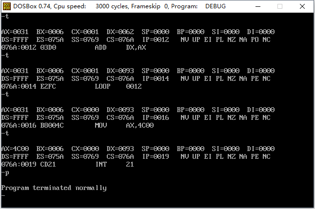
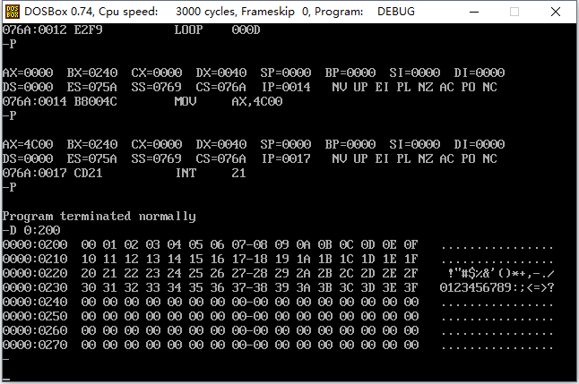

### # [BX]

看一看下面指令的功能。

```assembly
mov ax,[bx]
```

功能：bx中存放的数据作为一个偏移地址EA，段地址SA默认在ds中，将SA：EA处的数据送入到ax中。即（ax）=（（ds）*16 + （bx））。 

```assembly
mov [bx],ax
```

功能：bx中存放的数据作为一个偏移地址EA，段地址默认在ds中，将ax中的数据送入到内存SA：EA处。即（（ds）*16 + （bx）） = （ax）。

注意，inc bx的含义是bx的内容加1。

### # Loop指令

loop指令的格式是：loop标号，CPU执行loop指令的时候，要进行两步操作：

① （cx） = （cx） - 1；

② 判断cx中的值，不为零则跳转至标号处执行程序，如果为零则向下执行。

从上面的描述中，可以看到，cx（counter register 计数寄存器）中的值影响着loop指令的执行结果。通常我们用loop指令来实现循环功能，cx中存放循环次数。

1.任务：编程计算2^12

```assembly
; Date : 2017-11-11 11:11:03
; File Name : 04TEST.ASM
; Description : 编程实现2^12
; Author : Angus
; Version: V1.0

assume cs:codesg

codesg segment
	mov ax,2

	mov cx,11
s:	add ax,ax
	loop s

	mov ax,4c00H
	int 21H
codesg ends
end	
```

下面来分析一下该程序。

(1) 标号

在汇编语言中，标号代表一个地址，程序中有一个标号s，它实际上标识了一个地址，这个地址出有一条指令：add ax，ax。

(2) loop s

CPU执行loop指令的时候，要进行两步操作：

① （cx） = （cx） - 1；

② 判断cx中的值，不为零则跳转至标号处执行程序，如果为零则向下执行(下一条指令为mov ax，4c00h)。

(3) 以下三条指令

```assembly
	mov cx,11
s:	add ax,ax
	loop s
```

执行loop s时，首先将（cx）减1，然后若（cx）不为0，则向前转至s处执行add ax，ax。所以可以利用cx来控制add ax，ax的执行次数。

(4) 用cx和loop指令相配合实现循环功能的程序框架如下。

```assembly
   mov cx,循环次数
s： 循环执行的程序段
    loop s
```

### # 在Debug中跟踪用loop实现的循环程序

考虑：计算ffff：0006单元中的数乘以3，结果存在dx中。

(1) 运算后的结果是否会超出dx所能存储的范围？

ffff：0006单元的数是一个字节型的数据，范围在0-255之间，乘以3不会大于65535，可以在dx中存放。

(2) 用循环累加来实现乘法，用哪个寄存器进行累加？

将ffff：0006单元中的数赋值给ax，用dx进行累加。先设（dx）为0，然后做3次（dx）=（dx）+（ax）。

(3) ffff：0006是一个字节单元，ax是一个16位寄存器，数据的长度不一样，如何进行赋值？

设ffff：0006单元中的数据为XXH，若要ax中的值与其相等，则ax中的数据应该为00XXH。所以应该令（ah）= 0，（al）= （ffff6H）。

编写程序如下：

```assembly
; Date : 2017-11-11 12:20:51
; File Name : 05TEST.ASM
; Description : 计算ffff：0006单元中的数乘以3，结果存储在dx中
; Author : Angus
; Version: V1.0

assume cs:codesg

codesg segment
	
	mov ax,0ffffH
	mov ds,ax
	mov bx,6		; 设置ds；bx指向ffff：6

	mov ah,0
	mov al,[bx]		; 设置（al）=（（ds）*16+（bx）），（ah）=0

	mov dx,0		; 累加寄存器清0

	mov cx,3		; 循环3次
s:	add dx,ax
	loop s 			; 累加计算（ax）*3

	mov ax,4c00H
	int 21h			; 程序返回

codesg ends
end
```



注意程序第一条指令，在汇编源程序中，数据不能以字母开头，所以要在前面加0。比如，9138H在汇编源程序中可以直接写为“9138H”，而A000H在汇编源程序中要写为“0A000H”。

注：① 可以直接使用g（go）命令加偏移地址的方式，让代码直接执行到指定偏移地址处，“g 0012”，它表示执行程序到当前代码段（段地址在CS中）的0012H处。

② 可以使用p命令直接将循环执行完，使IP指向循环语句之外的下一条执行语句，也可以用P来实现同样效果。

### # loop和[bx]的联合使用

考虑：计算ffff：0-ffff：b单元数据的和，结果存储在dx中。

```assembly
; Date : 2017-11-11 13:01:22
; File Name : 06TEST.ASM
; Description : 计算ffff：0-ffff：b单元数据的和，结果存储在dx中
; Author : Angus
; Version: V1.0

assume cs:codesg

codesg segment
	mov ax,0ffffH
	mov ds,ax
	mov bx,0		; 初始化ds：bx指向ffff：0

	mov dx,0		; 初始化累加寄存器dx，（dx）=0

	mov cx,12		; 初始化循环计数寄存器cx，（cx）=12

s:	mov ah,0		
	mov al,[bx]
	add dx,ax 		; 间接向dx加上（（ds）*16+（bx））
	inc bx 			; ds：bx指向下一个单元
	loop s

	mov ax,4c00H
	int 21H
codesg ends
end
```

### # 段前缀

指令“mov ax,[bx]”中，内存单元的偏移地址由bx给出，而段地址默认在ds中。我们可以在访问内存单元中的指令中显示地给出内存单元的段地址所在的段寄存器。比如：

(1) mov ax,ds:[bx]

将一个内存单元的内容送入ax，这个内存单元的长度为2字节（字单元），存放一个字，偏移地址在bx中，段地址在ds中。

(2) mov ax,cs:[bx]

将一个内存单元的内容送入ax，这个内存单元的长度为2字节（字单元），存放一个字，偏移地址在bx中，段地址在cs中。

(3) mov ax,ss:[bx]

将一个内存单元的内容送入ax，这个内存单元的长度为2字节（字单元），存放一个字，偏移地址在bx中，段地址在ss中。

(4) mov ax,es:[bx]将一个内存单元的内容送入ax，这个内存单元的长度为2字节（字单元），存放一个字，偏移地址在bx中，段地址在es中。(5) mov ax,ss:[0]将一个内存单元的内容送入ax，这个内存单元的长度为2字节（字单元），存放一个字，偏移地址为0，段地址在ss中。(6) mov ax,cs:[0]将一个内存单元的内容送入ax，这个内存单元的长度为2字节（字单元），存放一个字，偏移地址为0，段地址在cs中。这些出现在访问内存单元的指令中，用于显式地指明内存单元的段地址的“ds：”，“cs：”，“ss：”，“es：”在汇编语言中称为段前缀。# 一段安全的空间(1) 我们需要直接向一段内存中写入内容；(2) 这段内存空间不应存放系统或其他程序的数据或代码，否者写入操作可能会引发错误。(3) DOS方式下，一般情况下，0:200-0:2ff空间中没有系统或其他程序的数据或代码；(4) 以后，我们需要向一段程序转给你写入数据时，就使用0:200-0:2ff这段空间。

### # 实验4 [bx]和loop的使用

(1) 编程，向内存0:200-0:23F一次传送数据0-63（3FH）。

```assembly
; Date : 2017-11-11 13:37:09
; File Name : 07TEST04.ASM
; Description : 编程，向内存0:200-0:23F一次传送数据0-63（3FH）
; Author : Angus
; Version: V1.0

assume cs:codesg

codesg segment
	
	mov ax,0000H
	mov ds,ax
	mov bx,0200H	; 使ds：bx指向0000:0200H单元

	mov dl,0		; 给定初始数据0

	mov cx,64       ; 循环次数

s:	mov [bx],dl    	; 将数据0赋值给0000:0200H单元
	inc bx 			; 使ds：bx指向下一单元
	inc dl 			; 数据递增
	loop s

	mov ax,4c00H
	int 21H

codesg ends
end
```



(2)  只用9条指令实现上诉相同效果 

```assembly
; Date : 2017-11-11 13:37:09
; File Name : 07TEST04.ASM
; Description : 编程，向内存0:200-0:23F一次传送数据0-63（3FH）
; Author : Angus
; Version: V1.0

assume cs:codesg

codesg segment
	
	mov ax,0000H
	mov ds,ax
	mov bx,0200H	; 使ds：bx指向0000:0200H单元

	mov cx,64       ; 循环次数

s:	mov [bx],bl    	; 将bl的存储的值0赋值给0000:0200H单元
	inc bx 			; 使ds：bx指向下一单元
	loop s

	mov ax,4c00H
	int 21H

codesg ends
end
```

(3) 下面的程序功能是将“mov ax,4c00h”之前的指令复制到0:200处，补全程序。上机调试，跟踪运行结果。 

```assembly
; Date : 2017-11-11 14:05:32
; File Name : 08TEST04.ASM
; Description : 下面的程序功能是将“mov ax,4c00h”之前的指令复制到0:200处，补全程序。
; Author : Angus
; Version: V1.0

assume cs:code
code segment
	mov ax,cs   	; (ax)=(cs)
	mov ds,ax 		; (ds)=(ax)=(cs)
	mov ax,0020H	; (ax)=0020H
	mov es,ax 		; (es)=0020H
	mov bx,0		; (bx)=0
	mov cx,17		; (cx)=10
s:	mov al,[bx]		; (al)=((ds)*16+bx)
	mov es:[bx],al  ; ((es)*16+bx)=(al)
	inc bx 			; (bx)=(bx)+1
	loop s
	mov ax,4c00H
	int 21H
code ends
end
```

(1) 复制的是什么？从哪里到哪里？

(2) 复制的是什么？有多少个字节？如何知道要复制的字节的数量？

此题有多个答案，因为mov用在寄存器之间传送数据的指令是2个字节，用在寄存器和立即数之间是3个字节

答案1:mov ax,cs  (占2个字节)       mov cx,17

答案2:mov ax,code (占3个字节)    mov cx,18

答案3:mov ax,cs 或mov ax,code   把mov cx,  改成 sub cx,5

(因为在载入程序时,cx保存程序的长度,减去5是为减去mov ax,4c00h和int 21h的长度)

此题的目的是:

1、理解CS和CODE的关联

2、理解CS保存程序的代码段，即“复制的是什么，从哪里到哪里”

3、理解CX在载入程序后保存程序的长度。

4、理解数据和代码对CPU来说是没区别的，只要CS：IP指向的就是代码


