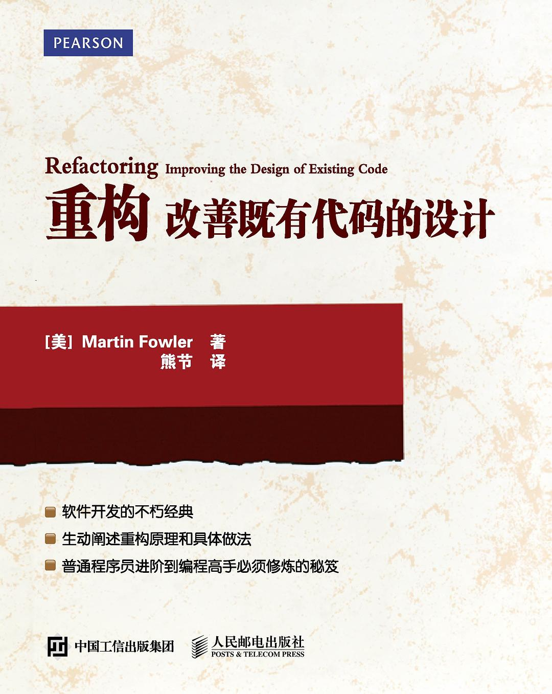

# 重构

>豆瓣：[重构](https://book.douban.com/subject/26575459/) \\ [重构(第2版)](https://book.douban.com/subject/30468597/)
>
>百度云：https://pan.baidu.com/s/1nM96h3xXu1d-OrWk2FnU8A

## 目录 & 进度

- [ ] 第1章　重构，第一个案例
- [ ] 第2章重构原则
- [ ] 第3章 代码的坏味道
- [ ] 第4章 构筑测试体系
- [ ] 第5章 重构列表
- [ ] 第6章 重新组织函数
- [ ] 第7章 在对象之间搬移特性
- [ ] 第8章 重新组织数据
- [ ] 第9章 简化条件表达式
- [ ] 第10章 简化函数调用
- [ ] 第11章 处理概括关系
- [ ] 第12章 大型重构
- [ ] 第13章 重构，复用与现实
- [ ] 第14章 重构工具
- [ ] 第15章 总结

## 读后感

暂无