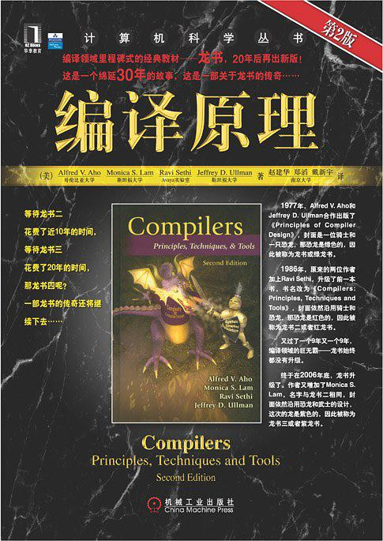

## 编译原理

> 补充**编译**方面知识，参考自书籍[《编译原理》](https://book.douban.com/subject/3296317/)。
>
> 下载链接：<http://readfree.me/book/3296317/>

 

## 目录 & 进度

- [ ] 第1章 引论
- [ ] 第2章 一个简单的语法制导翻译器
- [ ] 第3章 词法分析
- [ ] 第4章 语法分析
- [ ] 第5章 语法制导的翻译
- [ ] ...