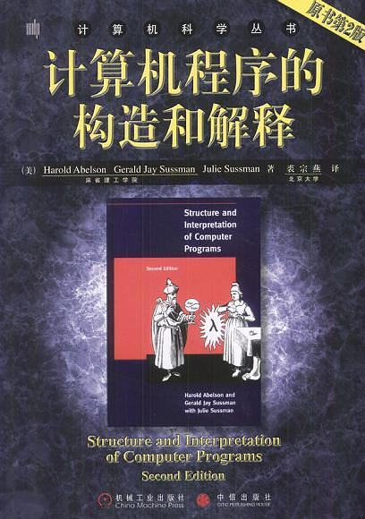

# 计算机程序的构造和解释（SICP）

> 书籍[《计算机程序的构造和解释》](<https://book.douban.com/subject/1148282/)，“后悔没早读”系列（早读也不一定看得懂啊😂）。
>
> 下载链接：<http://readfree.me/book/1148282/>

## 目录 & 进度

- [ ] 第1章 构造过程抽象
- [ ] 第2章 构造数据抽象
- [ ] 第3章 模块化、对象和状态
- [ ] 第4章 元语言抽象
- [ ] 第5章 寄存机器里的运算

## 读后感

暂无