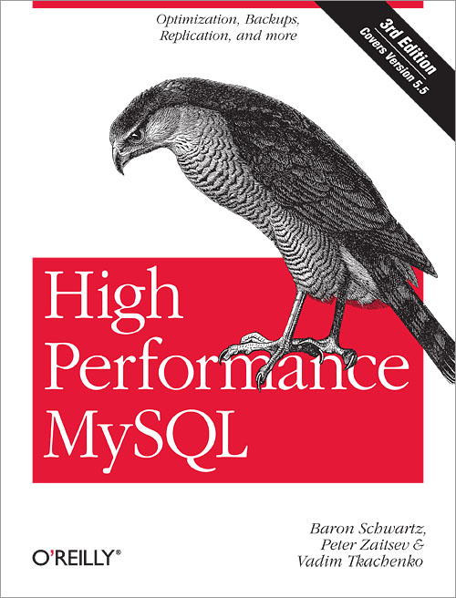

## High Performance MySQL

> 记录学习**MySQL数据库优化**的历程，参考自书籍[《High Performance MySQL,3rd （高性能MySQL，第三版）》](https://book.douban.com/subject/23008813/)。
>
> 下载链接：<http://readfree.me/book/23008813/>

 

## 目录

+ [第01章-MySQL架构与历史](第01章-MySQL架构与历史.md)
+ [第02章-MySQL基准测试](第02章-MySQL基准测试.md)
+ [第03章-服务器性能剖析](第03章-服务器性能剖析.md)
+ [第04章-Schema与数据类型优化](第04章-Schema与数据类型优化.md)
+ [第05章-创建高性能的索引](第05章-创建高性能的索引.md)
+ [第06章-查询性能优化.md](第06章-查询性能优化.md)
+ [第07章-MySQL高级特性](第07章-MySQL高级特性.md)
+ [第08章-优化服务器设置](第08章-优化服务器设置.md)
+ [第09章-操作系统和硬件优化](第09章-操作系统和硬件优化.md)
+ [第10章-复制](第10章-复制.md)
+ [第11章-可扩展的MySQL](第11章-可扩展的MySQL.md)
+ [第12章-高可用性](第12章-高可用性.md)
+ [第13章-云端的MySQL](第13章-云端的MySQL.md)
+ [第14章-应用层优化](第14章-应用层优化.md)
+ [第15章-备份与恢复](第15章-备份与恢复.md)
+ [第16章-MySQL用户工具](第16章-MySQL用户工具.md)
+ [附录A-MySQL分支与变种](附录A-MySQL分支与变种.md)
+ [附录B-MySQL服务器状态](附录B-MySQL服务器状态.md)
+ [附录C-大文件传输](附录C-大文件传输.md)
+ [附录D-EXPLAIN](附录D-EXPLAIN.md)
+ [附录E-锁的调试](附录E-锁的调试.md)
+ [附录F-在MySQL上使用Sphinx](附录F-在MySQL上使用Sphinx.md)

