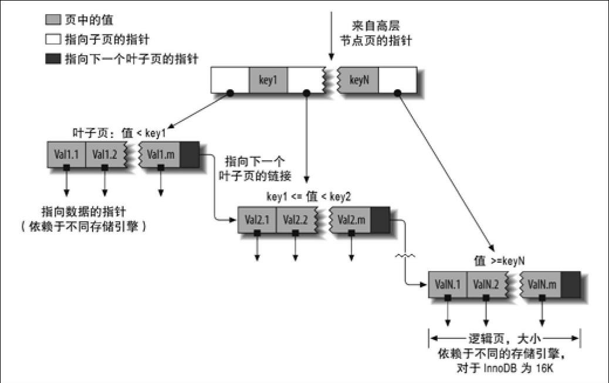

### 5.1 索引基础

在MySQL中，存储引擎先在索引中找到对应值，然后根据匹配的索引记录找到对应的数据行。

索引可以包含一个或多个列的值。如果索引包含多个列，那么列的顺序也十分重要，因为MySQL只能高效地使用索引的最左前缀列。创建一个包含两个列的索引，和创建两个只包含一列的索引是大不相同的。

#### 5.1.1 索引的类型

MySQL中，索引是在存储引擎层而不是服务器层实现的。所以，并没有统一的索引标准：不同存储引擎的索引的工作方式并不一样，也不是所有的存储引擎都支持所有类型的索引。

**B-Tree索引**

B-Tree索引使用B-Tree数据结构来存储数据，大多数MySQL引擎都支持这种索引。

存储引擎以不同的方式使用B-Tree索引，性能也各有不同，各有优劣。例如，MyISAM使用前缀压缩技术使得索引更小，但InnoDB则按照原数据格式进行存储。再如MyISAM索引通过数据的物理位置引用被索引的行，而InnoDB则根据主键引用被索引的行。

B-Tree通常意味着所有的值都是按顺序存储的，并且每一个叶子页到根的距离相同。如图是InnoDB建立在B-Tree结构（从技术上来说是B+Tree）上的索引的抽象表示：

B-Tree索引能够加快访问数据的速度，因为存储引擎不再需要进行全表扫描来获取需要的数据，取而代之的是从索引的根节点开始进行搜索。根节点的槽中存放了指向子节点的指针，存储引擎根据这些指针向下层查找。通过比较节点页的值和要查找的值可以找到合适的指针进入下层子节点，这些指针实际上定义了子节点页中值的上限和下限。最终存储引擎要么是找到对应的值，要么该记录不存在。

叶子节点比较特别，它们的指针指向的是被索引的数据，而不是其他的节点页（不同引擎的“指针”类型不同）。

### 5.2 索引的优点

索引有如下三个优点：

+ 索引大大减少了服务器需要扫描的数据量。
+ 索引可以帮助服务器避免排序和临时表。
+ 索引可以将随机I/O变为顺序I/O。

### 5.3 高性能的索引策略

#### 5.3.3 多列索引

索引合并策略有时候是一种优化的结果，但实际上更多时候说明了表上的索引建得很糟糕：

+ 当出现服务器对多个索引做相交操作时（通常有多个AND条件），通常意味着需要一个包含所有相关列的多列索引，而不是多个独立的单列索引。
+ 当服务器需要对多个索引做联合操作时（通常有多个OR条件），通常需要耗费大量CPU和内存资源在算法的缓存、排序和合并操作上。特别是当其中有些索引的选择性不高，需要合并扫描返回的大量数据的时候。
+ 更重要的是，优化器不会把这些计算到“查询成本”（cost）中，优化器只关心随机页面读取。这会使得查询的成本被“低估”，导致该执行计划还不如直接走全表扫描。这样做不但会消耗更多的CPU和内存资源，还可能会影响查询的并发性，但如果是单独运行这样的查询则往往会忽略对并发性的影响。通常来说，还不如像在MySQL 4.1或者更早的时代一样，将查询改写成UNION的方式往往更好。

#### 5.3.4 选择合适的索引列顺序

