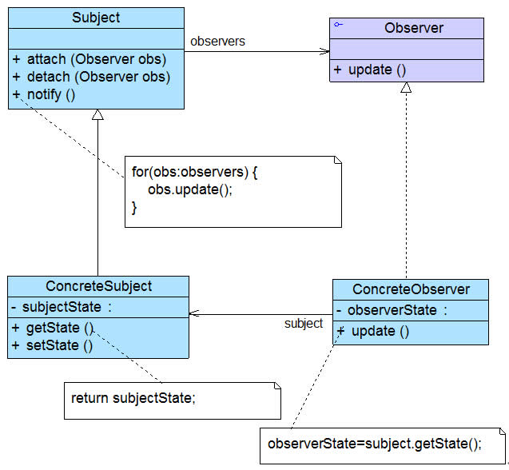
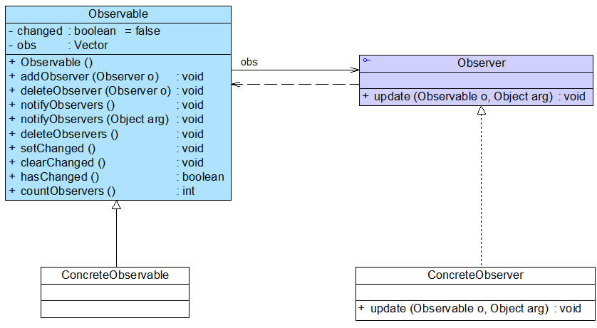
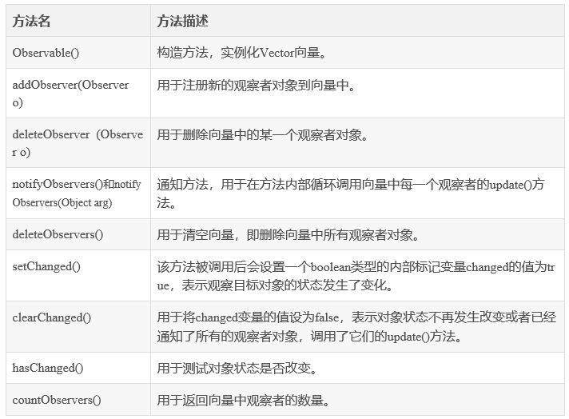
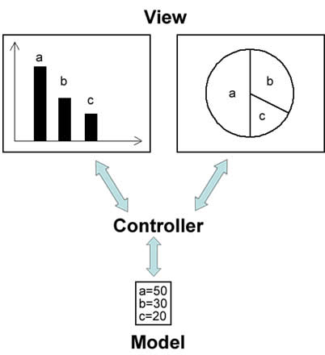

### # 观察者模式概述

(1) 观察者模式是使用频率最高的设计模式之一，它用于建立一种对象与对象之间的依赖关系，一个对象发生改变时将自动通知其他对象，其他对象将相应作出反应。在观察者模式中，发生改变的对象称为观察目标，而被通知的对象称为观察者，一个观察目标可以对应多个观察者，而且这些观察者之间可以没有任何相互联系，可以根据需要增加和删除观察者，使得系统更易于扩展。

(2) **观察者模式(Observer Pattern)定义：**定义对象之间的一种一对多依赖关系，使得每当一个对象状态发生改变时，其相关依赖对象皆得到通知并被自动更新。观察者模式的别名包括发布-订阅（Publish/Subscribe）模式、模型-视图（Model/View）模式、源-监听器（Source/Listener）模式或从属者（Dependents）模式。观察者模式是一种对象行为型模式。

(3) 观察者模式结构中通常包括观察目标和观察者两个继承层次结构，其结构如图所示：



在观察者模式结构图中包含如下几个角色：

+ Subject（目标）：目标又称为主题，它是指被观察的对象。在目标中定义了一个观察者集合，一个观察目标可以接受任意数量的观察者来观察，它提供一系列方法来增加和删除观察者对象，同时它定义了通知方法notify()。目标类可以是接口，也可以是抽象类或具体类。
+ ConcreteSubject（具体目标）：具体目标是目标类的子类，通常它包含有经常发生改变的数据，当它的状态发生改变时，向它的各个观察者发出通知；同时它还实现了在目标类中定义的抽象业务逻辑方法（如果有的话）。如果无须扩展目标类，则具体目标类可以省略。
+ Observer（观察者）：观察者将对观察目标的改变做出反应，观察者一般定义为接口，该接口声明了更新数据的方法update()，因此又称为抽象观察者。
+ ConcreteObserver（具体观察者）：在具体观察者中维护一个指向具体目标对象的引用，它存储具体观察者的有关状态，这些状态需要和具体目标的状态保持一致；它实现了在抽象观察者Observer中定义的update()方法。通常在实现时，可以调用具体目标类的attach()方法将自己添加到目标类的集合中或通过detach()方法将自己从目标类的集合中删除。

(4) **观察者模式描述了如何建立对象与对象之间的依赖关系，以及如何构造满足这种需求的系统。**观察者模式包含观察目标和观察者两类对象，一个目标可以有任意数目的与之相依赖的观察者，一旦观察目标的状态发生改变，所有的观察者都将得到通知。作为对这个通知的响应，每个观察者都将监视观察目标的状态以使其状态与目标状态同步，这种交互也称为发布-订阅(Publish-Subscribe)。观察目标是通知的发布者，它发出通知时并不需要知道谁是它的观察者，可以有任意数目的观察者订阅它并接收通知。

(5) 下面通过示意代码来对该模式进行进一步分析。首先我们定义一个抽象目标Subject，典型代码如下所示：

```java
import java.util.*;
abstract class Subject {
    //定义一个观察者集合用于存储所有观察者对象
    protected ArrayList observers<Observer> = new ArrayList();

    //注册方法，用于向观察者集合中增加一个观察者
    public void attach(Observer observer) {
        observers.add(observer);
    }

    //注销方法，用于在观察者集合中删除一个观察者
    public void detach(Observer observer) {
        observers.remove(observer);
    }

    //声明抽象通知方法
    public abstract void notify();
}
```

具体目标类ConcreteSubject是实现了抽象目标类Subject的一个具体子类，其典型代码如下所示：  

```java
class ConcreteSubject extends Subject {
    //实现通知方法
    public void notify() {
        //遍历观察者集合，调用每一个观察者的响应方法
        for(Object obs:observers) {
            ((Observer)obs).update();
        }
    }	
}
```

抽象观察者角色一般定义为一个接口，通常只声明一个update()方法，为不同观察者的更新（响应）行为定义相同的接口，这个方法在其子类中实现，不同的观察者具有不同的响应方法。抽象观察者Observer典型代码如下所示：  

```java
interface Observer {
    //声明响应方法
    public void update();
}
```

在具体观察者ConcreteObserver中实现了update()方法，其典型代码如下所示：  

```java
class ConcreteObserver implements Observer {
    //实现响应方法
    public void update() {
        //具体响应代码
    }
}
```

在有些更加复杂的情况下，**具体观察者类ConcreteObserver的update()方法在执行时需要使用到具体目标类ConcreteSubject中的状态（属性）**，因此在ConcreteObserver与ConcreteSubject之间有时候还存在关联或依赖关系，在ConcreteObserver中定义一个ConcreteSubject实例，通过该实例获取存储在ConcreteSubject中的状态。如果ConcreteObserver的update()方法不需要使用到ConcreteSubject中的状态属性，则可以对观察者模式的标准结构进行简化，在具体观察者ConcreteObserver和具体目标ConcreteSubject之间无须维持对象引用。如果在具体层具有关联关系，系统的扩展性将受到一定的影响，增加新的具体目标类有时候需要修改原有观察者的代码，在一定程度上违反了“开闭原则”，但是如果原有观察者类无须关联新增的具体目标，则系统扩展性不受影响。

### # JDK对观察者模式的支持

观察者模式在Java语言中的地位非常重要。在JDK的java.util包中，提供了Observable类以及Observer接口，它们构成了JDK对观察者模式的支持。如图所示：



**(1)  Observer接口**

在java.util.Observer接口中只声明一个方法，它充当抽象观察者，其方法声明代码如下所示：

```java
void  update(Observable o, Object arg);
```

当观察目标的状态发生变化时，该方法将会被调用，在Observer的子类中将实现update()方法，即具体观察者可以根据需要具有不同的更新行为。当调用观察目标类Observable的notifyObservers()方法时，将执行观察者类中的update()方法。

**(2)  Observable类**

java.util.Observable类充当观察目标类，在Observable中定义了一个向量Vector来存储观察者对象，它所包含的方法及说明见表：



我们**可以直接使用Observer接口和Observable类来作为观察者模式的抽象层，再自定义具体观察者类和具体观察目标类**，通过使用JDK中的Observer接口和Observable类，可以更加方便地在Java语言中应用观察者模式。

### # 观察者模式与Java事件处理

JDK 1.0及更早版本的事件模型基于职责链模式，但是这种模型不适用于复杂的系统，因此在JDK 1.1及以后的各个版本中，事件处理模型采用**基于观察者模式的委派事件模型(DelegationEvent Model, DEM)****，即一个****J****a****va组件所引发的事件并不由引发事件的对象自己来负责处理，而是委派给独立的事件处理对象负责。**

在DEM模型中，目标角色（如界面组件）负责发布事件，而观察者角色（事件处理者）可以向目标订阅它所感兴趣的事件。当一个具体目标产生一个事件时，它将通知所有订阅者。事件的发布者称为**事件源(Event Source)**，而订阅者称为**事件监听器(Event Listener)**，在这个过程中还可以通过**事件对象(Event Object)**来传递与事件相关的信息，可以在事件监听者的实现类中实现事件处理，因此事件监听对象又可以称为事件处理对象。**事件源对象、事件监听对象（事件处理对象）和事件对象**构成了**Java事件处理模型的三要素**。事件源对象充当观察目标，而事件监听对象充当观察者。以按钮点击事件为例，其事件处理流程如下：

(1) 如果用户在GUI中单击一个按钮，将触发一个事件（如ActionEvent类型的动作事件），JVM将产生一个相应的ActionEvent类型的事件对象，在该事件对象中包含了有关事件和事件源的信息，此时按钮是事件源对象；

(2) 将ActionEvent事件对象传递给事件监听对象（事件处理对象），JDK提供了专门用于处理ActionEvent事件的接口ActionListener，开发人员需提供一个ActionListener的实现类（如MyActionHandler），实现在ActionListener接口中声明的抽象事件处理方法actionPerformed()，对所发生事件做出相应的处理；

(3) 开发人员将ActionListener接口的实现类（如MyActionHandler）对象注册到按钮中，可以通过按钮类的addActionListener()方法来实现注册；

(4) JVM在触发事件时将调用按钮的fireXXX()方法，在该方法内部将调用注册到按钮中的事件处理对象的actionPerformed()方法，实现对事件的处理。

使用类似的方法，我们可自定义GUI组件，如包含两个文本框和两个按钮的登录组件LoginBean，可以采用如图所示设计方案：


图中相关类说明如下：

(1) **LoginEvent是事件类**，它用于封装与事件有关的信息，它不是观察者模式的一部分，但是它可以在目标对象和观察者对象之间传递数据，在AWT事件模型中，所有的自定义事件类都是java.util.EventObject的子类。

(2) **LoginEventListener充当抽象观察者**，它声明了事件响应方法validateLogin()，用于处理事件，该方法也称为事件处理方法，validateLogin()方法将一个LoginEvent类型的事件对象作为参数，用于传输与事件相关的数据，在其子类中实现该方法，实现具体的事件处理。

(3) **LoginBean充当具体目标类**，在这里我们没有定义抽象目标类，对观察者模式进行了一定的简化。在LoginBean中定义了抽象观察者LoginEventListener类型的对象lel和事件对象LoginEvent，提供了注册方法addLoginEventListener()用于添加观察者**，在Java事件处理中，通常使用的是一对一的观察者模式，而不是一对多的观察者模式**，也就是说，一个观察目标中只定义一个观察者对象，而不是提供一个观察者对象的集合。在LoginBean中还定义了通知方法fireLoginEvent()，该方法在Java事件处理模型中称为“点火方法”，在该方法内部实例化了一个事件对象LoginEvent，将用户输入的信息传给观察者对象，并且调用了观察者对象的响应方法validateLogin()。

(4) **LoginValidatorA和LoginValidatorB充当具体观察者类**，它们实现了在LoginEventListener接口中声明的抽象方法validateLogin()，用于具体实现事件处理，该方法包含一个LoginEvent类型的参数，在LoginValidatorA和LoginValidatorB类中可以针对相同的事件提供不同的实现。

### # 观察者模式与MVC

在当前流行的**MVC(Model-View-Controller)**架构中也应用了观察者模式，MVC是一种架构模式，它包含三个角色：模型(Model)，视图(View)和控制器(Controller)。其中模型可对应于观察者模式中的观察目标，而视图对应于观察者，控制器可充当两者之间的中介者。当模型层的数据发生改变时，视图层将自动改变其显示内容。如图所示：



在图中，**模型层提供的数据是视图层所观察的对象**，在视图层中包含两个用于显示数据的图表对象，一个是柱状图，一个是饼状图，相同的数据拥有不同的图表显示方式，如果模型层的数据发生改变，两个图表对象将随之发生变化，这意味着图表对象依赖模型层提供的数据对象，因此数据对象的任何状态改变都应立即通知它们。同时，这两个图表之间相互独立，不存在任何联系，而且图表对象的个数没有任何限制，用户可以根据需要再增加新的图表对象，如折线图。在增加新的图表对象时，无须修改原有类库，满足“开闭原则”。

**备注：与普通观察者模式不一样的是这里通常注册的是Controller，由Controller通知对应的View产生响应。**

### # 观察者模式总结

观察者模式是一种使用频率非常高的设计模式，无论是移动应用、Web应用或者桌面应用，观察者模式几乎无处不在，它为实现对象之间的联动提供了一套完整的解决方案，凡是涉及到一对一或者一对多的对象交互场景都可以使用观察者模式。观察者模式广泛应用于各种编程语言的GUI事件处理的实现，在基于事件的XML解析技术（如SAX2）以及Web事件处理中也都使用了观察者模式。

#### 1.主要优点 

(1) 观察者模式可以实现表示层和数据逻辑层的分离，定义了稳定的消息更新传递机制，并抽象了更新接口，使得可以有各种各样不同的表示层充当具体观察者角色。

(2) 观察者模式在观察目标和观察者之间建立一个抽象的耦合。观察目标只需要维持一个抽象观察者的集合，无须了解其具体观察者。由于观察目标和观察者没有紧密地耦合在一起，因此它们可以属于不同的抽象化层次。

(3) 观察者模式支持广播通信，观察目标会向所有已注册的观察者对象发送通知，简化了一对多系统设计的难度。

(4) 观察者模式满足“开闭原则”的要求，增加新的具体观察者无须修改原有系统代码，在具体观察者与观察目标之间不存在关联关系的情况下，增加新的观察目标也很方便。

#### 2.主要缺点 

(1) 如果一个观察目标对象有很多直接和间接观察者，将所有的观察者都通知到会花费很多时间。

(2) 如果在观察者和观察目标之间存在循环依赖，观察目标会触发它们之间进行循环调用，可能导致系统崩溃。

(3) 观察者模式没有相应的机制让观察者知道所观察的目标对象是怎么发生变化的，而仅仅只是知道观察目标发生了变化。

#### 3.适用场景 

(1) 一个抽象模型有两个方面，其中一个方面依赖于另一个方面，将这两个方面封装在独立的对象中使它们可以各自独立地改变和复用。

(2) 一个对象的改变将导致一个或多个其他对象也发生改变，而并不知道具体有多少对象将发生改变，也不知道这些对象是谁。

(3) 需要在系统中创建一个触发链，A对象的行为将影响B对象，B对象的行为将影响C对象……，可以使用观察者模式创建一种链式触发机制。

 