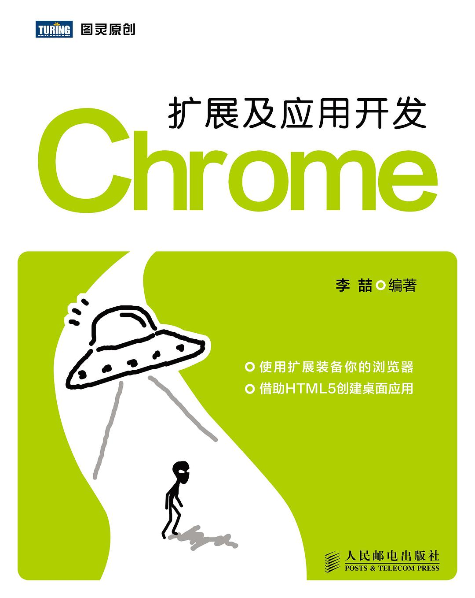

# Chrome 扩展及应用开发

> 参考书籍[《Chrome 扩展及应用开发》](https://book.douban.com/subject/27086821/)，继续学习Java虚拟机方面知识。
>
> 下载链接：<http://www.ituring.com.cn/book/1421>

## 目录 & 进度

- [x] 第1章 初步接触Chrome扩展及应用开发
- [x] 第2章 Chrome扩展基础
- [x] 第3章 Chrome扩展的UI界面
- [x] 第4章 管理你的浏览器
- [x] 第5章 部分高级API
- [x] 第6章 Chrome应用基础
- [ ] 第7章 文件系统
- [ ] 第8章 媒体库
- [ ] 第9章 网络通信
- [ ] 第10章 其他接口