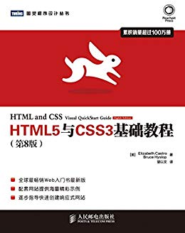

# HTML5 与 CSS3 基础教程

> 参考书籍[《HTML5 与 CSS3 基础教程》](https://book.douban.com/subject/25878992/)，补一补前端的基础，往全干工程师发展！😂
>
> 下载链接：<https://readfree.me/book/25878992/>

## 目录 & 进度

- [x] 第1章 网页的构造块
- [x] 第2章 处理网页文件
- [x] 第3章 基本HTML结构
- [ ] 第4章 文本
- [ ] 第5章 图像
- [ ] 第6章 链接
- [ ] 第7章 CSS构造块
- [ ] 第8章 操作样式表
- [ ] 第9章 定义选择器
- [ ] 第10章 为文本添加样式
- [ ] 第11章 用CSS布局
- [ ] 第12章 构建响应式网站
- [ ] 第13章 使用Web字体
- [ ] 第14章 使用CSS3进行增强
- [ ] 第15章 列表
- [ ] 第16章 表单
- [ ] 第17章 视频、音频和其他多媒体
- [ ] 第18章 表格
- [ ] 第19章 添加JavaScript
- [ ] 第20章 测试和调试网页
- [ ] 第21章 发布网站
- [ ] 附录A HTML参考
- [ ] 附录B CSS引用