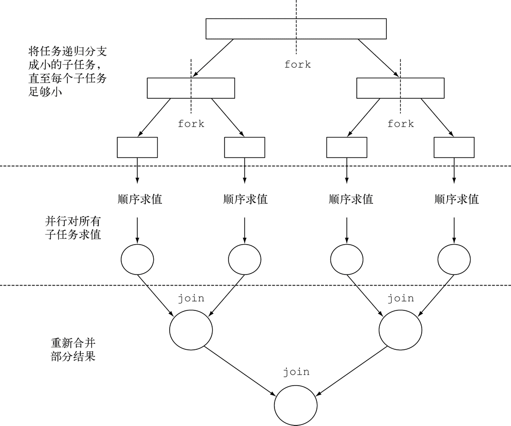
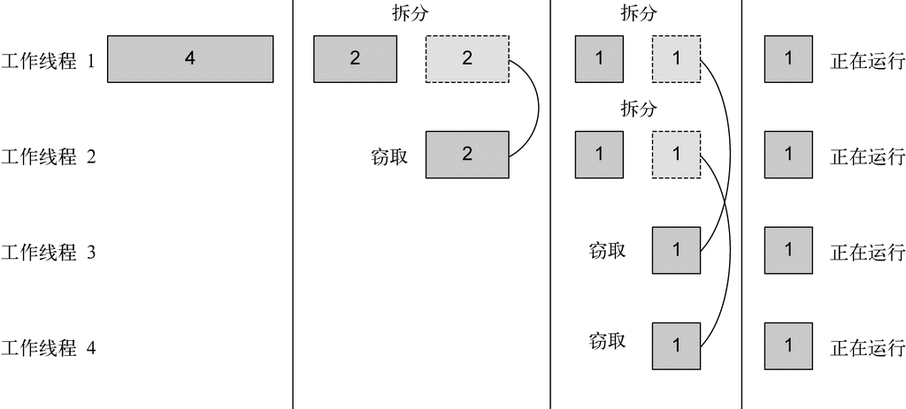
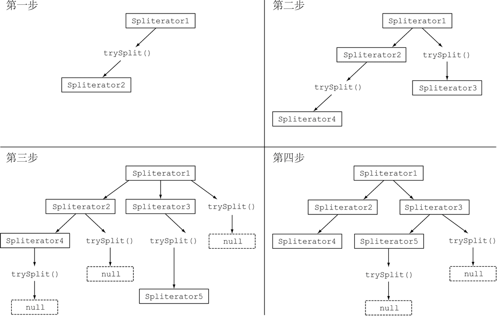

### 7.1 并行流

Stream接口可以让你非常方便地处理它的元素：可以通过对收集源调用parallelStream方法来把集合转换为并行流。**并行流**就是一个把内容分成多个数据块，并用不同的线程分别处理每个数据块的流。

#### 7.1.1 将顺序流装换为并行流

在现实中，对顺序流调用parallel方法并不意味着流本身有任何实际的变化。它在内部实际上就是设了一个boolean标志，表示你想让调用parallel之后进行的所有操作都并行执行。类似地，你只需要对并行流调用sequential方法就可以把它变成顺序流。请注意，你可能以为把这两个方法结合起来，就可以更细化地控制在遍历流时哪些操作要并行执行，哪些要顺序执行。例如，你可以这样做：

```java
stream.parallel()
    .filter(...)
    .sequential()
    .map(...)
    .parallel()
    .reduce();
```

最后一次parallel或sequential调用会影响整个流水线。在本例中，流水线会并行执行，因为最后调用的是它。

**配置并行流使用的线程池**

并行流内部使用了默认的ForkJoinPool，它默认的线程数量就是当前的处理器数量，这个值是由Runtime.getRuntime().availableProcessors()得到的。

可以通过系统属性java.util.concurrent.ForkJoinPool.common. parallelism来改变线程池大小，如下所示：

```java
System.setProperty("java.util.concurrent.ForkJoinPool.common.parallelism","12");
```

这是一个全局设置，因此它将影响代码中所有的并行流。反过来说，目前还无法专为某个并行流指定这个值。一般而言，让ForkJoinPool的大小等于处理器数量是个不错的默认值。

#### 7.1.2 测试流性能

并行编程可能很复杂，有时候甚至有点违反直觉。如果用得不对（比如采用了一个不易并行化的操作，如iterate），它甚至可能让程序的整体性能更差，所以在调用那个看似神奇的parallel操作时，了解背后到底发生了什么是很有必要的。

**使用更有针对性的方法**

并行化并不是没有代价的。并行化过程本身需要对流做递归划分，把每个子流的归纳操作分配到不同的线程，然后把这些操作的结果合并成一个值。但在多个内核之间移动数据的代价也可能比你想的要大，所以很重要的一点是要保证在内核中并行执行工作的时间比在内核之间传输数据的时间长。总而言之，很多情况下不可能或不方便并行化。然而，在使用并行Stream加速代码之前，你必须确保用得对；如果结果错了，算得快就毫无意义了。

#### 7.1.3 正确使用并行流

共享可变状态会影响并行流以及并行计算，要避免共享可变状态，确保并行Stream得到正确的结果。

#### 7.1.4 高效使用并行流

一般而言，想给出任何关于什么时候该用并行流的定量建议都是不可能也毫无意义的，因为任何类似于“仅当至少有一千个（或一百万个或随便什么数字）元素的时候才用并行流）”的建议对于某台特定机器上的某个特定操作可能是对的，但在略有差异的另一种情况下可能就是大错特错。尽管如此，我们至少可以提出一些定性意见，帮你决定某个特定情况下是否有必要使用并行流。

(1) 如果有疑问，那就进行测量。把顺序流转成并行流轻而易举，但却不一定是好事，并行流并不总是比顺序流快。此外，并行流有时候会和你的直觉不一致，所以在考虑选择顺序流还是并行流时，第一个也是最重要的建议就是用适当的基准来检查其性能。

(2) 留意装箱。自动装箱和拆箱操作会大大降低性能。Java 8中有原始类型流（IntStream、LongStream、DoubleStream）来避免这种操作，但凡有可能都应该用这些流。 

(3) 有些操作本身在并行流上的性能就比顺序流差。特别是limit和findFirst等依赖于元素顺序的操作，它们在并行流上执行的代价非常大。例如，findAny会比findFirst性能好，因为它不一定要按顺序来执行。你总是可以调用unordered方法来把有序流变成无序流。那么，如果你需要流中的n 个元素而不是专门要前n 个的话，对无序并行流调用limit可能会比单个有序流（比如数据源是一个List）更高效。

(4) 还要考虑流的操作流水线的总计算成本。设 N 是要处理的元素的总数，Q 是一个元素通过流水线的大致处理成本，则 N*Q 就是这个对成本的一个粗略的定性估计。Q 值较高就意味着使用并行流时性能好的可能性比较大。

(5) 对于较小的数据量，选择并行流几乎从来都不是一个好的决定。并行处理少数几个元素的好处还抵不上并行化造成的额外开销。

(6) 要考虑流背后的数据结构是否易于分解。例如，ArrayList的拆分效率比LinkedList高得多，因为前者用不着遍历就可以平均拆分，而后者则必须遍历。另外，用range工厂方法创建的原始类型流也可以快速分解。

(7) 流自身的特点，以及流水线中的中间操作修改流的方式，都可能会改变分解过程的性能。例如，一个SIZED流可以分成大小相等的两部分，这样每个部分都可以比较高效地并行处理，但筛选操作可能丢弃的元素个数却无法预测，导致流本身的大小未知。

(8) 还要考虑终端操作中合并步骤的代价是大是小（例如Collector中的combiner方法）。如果这一步代价很大，那么组合每个子流产生的部分结果所付出的代价就可能会超出通过并行流得到的性能提升。

**流的数据源和可分解性**

| 源                | 可分解性 |
| ----------------- | -------- |
| `ArrayList`       | 极佳     |
| `LinkedList`      | 差       |
| `IntStream.range` | 极佳     |
| `Stream.iterate`  | 差       |
| `HashSet`         | 好       |
| `TreeSet`         | 好       |

### 7.2 分支合并框架

分支/合并框架的目的是以递归方式将可以并行的任务拆分成更小的任务，然后将每个子任务的结果合并起来生成整体结果。它是ExecutorService接口的一个实现，它把子任务分配给线程池（称为ForkJoinPool）中的工作线程。

#### 7.2.1 使用RecursiveTask

要把任务提交到这个池，必须创建RecursiveTask<R>的一个子类，其中R是并行化任务（以及所有子任务）产生的结果类型，或者如果任务不返回结果，则是RecursiveAction类型（当然它可能会更新其他非局部机构）。要定义RecursiveTask，只需实现它唯一的抽象方法compute：

```java
protected abstract R compute();
```

这个方法同时定义了将任务拆分成子任务的逻辑，以及无法再拆分或不方便再拆分时，生成单个子任务结果的逻辑。正由于此，这个方法的实现类似于下面的伪代码： 

```java
if (任务足够小或不可分) {
    顺序计算该任务
} else {
    将任务分成两个子任务
    递归调用本方法，拆分每个子任务，等待所有子任务完成
    合并每个子任务的结果
}
```



```java
// 用分支/合并框架并行求和
public class ForkJoinSumCalculator
             extends java.util.concurrent.RecursiveTask<Long> {    ←─继承RecursiveTask来创建可以用于分支/合并框架的任务

    private final long[] numbers;    ←─要求和的数组
    private final int start;    ←─子任务处理的数组的起始和终止位置
    private final int end;

    public static final long THRESHOLD = 10_000;    ←─不再将任务分解为子任务的数组大小

    public ForkJoinSumCalculator(long[] numbers) {    ←─公共构造函数用于创建主任务
        this(numbers, 0, numbers.length);
    }

    private ForkJoinSumCalculator(long[] numbers, int start, int end) {    ←─私有构造函数用于以递归方式为主任务创建子任务
        this.numbers = numbers;
        this.start = start;
        this.end = end;
    }

    @Override
    protected Long compute() {    ←─覆盖RecursiveTask抽象方法
        int length = end - start;    ←─该任务负责求和的部分的大小
        if (length <= THRESHOLD) {
            return computeSequentially();    ←─如果大小小于或等于阈值，顺序计算结果
        }
        ForkJoinSumCalculator leftTask =
            new ForkJoinSumCalculator(numbers, start, start + length/2);    ←─创建一个子任务来为数组的前一半求和
        leftTask.fork();    ←─利用另一个ForkJoinPool线程异步执行新创建的子任务
        ForkJoinSumCalculator rightTask =
            new ForkJoinSumCalculator(numbers, start + length/2, end);    ←─创建一个任务为数组的后一半求和
        Long rightResult = rightTask.compute();    ←─同步执行第二个子任务，有可能允许进一步递归划分
        Long leftResult = leftTask.join();    ←─读取第一个子任务的结果，如果尚未完成就等待
        return leftResult + rightResult;    ←─该任务的结果是两个子任务结果的组合
    }

    private long computeSequentially() {    ←─在子任务不再可分时计算结果的简单算法
        long sum = 0;
        for (int i = start; i < end; i++) {{
            sum += numbers[i];
        }
        return sum;
    }
                                        
    public static long forkJoinSum(long n) {
        long[] numbers = LongStream.rangeClosed(1, n).toArray();
        ForkJoinTask<Long> task = new ForkJoinSumCalculator(numbers);
        return new ForkJoinPool().invoke(task);
    }
}
                                                               
public class ParallelStreamsHarness {

    public static final ForkJoinPool FORK_JOIN_POOL = new ForkJoinPool();

    public static void main(String[] args) {
        System.out.println("Iterative Sum done in: " + measurePerf(ParallelStreams::iterativeSum, 10_000_000L) + " msecs");
        System.out.println("Sequential Sum done in: " + measurePerf(ParallelStreams::sequentialSum, 10_000_000L) + " msecs");
        System.out.println("Parallel forkJoinSum done in: " + measurePerf(ParallelStreams::parallelSum, 10_000_000L) + " msecs");
        System.out.println("Range forkJoinSum done in: " + measurePerf(ParallelStreams::rangedSum, 10_000_000L) + " msecs");
        System.out.println("Parallel range forkJoinSum done in: " + measurePerf(ParallelStreams::parallelRangedSum, 10_000_000L) + " msecs");
        System.out.println("ForkJoin sum done in: " + measurePerf(ForkJoinSumCalculator::forkJoinSum, 10_000_000L) + " msecs");
        System.out.println("SideEffect sum done in: " + measurePerf(ParallelStreams::sideEffectSum, 10_000_000L) + " msecs");
        System.out.println("SideEffect prallel sum done in: " + measurePerf(ParallelStreams::sideEffectParallelSum, 10_000_000L) + " msecs");
    }

    public static <T, R> long measurePerf(Function<T, R> f, T input) {
        long fastest = Long.MAX_VALUE;
        for (int i = 0; i < 10; i++) {
            long start = System.nanoTime();
            R result = f.apply(input);
            long duration = (System.nanoTime() - start) / 1_000_000;
            System.out.println("Result: " + result);
            if (duration < fastest) fastest = duration;
        }
        return fastest;
    }
}
```

请注意在实际应用时，使用多个ForkJoinPool是没有什么意义的。正是出于这个原因，一般来说把它实例化一次，然后把实例保存在静态字段中，使之成为单例，这样就可以在软件中任何部分方便地重用了。这里创建时用了其默认的无参数构造函数，这意味着想让线程池使用JVM能够使用的所有处理器。更确切地说，该构造函数将使用Runtime.availableProcessors的返回值来决定线程池使用的线程数。请注意availableProcessors方法虽然看起来是处理器，但它实际上返回的是可用内核的数量，包括超线程生成的虚拟内核。

#### 7.2.2 使用分支/合并框架的最佳做法

虽然分支/合并框架还算简单易用，不幸的是它也很容易被误用。以下是几个有效使用它的最佳做法：

(1) 对一个任务调用join方法会阻塞调用方，直到该任务做出结果。因此，有必要在两个子任务的计算都开始之后再调用它。否则，你得到的版本会比原始的顺序算法更慢更复杂，因为每个子任务都必须等待另一个子任务完成才能启动。

(2) 不应该在RecursiveTask内部使用ForkJoinPool的invoke方法。相反，你应该始终直接调用compute或fork方法，只有顺序代码才应该用invoke来启动并行计算。

(3) 对子任务调用fork方法可以把它排进ForkJoinPool。同时对左边和右边的子任务调用它似乎很自然，但这样做的效率要比直接对其中一个调用compute低。这样做你可以为其中一个子任务重用同一线程，从而避免在线程池中多分配一个任务造成的开销。

(4) 调试使用分支/合并框架的并行计算可能有点棘手。特别是你平常都在你喜欢的IDE里面看栈跟踪（stack trace）来找问题，但放在分支-合并计算上就不行了，因为调用compute的线程并不是概念上的调用方，后者是调用fork的那个。

(5) 和并行流一样，你不应理所当然地认为在多核处理器上使用分支/合并框架就比顺序计算快。我们已经说过，一个任务可以分解成多个独立的子任务，才能让性能在并行化时有所提升。所有这些子任务的运行时间都应该比分出新任务所花的时间长；一个惯用方法是把输入/输出放在一个子任务里，计算放在另一个里，这样计算就可以和输入/输出同时进行。此外，在比较同一算法的顺序和并行版本的性能时还有别的因素要考虑。就像任何其他Java代码一样，分支/合并框架需要“预热”或者说要执行几遍才会被JIT编译器优化。这就是为什么在测量性能之前跑几遍程序很重要，我们的测试框架就是这么做的。同时还要知道，编译器内置的优化可能会为顺序版本带来一些优势（例如执行死码分析——删去从未被使用的计算）。

(6) 对于分支/合并拆分策略还有最后一点补充：你必须选择一个标准，来决定任务是要进一步拆分还是已小到可以顺序求值。

#### 7.2.3 工作窃取

分支/合并框架工程用一种称为工作窃取（work stealing）的技术来解决任务划分问题。在实际应用中，这意味着这些任务差不多被平均分配到ForkJoinPool中的所有线程上。每个线程都为分配给它的任务保存一个双向链式队列，每完成一个任务，就会从队列头上取出下一个任务开始执行。基于前面所述的原因，某个线程可能早早完成了分配给它的所有任务，也就是它的队列已经空了，而其他的线程还很忙。这时，这个线程并没有闲下来，而是随机选了一个别的线程，从队列的尾巴上“偷走”一个任务。这个过程一直继续下去，直到所有的任务都执行完毕，所有的队列都清空。这就是为什么要划成许多小任务而不是少数几个大任务，这有助于更好地在工作线程之间平衡负载。



### 7.3 Spliterator（可分迭代器）

Spliterator是Java 8中加入的另一个新接口；这个名字代表“可分迭代器”（splitable iterator）。和Iterator一样，Spliterator也用于遍历数据源中的元素，但它是为了并行执行而设计的。Java 8已经为集合框架中包含的所有数据结构提供了一个默认的Spliterator实现。集合实现了Spliterator接口，接口提供了一个spliterator方法。这个接口定义了若干方法，如下面的代码清单所示。

```java
public interface Spliterator<T> {
    boolean tryAdvance(Consumer<? super T> action);
    Spliterator<T> trySplit();
    long estimateSize();
    int characteristics();
}
```

与往常一样，T是Spliterator遍历的元素的类型。tryAdvance方法的行为类似于普通的Iterator，因为它会按顺序一个一个使用Spliterator中的元素，并且如果还有其他元素要遍历就返回true。但trySplit是专为Spliterator接口设计的，因为它可以把一些元素划出去分给第二个Spliterator（由该方法返回），让它们两个并行处理。Spliterator还可通过estimateSize方法估计还剩下多少元素要遍历，因为即使不那么确切，能快速算出来是一个值也有助于让拆分均匀一点。

#### 7.3.1 拆分过程

将Stream拆分成多个部分的算法是一个递归过程，如图7-6所示。第一步是对第一个Spliterator调用trySplit，生成第二个Spliterator。第二步对这两个Spliterator调用trysplit，这样总共就有了四个Spliterator。这个框架不断对Spliterator调用trySplit直到它返回null，表明它处理的数据结构不能再分割，如第三步所示。最后，这个递归拆分过程到第四步就终止了，这时所有的Spliterator在调用trySplit时都返回了null。



这个拆分过程也受Spliterator本身的特性影响，而特性是通过characteristics方法声明的。 

**Spliterator的特性**

Spliterator接口声明的最后一个抽象方法是characteristics，它将返回一个int，代表Spliterator本身特性集的编码。使用Spliterator的客户可以用这些特性来更好地控制和优化它的使用。

| 特性         | 含义                                                         |
| ------------ | ------------------------------------------------------------ |
| `ORDERED`    | 元素有既定的顺序（例如`List`），因此`Spliterator`在遍历和划分时也会遵循这一顺序 |
| `DISTINCT`   | 对于任意一对遍历过的元素`x`和`y`，`x.equals(y)`返回`false`   |
| `SORTED`     | 遍历的元素按照一个预定义的顺序排序                           |
| `SIZED`      | 该`Spliterator`由一个已知大小的源建立（例如`Set`），因此`estimatedSize()`返回的是准确值 |
| `NONNULL`    | 保证遍历的元素不会为`null`                                   |
| `IMMUTABLE`  | `Spliterator`的数据源不能修改。这意味着在遍历时不能添加、删除或修改任何元素 |
| `CONCURRENT` | 该`Spliterator`的数据源可以被其他线程同时修改而无需同步      |
| `SUBSIZED`   | 该`Spliterator`和所有从它拆分出来的`Spliterator`都是`SIZED`  |

#### 7.3.2 实现你自己的Spliterator

### 7.4 小结

(1) 内部迭代让你可以并行处理一个流，而无需在代码中显式使用和协调不同的线程。

(2) 虽然并行处理一个流很容易，却不能保证程序在所有情况下都运行得更快。并行软件的行为和性能有时是违反直觉的，因此一定要测量，确保你并没有把程序拖得更慢。

(3) 像并行流那样对一个数据集并行执行操作可以提升性能，特别是要处理的元素数量庞大，或处理单个元素特别耗时的时候。

(4) 从性能角度来看，使用正确的数据结构，如尽可能利用原始流而不是一般化的流，几乎总是比尝试并行化某些操作更为重要。

(5) 分支/合并框架让你得以用递归方式将可以并行的任务拆分成更小的任务，在不同的线程上执行，然后将各个子任务的结果合并起来生成整体结果。

(6) Spliterator定义了并行流如何拆分它要遍历的数据。

 

