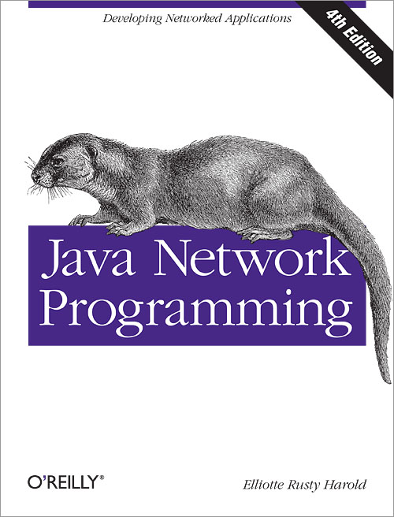

## Java Network Programming

> 记录学习**java网络编程**的历程，参考自书籍[《Java Network Programming, Fourth Edition》](https://book.douban.com/subject/26259017/)。
>
> 下载链接：<http://readfree.me/book/26259017/>

 

## 目录

+ [第01章-基本网络概念](第01章-基本网络概念.md  )
+ [第02章-流](第02章-流.md )
+ [第03章-线程](第03章-线程.md )
+ [第04章-Internet地址](第04章-Internet地址.md )
+ [第05章-URL和URI](第05章-URL和URI.md)
+ [第06章-HTTP](第06章-HTTP.md )
+ [第07章-URLConnection](第07章-URLConnection.md)
+ [第08章-客户端Socket](第08章-客户端Socket.md)
+ [第09章-服务器Socket](第09章-服务器Socket.md)
+ [第10章-安全Socket](第10章-安全Socket.md)
+ [第11章-非阻塞IO](第11章-非阻塞IO.md)
+ [第12章-UDP](第12章-UDP.md )
+ [第13章-IP组播](第13章-IP组播.md )

