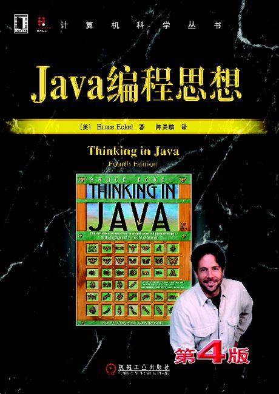

## Thinking in Java

> 了解**java编程思想**，参考自书籍[《Thinking in Java, 4th Edition》](https://book.douban.com/subject/2130190/)。
>
> 下载链接：<http://readfree.me/book/2130190/>

 

## 目录 & 进度

- [x] 第1章 对象导论
- [x] 第2章 一切都是对象
- [x] 第3章 操作符
- [x] 第4章 控制执行流程
- [x] 第5章 初始化与清理
- [x] 第6章 访问权限控制
- [x] 第7章 复用类
- [x] 第8章 多态
- [x] 第9章 接口
- [x] 第10章 内部类
- [x] 第11章 持有对象
- [x] 第12章 通过异常处理错误
- [x] 第13章 字符串
- [x] 第14章 类型信息
- [x] 第15章 泛型
- [x] 第16章 数组
- [x] 第17章 容器深入研究
- [x] 第18章 Java I/O 系统
- [ ] 第19章 枚举类型
- [ ] 第20章 注解
- [ ] 第21章 并发
- [ ] 第22章 图形化用户界面

