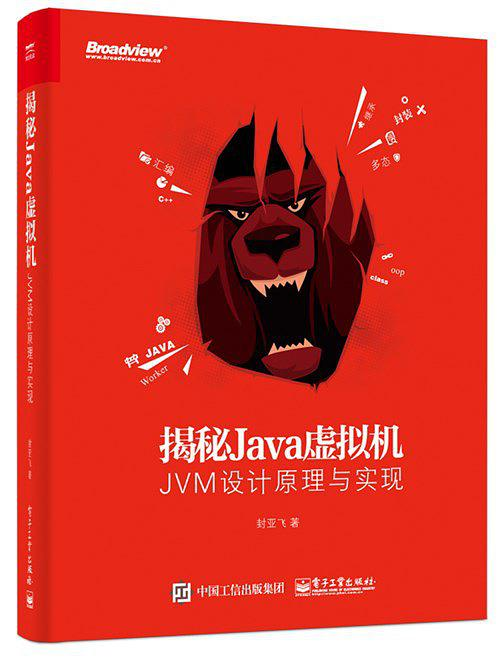

# 揭秘Java虚拟机

> 参考书籍[《揭秘Java虚拟机》](https://book.douban.com/subject/27086821/)，继续学习Java虚拟机方面知识。
>
> 下载链接：<http://readfree.me/book/27086821/> 

## 目录 & 进度

- [x] 第1章 Java虚拟机概述
- [ ] 第2章 Java执行引擎工作原理：方法调用
- [ ] 第3章 Java数据结构与面向对象
- [ ] 第4章 Java字节码实战
- [ ] 第5章 常量池解析
- [ ] 第6章 类变量解析
- [ ] 第7章 Java栈帧
- [ ] 第8章 类方法解析
- [ ] 第9章 执行引擎
- [ ] 第10章 类的生命周期

