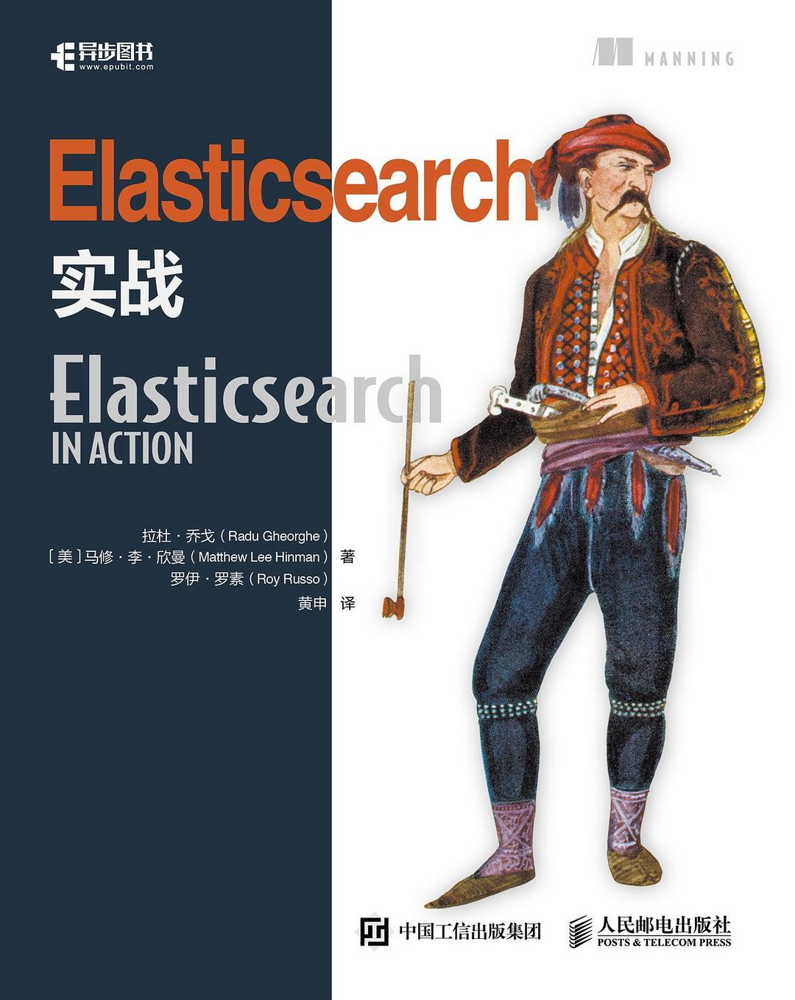

# Elasticsearch In Action

> 参考自书籍[《Elasticsearch实战》](<https://book.douban.com/subject/30380439/>)，补充 Elasticsearch 基础知识。
>
> 下载链接：<http://readfree.me/book/30380439/> 

## 目录 & 进度

- [x] 第01章 Elasticsearch介绍
- [x] 第02章 深入功能
- [x] 第03章 索引、更新和删除数据
- [x] 第04章 搜索数据
- [x] 第05章 分析数据
- [ ] 第06章 使用相关性进行搜索
- [ ] 第07章 使用聚集来探索数据
- [ ] 第08章 文档间的关系
- [ ] 第09章 向外扩展
- [ ] 第10章 提升性能
- [ ] 第11章 管理集群
- [ ] 附录A 处理地理空间的数据
- [ ] 附录B 插件
- [ ] 附录C 高亮
- [ ] 附录D Elasticsearch 的监控插件
- [ ] 附录E 使用渗滤器将搜索颠倒过来
- [ ] 附录F 为自动完成和“你是指”功能使用建议器

## 读后感

书籍对应的 Elasticsearch 版本为 1.4.x - 2.x，API 与当前主流版本 6.x 和最新版本 7.x 有很多地方不一样，好在查询 API 方面变化不大。也可以结合代码仓库 6.x 分支查看代码

还是可以做参考指南看看。