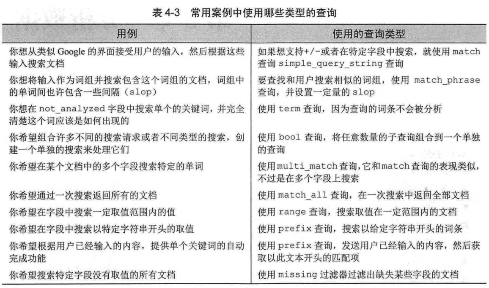

# 第04章 搜索数据

## 4.1 搜索请求的结构

### 4.1.3 基于请求主体的搜索请求

```json
// 结果分页
GET localhost:9200/get-together/_doc/_search
{
	"query": {
		"match_all": {}
	},
	"from": 10,
	"size": 10
}

// 结果中返回的字段
GET localhost:9200/get-together/_doc/_search
{
	"query": {
		"match_all": {}
	},
	"_source": ["name", "title"]
}

// 结果的排序
GET localhost:9200/get-together/_doc/_search
{
	"query": {
		"match_all": {}
	},
	"sort": [
		{"created_on":"asc"},
		"_score"
	]
}
```


## 4.2 介绍查询和过滤器DSL

### 4.2.1 match 查询和 term 过滤器

```json
// match 查询
GET localhost:9200/get-together/_doc/_search
{
	"query": {
		"match": {
			"title": "hadoop"
		}
	}
}
```

### 4.2.2 常用的基础查询和过滤器

```json
// match_all 查询
GET localhost:9200/_search
{
	"query": {
		"match_all": {}
	}
}

// query_string 查询
GET localhost:9200/get-together/_doc/_search
{
	"query": {
		"query_string": {
			"query": "nosql"
		}
	}
}

// query_string 查询，指定默认的字段
{
	"query": {
		"query_string": {
			"query": "nosql",
			"default_field": "description"
		}
	}
}

// term 查询
GET localhost:9200/get-together/_doc/_search
{
	"query": {
		"term": {
			"tags": "elasticsearch"
		}
	}
}

// terms 查询
GET localhost:9200/get-together/_doc/_search
{
	"query": {
		"terms": {
			"tags": ["jvm", "hadoop"]
		}
	}
}

// match 查询
GET localhost:9200/get-together/_doc/_search
{
	"query": {
		"match": {
			"name": "elasticsearch"
		}
	}
}

//match 查询 - 布尔查询行为
GET localhost:9200/get-together/_doc/_search
{
	"query": {
		"match": {
			"name": {
				"query": "Elasticsearch Denver",
				"operator": "and"
			}
			
		}
	}
}

// multi_match 查询
GET localhost:9200/get-together/_doc/_search
{
	"query": {
		"multi_match": {
			"query": "elasticsearch hadoop",
			"fields": ["name", "description"]
		}
	}
}
```


### 使用 multi_match 来匹配多个字段

```json
GET localhost:9200/get-together/_doc/_search

{
	"query":{
		"multi_match": {
			"query": "elasticsearch denver",
			"fields": ["name", "description"]
		}
	}
}
```

## 4.3 组合查询和复合查询

### 4.3.1 bool 查询

## 4.4 超越 match 和过滤器查询

### 4.4.1 range 查询和过滤器

```json
// 适用于数字、日期及字符串
GET localhost:9200/get-together/_doc/_search
{
	"query":{
		"range": {
			"created_on": {
				"gt": "2012-06-01",
				"lt": "2012-09-01"
			}
		}
	}
}

GET localhost:9200/get-together/_doc/_search
{
	"query":{
		"range": {
			"name": {
				"gt": "c",
				"lt": "e"
			}
		}
	}
}
```

## 4.6 为任务选择最好的查询

