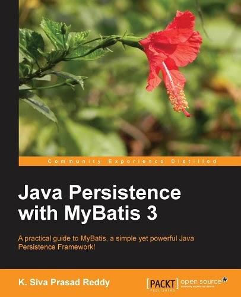

## Java 持久化之 MyBatis 3

> 记录学习 **MyBatis** 的历程，参考自书籍[《Java Persistence with MyBatis 3》](https://book.douban.com/subject/24833391/)。
>
> 下载链接：<https://readfree.me/book/24833391/> 

- [x] 第1章 MyBatis 入门
- [ ] 第2章 引导MyBatis
- [ ] 第3章 使用XML配置SQL映射器
- [ ] 第4章 使用注解配置SQL映射器
- [ ] 第5章 与Spring集成