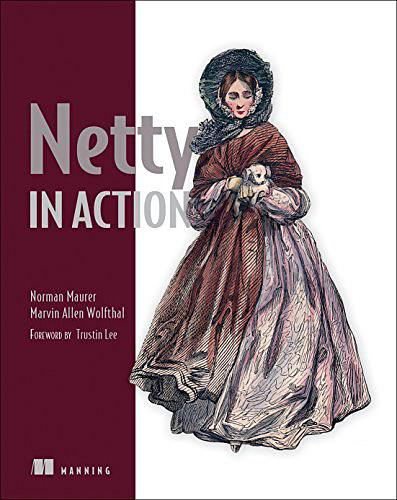

# Netty In Action

> 记录学习**Netty**的历程，方便以后查阅，参考自书籍[《Netty In Action》](https://book.douban.com/subject/27038538/)。
>
> 下载链接：<http://readfree.me/book/27038538/> 

 

## 目录

- [x] 第01章 Netty——异步和事件驱动
- [x] 第02章 你的第一款Netty应用程序
- [x] 第03章 Netty的组件和设计
- [ ] 第04章 传输
- [ ] 第05章 ByteBuf
- [ ] 第06章 ChannelHandler和ChannelPipeLine
- [ ] 第07章 EventLoop和线程模型
- [ ] 第08章 引导
- [ ] 第09章 单元测试
- [ ] 第10章 编解码器框架
- [ ] 第11章 预置的ChannelHandler和编解码器
- [ ] 第12章 WebSocket
- [ ] 第13章 使用UDP广播事件
- [ ] 第14章 案例研究，第一部分
- [ ] 第15章 案例研究，第二部分
- [x] 附录 Maven介绍

## 读后感

暂无