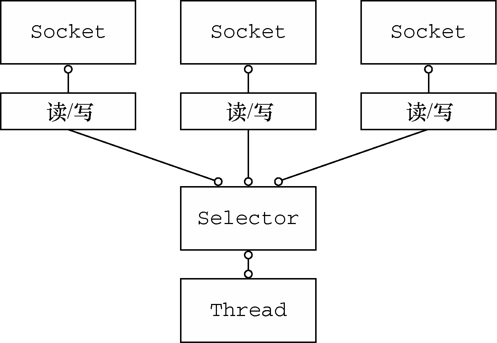

### 1.1 Java网络编程

最早期的Java API（java.net）只支持由本地系统套接字库提供的所谓的阻塞函数。


#### 1.1.1 Java NIO

NIO代表非阻塞I/O（Non-blocking I/O）。

- 可以使用setsockopt()方法配置套接字，以便读/写调用在没有数据的时候立即返回，也就是说，如果是一个阻塞调用应该已经被阻塞了；
- 可以使用操作系统的事件通知API注册一组非阻塞套接字，以确定它们中是否有任何的套接字已经有数据可供读写。

#### 1.1.2 选择器



class java.nio.channels.Selector是Java的非阻塞I/O实现的关键。它使用了事件通知API以确定在一组非阻塞套接字中有哪些已经就绪能够进行I/O相关的操作。因为可以在任何的时间检查任意的读操作或者写操作的完成状态，所以一个单一的线程便可以处理多个并发的连接。

---

### 1.2 Netty简介

**Netty特性总结**

| 分类     | Netty的特性                                                  |
| -------- | ------------------------------------------------------------ |
| 设计     | 统一的API，支持多种传输类型，阻塞的和非阻塞的简单而强大的线程模型真正的无连接数据报套接字支持链接逻辑组件以支持复用 |
| 易于使用 | 详实的Javadoc和大量的示例集不需要超过JDK 1.6+的依赖。（一些可选的特性可能需要Java 1.7+或额外的依赖） |
| 性能     | 拥有比Java的核心API更高的吞吐量以及更低的延迟得益于池化和复用，拥有更低的资源消耗最少的内存复制 |
| 健壮性   | 不会因为慢速、快速或者超载的连接而导致OutOfMemoryError消除在高速网络中NIO应用程序常见的不公平读/写比率 |
| 安全性   | 完整的SSL/TLS以及StartTLS支持可用于受限环境下，如Applet和OSGI |
| 社区驱动 | 发布快速而且频繁                                             |

#### 1.2.1 谁在使用Netty

大型公司，如Apple、Twitter、Facebook、Google、Square和Instagram，还有流行的开源项目，如Infinispan、HornetQ、Vert.x、Apache Cassandra和Elasticsearch等。

#### 1.2.2 异步和事件驱动

本质上，一个既是异步的又是事件驱动的系统会表现出一种特殊的、对我们来说极具价值的行为：它可以以任意的顺序响应在任意的时间点产生的事件。

异步和可伸缩性之间的联系：

+ 非阻塞网络调用使得我们可以不必等待一个操作的完成。完全异步的I/O正是基于这个特性构建的，并且更进一步：异步方法会立即返回，并且在它完成时，会直接或者在稍后的某个时间点通知用户。
+ 选择器使得我们能够通过较少的线程便可监视许多连接上的事件。

---

### 1.3 Netty的核心组件

Netty的主要构件：

+ Channel
+ 回调
+ Future
+ 事件和ChannelHandler

#### 1.3.1 Channel

Channel是Java NIO的一个基本构造。

> 它代表一个到实体（如一个硬件设备、一个文件、一个网络套接字或者一个能够执行一个或者多个不同的I/O操作的程序组件）的开放连接，如读操作和写操作。

#### 1.3.2 回调

Netty在内部使用了回调来处理事件；当一个回调被触发时，相关的事件可以被一个interface-ChannelHandler的实现处理。例如：当一个新的连接已经被建立时，ChannelHandler的channelActive()回调方法将会被调用，并将打印出一条信息。

```java
public class ConnectHandler extends ChannelInboundHandlerAdapter {
    @Override
    public void channelActive(ChannelHandlerContext ctx)
        throws Exception {    // 当一个新的连接已经被建立时，
        System.out.println(   // channelActive(ChannelHandlerContext)将会被调用
            "Client " + ctx.channel().remoteAddress() + " connected");
    }
}
```

#### 1.3.3 Future

Future提供了另一种在操作完成时通知应用程序的方式。这个对象可以看作是一个异步操作的结果的占位符；它将在未来的某个时刻完成，并提供对其结果的访问。

JDK预置了interface java.util.concurrent.Future，但是其所提供的实现，只允许手动检查对应的操作是否已经完成，或者一直阻塞直到它完成。这是非常繁琐的，所以Netty提供了它自己的实现——ChannelFuture，用于在执行异步操作的时候使用。

```java
Channel channel = ...;
// Does not block
ChannelFuture future = channel.connect( // 异步地连接到远程节点
    new InetSocketAddress("192.168.0.1", 25));
future.addListener(new ChannelFutureListener() { // 注册一个ChannelFutureListener，以便在操作完成时获得通知
    @Override
    public void operationComplete(ChannelFuture future) { // 检查操作的状态
       if (future.isSuccess()){ 
            ByteBuf buffer = Unpooled.copiedBuffer( // 如果操作是成功的，则创建一个ByteBuf以持有数据
               "Hello",Charset.defaultCharset()); 
           ChannelFuture wf = future.channel()
                .writeAndFlush(buffer); // 将数据异步地发送到远程节点。返回一个ChannelFuture
            .... 
        } else {
            Throwable cause = future.cause(); // 如果发生错误，则访问描述原因的Throwable
            cause.printStackTrace();
        }
    }
});
```

#### 1.3.4 事件和ChannelHandler


#### 1.3.5 把它们放在一起

**1.Future、回调和ChannelHandler**

Netty的异步编程模型是建立在Future和回调的概念之上的， 而将事件派发到ChannelHandler的方法则发生在更深的层次上。结合在一起，这些元素就提供了一个处理环境，使你的应用程序逻辑可以独立于任何网络操作相关的顾虑而独立地演变。这也是Netty的设计方式的一个关键目标。

拦截操作以及高速地转换入站数据和出站数据，都只需要你提供回调或者利用操作所返回的Future。这使得链接操作变得既简单又高效，并且促进了可重用的通用代码的编写。

**2.选择器、事件和EventLoop**

Netty通过触发事件将Selector从应用程序中抽象出来，消除了所有本来将需要手动编写的派发代码。在内部，将会为每个Channel分配一个EventLoop，用以处理所有事件，包括：

+ 注册感兴趣的事件；
+ 将事件派发给ChannelHandler；
+ 安排进一步的动作。

EventLoop本身只由一个线程驱动，其处理了一个Channel的所有I/O事件，并且在该EventLoop的整个生命周期内都不会改变。这个简单而强大的设计消除了你可能有的在ChannelHandler实现中需要进行同步的任何顾虑，因此，你可以专注于提供正确的逻辑，用来在有感兴趣的数据要处理的时候执行。如同我们在详细探讨Netty的线程模型时将会看到的，该API是简单而紧凑的。

---

### 1.4 小结

在这一章中，我们介绍了Netty框架的背景知识，包括Java网络编程API的演变过程，阻塞和非阻塞网络操作之间的区别，以及异步I/O在高容量、高性能的网络编程中的优势。

然后，我们概述了Netty的特性、设计和优点，其中包括Netty异步模型的底层机制，包括回调、Future以及它们的结合使用。我们还谈到了事件是如何产生的以及如何拦截和处理它们。


