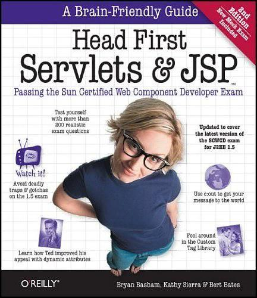

# Head First Servlets & JSP 2nd Edition

> 回顾**Java EE基础知识**，参考自书籍[《Head First Servlets & JSP 2nd Edition（深入浅出Servlets和JSP 第二版）》](https://book.douban.com/subject/4604858/)，部分内容根据Java EE新规范进行了更新。
>
> 下载链接：<http://readfree.me/book/4604858/>

## 目录

+ [第01章-为什么使用Servlet&JSP：前言与概述](第01章-为什么使用Servlet&JSP：前言与概述.md)
+ [第02章-Web应用体系结构：高层概述](第02章-Web应用体系结构：高层概述.md)
+ [第03章-MVC迷你教程：MVC实战](第03章-MVC迷你教程：MVC实战.md)
+ [第04章-作为Servlet：请求和响应](第04章-作为Servlet：请求和响应.md)
+ [第05章-作为Web应用：属性和监听者](第05章-作为Web应用：属性和监听者.md)
+ [第06章-会话状态：会话管理](第06章-会话状态：会话管理.md)
+ [第07章-作为JSP：使用JSP](第07章-作为JSP：使用JSP.md)
+ [第08章-没有脚本的页面：无脚本的JSP](第08章-没有脚本的页面：无脚本的JSP.md)
+ [第09章-强大的定制标记：使用JSTL](第09章-强大的定制标记：使用JSTL.md)
+ [第10章-JSTL也有力不能及的时候：定制标记开发](第10章-JSTL也有力不能及的时候：定制标记开发.md)
+ [第11章-部署Web应用：Web应用部署](第11章-部署Web应用：Web应用部署.md)
+ [第12章-要保密，要安全：Web应用安全](第12章-要保密，要安全：Web应用安全.md)
+ [第13章-过滤器的威力：过滤器和包装器](第13章-过滤器的威力：过滤器和包装器.md)
+ [第14章-企业设计模式：模式和struts](第14章-企业设计模式：模式和struts.md)
