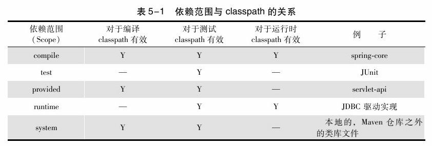
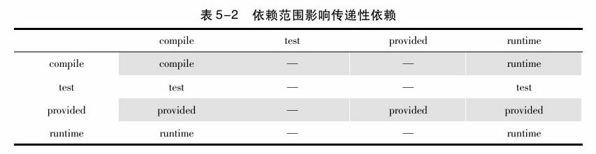
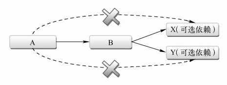
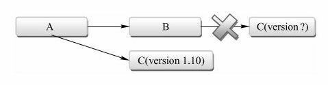

### 5.1 何为Maven坐标

Maven定义了这样一组规则：世界上任何一个构件都可以使用Maven坐标唯一标识，Maven坐标的元素包括groupId、artifactId、version、packaging、classifier。

Maven内置了一个中央仓库的地址<http://repo1.maven.org/maven2>，该中央仓库包含了世界上大部分流行的开源项目构件，Maven会在需要的时候去那里下载。

在我们开发自己项目的时候，也需要为其定义适当的坐标，这是Maven强制要求的。在这个基础上，其他Maven项目才能引用该项目生成的构件。

### 5.2 坐标详解

Maven坐标为各种构件引入了秩序，任何一个构件都必须明确定义自己的坐标，而一组Maven坐标是通过一些元素定义的，它们是groupId、artifactId、version、packaging、classifier：

```xml
<!-- groupId：定义当前Maven项目隶属的实际项目 -->
<!-- groupId的表示方式与Java包名的表示方式类似，通常与域名反向一一对应 -->
<groupId>org.sonatype.nexus</groupId>
<!-- artifactId：该元素定义实际项目中的一个Maven项目（模块） -->
<!-- 推荐的做法是使用实际项目名称作为artifactId的前缀（Maven生成的构件，其文件名会以artifactId作为开头，方便查找） -->
<artifactId>nexus-indexer</artifactId>
<!-- version：该元素定义Maven项目当前所处的版本 -->
<version>2.0.0</version>
<!-- packaging：该元素定义Maven项目的打包方式（不定义时，默认值为jar） -->
<packaging>jar</packaging>
<!-- classifier：该元素用来帮助定义构建输出的一些附属构件 -->
<!-- 如nexus-indexer-2.0.0-javadoc.jar、nexus-indexer-2.0.0-sources.jar这样一些附属构件，其包含了Java文档和源代码 -->
```

上述5个元素中，groupId、artifactId、version是必须定义的，packaging是可选的（默认为jar），而classifier是不能直接定义的。

同时，项目构件的文件名是与坐标相对应的，一般的规则为artifactId-version[-classifier].packaging。

### 5.3 account-email

### 5.4 依赖的配置

一个依赖声明可以包含如下的一些元素：

```xml
<project>
    ...
    <!-- 根元素project下的dependencies可以包含一个或者多个dependency元素，以声明一个或者多个项目依赖 -->
    <dependencies>
        <dependency>
            <!-- groupId、artifactId和version：依赖的基本坐标，对于任何一个依赖来说，基本坐标是最重要的，Maven根据坐标才能找到需要的依赖。 -->
            <groupId>...</groupId>
            <artifactId>...</artifactId>
            <version>...</version>
            <!-- type：依赖的类型，对应于项目坐标定义的packaging。大部分情况下，该元素不必声明，其默认值为jar -->
            <type>...</type>
            <!-- scope：依赖的范围 -->
            <scope>...</scope>
            <!-- optional：标记依赖是否可选 -->
            <optional>...</optional>
            <!-- exclusions：用来排除传递性依赖 -->
            <excutions>
                <excution>...</excution>
                ...
            </excutions>
        </dependency> 
        ...
    </dependencies>
    ...
</project>
```

### 5.5 依赖范围

依赖范围就是用来控制依赖与这三种classpath（编译classpath、测试classpath、运行classpath）的关系，Maven有以下几种依赖范围：

+ compile：编译依赖范围。如果没有指定，就会默认使用该依赖范围。使用此依赖范围的Maven依赖，对于编译、测试、运行三种classpath都有效。典型的例子是spring-core，在编译、测试和运行的时候都需要使用该依赖。
+ test：测试依赖范围。使用此依赖范围的Maven依赖，只对于测试classpath有效，在编译主代码或者运行项目的使用时将无法使用此类依赖。典型的例子是JUnit，它只有在编译测试代码及运行测试的时候才需要。
+ provided：已提供依赖范围。使用此依赖范围的Maven依赖，对于编译和测试class-path有效，但在运行时无效。典型的例子是servlet-api，编译和测试项目的时候需要该依赖，但在运行项目的时候，由于容器已经提供，就不需要Maven重复地引入一遍。
+ runtime：运行时依赖范围。使用此依赖范围的Maven依赖，对于测试和运行class-path有效，但在编译主代码时无效。典型的例子是JDBC驱动实现，项目主代码的编译只需要JDK提供的JDBC接口，只有在执行测试或者运行项目的时候才需要实现上述接口的具体JDBC驱动。
+ system：系统依赖范围。该依赖与三种classpath的关系，和provided依赖范围完全一致。但是，使用system范围的依赖时必须通过systemPath元素显式地指定依赖文件的路径。由于此类依赖不是通过Maven仓库解析的，而且往往与本机系统绑定，可能造成构建的不可移植，因此应该谨慎使用。systemPath元素可以引用环境变量。
+ import：导入依赖范围。该依赖范围不会对三种classpath产生实际的影响。



### 5.6 传递性依赖

#### 5.6.1 何为传递性依赖

account-mail有一个compile范围的spring-core依赖，spring-core有一个compile范围的commons-logging依赖，那么commons-logging就会成为account-email的compile范围依赖，commons-logging是account-email的一个传递性依赖。

有了传递性依赖机制，在使用Spring Framework的时候就不用去考虑它依赖了什么，也不用担心引入多余的依赖。Maven会解析各个直接依赖的POM，将那些必要的间接依赖，以传递性依赖的形式引入到当前的项目中。

#### 5.6.2 传递性依赖和依赖范围

最左边一列表示第一直接依赖范围，最上面一行表示第二直接依赖范围，中间的交叉单元格则表示传递性依赖范围。



### 5.7 依赖调解

出现这样的依赖关系：A-＞B-＞C-＞X（1.0）、A-＞D-＞X（2.0）。为了防止依赖重复（A依赖两次X），Maven依赖调解（Dependency Mediation）的第一原则是：**路径最近者优先**。

若是出现这样的依赖的关系：A-＞B-＞Y（1.0）、A-＞C-＞Y（2.0）。Maven定义了依赖调解的第二原则：第一声明者优先。在依赖路径长度相等的前提下，在POM中依赖声明的顺序决定了谁会被解析使用，**顺序最靠前的那个依赖优胜**。该例中，如果B的依赖声明在C之前，那么Y（1.0）就会被解析使用。

### 5.8 可选依赖

假设有这样一个依赖关系，项目A依赖于项目B，项目B依赖于项目X和Y，B对于X和Y的依赖都是可选依赖：A-＞B、B-＞X（可选）、B-＞Y（可选）。由于这里X、Y是可选依赖，依赖将不会得以传递。

```xml
<!-- 可选依赖需要加上这一句 -->
<optional>true</optional>
<!-- 因为可选依赖不会被传递，故若是A依赖B中的一个可选依赖，需要在A中显示声明 -->
<!-- 一般而言，根据面向对象单一职责原则，可选依赖不应该出现，
     而是根据可选依赖的不同将B分为B1和B2两个模块，由A自己来选择依赖哪个B，这样就不存在可选依赖的问题了 -->
```



### 5.9 最佳实践

#### 5.9.1 排除依赖

项目A依赖于项目B，但是由于一些原因，不想引入传递性依赖C，而是自己显式地声明对于项目C 1.1.0版本的依赖。代码中使用exclusions元素声明排除依赖，exclusions可以包含一个或者多个exclusion子元素，因此可以排除一个或者多个传递性依赖。需要注意的是，声明exclusion的时候只需要groupId和artifactId。

```xml
<exclutions>
    <exclution>
        <groupId>com.angus.mvnbook</groupId>
        <artifactId>mvnbook-modelc</artifactId>
    </exclution>
</exclutions>
```



#### 5.9.2 归类依赖

```xml
<?xml version="1.0" encoding="UTF-8"?>
<project xmlns="http://maven.apache.org/POM/4.0.0"
         xmlns:xsi="http://www.w3.org/2001/XMLSchema-instance"
         xsi:schemaLocation="http://maven.apache.org/POM/4.0.0 http://maven.apache.org/xsd/maven-4.0.0.xsd">
    <modelVersion>4.0.0</modelVersion>

    <groupId>com.angus.mvnbook.account</groupId>
    <artifactId>account-email</artifactId>
    <name>Account Email</name>
    <version>1.0-SNAPSHOT</version>
    
    <!-- 使用Maven属性归类依赖 -->
    <properties>
        <springframework.version>5.0.5.RELEASE</springframework.version>
    </properties>
    
    <dependencies>
        <dependency>
            <groupId>org.springframework</groupId>
            <artifactId>spring-core</artifactId>
            <!-- 引用maven属性的值 -->
            <version>${springframework.version}</version>
        </dependency>
        <dependency>
            <groupId>org.springframework</groupId>
            <artifactId>spring-beans</artifactId>
            <version>${springframework.version}</version>
        </dependency>
        <dependency>
            <groupId>org.springframework</groupId>
            <artifactId>spring-context</artifactId>
            <version>${springframework.version}</version>
        </dependency>
        <dependency>
            <groupId>org.springframework</groupId>
            <artifactId>spring-context-support</artifactId>
            <version>${springframework.version}</version>
        </dependency>
        ...
</project>
```

#### 5.9.3 优化依赖

使用`mvn dependency:list`可以查看项目的已解析依赖及其范围：

```bash
$ mvn dependency:list
[INFO] Scanning for projects...
[INFO]
[INFO] --------------< com.angus.mvnbook.account:account-email >---------------
[INFO] Building Account Email 1.0-SNAPSHOT
[INFO] --------------------------------[ jar ]---------------------------------
[INFO]
[INFO] --- maven-dependency-plugin:2.8:list (default-cli) @ account-email ---
[INFO]
[INFO] The following files have been resolved:
[INFO]    org.springframework:spring-aop:jar:5.0.5.RELEASE:compile
[INFO]    com.icegreen:greenmail:jar:1.5.7:test
[INFO]    org.slf4j:slf4j-api:jar:1.7.21:test
[INFO]    org.hamcrest:hamcrest-core:jar:1.3:test
[INFO]    org.springframework:spring-expression:jar:5.0.5.RELEASE:compile
[INFO]    com.sun.mail:javax.mail:jar:1.5.6:test
[INFO]    junit:junit:jar:4.12:test
[INFO]    org.springframework:spring-core:jar:5.0.5.RELEASE:compile
[INFO]    org.springframework:spring-context:jar:5.0.5.RELEASE:compile
[INFO]    org.springframework:spring-beans:jar:5.0.5.RELEASE:compile
[INFO]    javax.activation:activation:jar:1.1:compile
[INFO]    javax.mail:mail:jar:1.4.7:compile
[INFO]    org.springframework:spring-context-support:jar:5.0.5.RELEASE:compile
[INFO]    org.springframework:spring-jcl:jar:5.0.5.RELEASE:compile
[INFO]
[INFO] ------------------------------------------------------------------------
[INFO] BUILD SUCCESS
[INFO] ------------------------------------------------------------------------
[INFO] Total time: 2.557 s
[INFO] Finished at: 2018-05-14T09:05:05+08:00
[INFO] ------------------------------------------------------------------------
```

通过`mvn dependency:tree`将直接在当前项目POM声明的依赖定义为顶层依赖，而这些顶层依赖的依赖则定义为第二层依赖，以此类推，有第三、第四层依赖。当这些依赖经Maven解析后，就会构成一个依赖树，通过这棵依赖树就能很清楚地看到某个依赖是通过哪条传递路径引入的：

```bash
$ mvn dependency:tree
[INFO] Scanning for projects...
[INFO]
[INFO] --------------< com.angus.mvnbook.account:account-email >---------------
[INFO] Building Account Email 1.0-SNAPSHOT
[INFO] --------------------------------[ jar ]---------------------------------
[INFO]
[INFO] --- maven-dependency-plugin:2.8:tree (default-cli) @ account-email ---
[INFO] com.angus.mvnbook.account:account-email:jar:1.0-SNAPSHOT
[INFO] +- org.springframework:spring-core:jar:5.0.5.RELEASE:compile
[INFO] |  \- org.springframework:spring-jcl:jar:5.0.5.RELEASE:compile
[INFO] +- org.springframework:spring-beans:jar:5.0.5.RELEASE:compile
[INFO] +- org.springframework:spring-context:jar:5.0.5.RELEASE:compile
[INFO] |  +- org.springframework:spring-aop:jar:5.0.5.RELEASE:compile
[INFO] |  \- org.springframework:spring-expression:jar:5.0.5.RELEASE:compile
[INFO] +- org.springframework:spring-context-support:jar:5.0.5.RELEASE:compile
[INFO] +- javax.mail:mail:jar:1.4.7:compile
[INFO] |  \- javax.activation:activation:jar:1.1:compile
[INFO] +- junit:junit:jar:4.12:test
[INFO] |  \- org.hamcrest:hamcrest-core:jar:1.3:test
[INFO] \- com.icegreen:greenmail:jar:1.5.7:test
[INFO]    +- com.sun.mail:javax.mail:jar:1.5.6:test
[INFO]    \- org.slf4j:slf4j-api:jar:1.7.21:test
[INFO] ------------------------------------------------------------------------
[INFO] BUILD SUCCESS
[INFO] ------------------------------------------------------------------------
[INFO] Total time: 2.556 s
[INFO] Finished at: 2018-05-14T09:10:52+08:00
[INFO] ------------------------------------------------------------------------
```

此外，`dependency:analyze`工具可以帮助分析当前项目的依赖：

```bash
$ mvn dependency:analyze
[INFO] Scanning for projects...
[INFO]
[INFO] --------------< com.angus.mvnbook.account:account-email >---------------
[INFO] Building Account Email 1.0-SNAPSHOT
[INFO] --------------------------------[ jar ]---------------------------------
...
[INFO] <<< maven-dependency-plugin:2.8:analyze (default-cli) < test-compile @ account-email <<<
[INFO]
[INFO]
[INFO] --- maven-dependency-plugin:2.8:analyze (default-cli) @ account-email ---

# Used undeclared dependencies，意指项目中使用到的，但是没有显式声明的依赖
# 这种依赖是通过直接依赖传递进来的，当升级直接依赖时，相关的依赖版本可能发生变化，继而有可能导致当前项目出错
# 故而需要显示声明项目中直接用到的依赖（即把传递依赖中直接用到的依赖显示声明）
[WARNING] Used undeclared dependencies found:
[WARNING]    com.sun.mail:javax.mail:jar:1.5.6:test

# Unused declared dependencies，意指项目中未使用的，但显式声明的依赖
# 由于dependency:analyze只会分析编译主代码和测试代码需要用到的依赖，一些执行测试和运行时需要的依赖它就发现不了
# 故而该类依赖不要简单删除，而应仔细分析，小心测试
[WARNING] Unused declared dependencies found:
[WARNING]    org.springframework:spring-core:jar:5.0.5.RELEASE:compile
[WARNING]    org.springframework:spring-beans:jar:5.0.5.RELEASE:compile
[WARNING]    javax.mail:mail:jar:1.4.7:compile
[INFO] ------------------------------------------------------------------------
[INFO] BUILD SUCCESS
[INFO] ------------------------------------------------------------------------
[INFO] Total time: 5.199 s
[INFO] Finished at: 2018-05-14T09:16:09+08:00
[INFO] ------------------------------------------------------------------------
```

### 5.10 小结

本章主要介绍了Maven的两个核心概念：坐标和依赖。解释了坐标的由来，并详细阐述了各坐标元素的作用及定义方式。随后引入account-email这一实际的基于Spring Frame-work的模块，包括了POM定义、主代码和测试代码。在这一直观感受的基础上，再花了大篇幅介绍Maven依赖，包括依赖范围、传递性依赖、可选依赖等概念。


