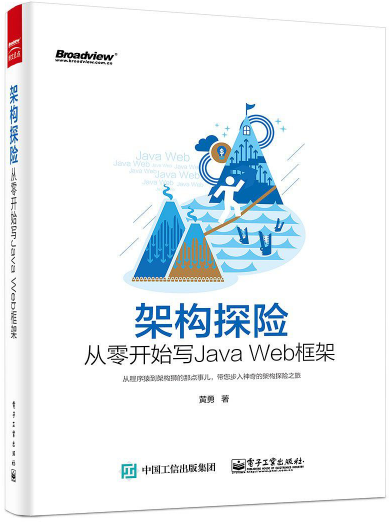

# 架构探险――从零开始写Java Web框架

> 参考书籍[《架构探险――从零开始写Java Web框架》](https://book.douban.com/subject/26593466/)，编写了一个简单的 Java Web 框架，收获很大。
>
> 下载链接：<http://readfree.me/book/26593466/> 

## 目录

- [x] 第1章 从一个简单的Web应用开始
- [x] 第2章 为Web应用添加业务功能
- [x] 第3章 搭建轻量级Java Web框架
- [x] 第4章 使框架具备AOP特性
- [x] 第5章 框架优化与功能扩展

