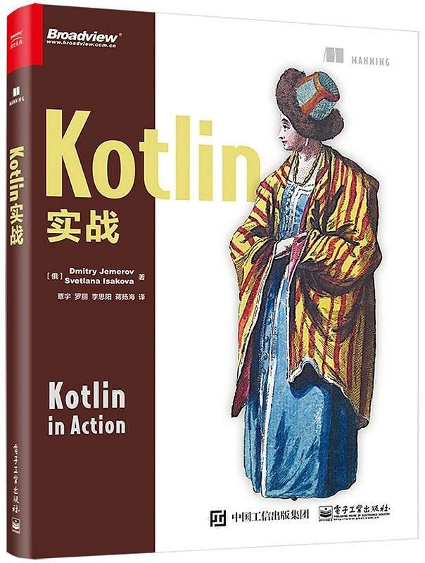

## Kotlin 实战

> 因项目需要，学习 Kotlin，参考自书籍[《Kotlin 实战》](https://book.douban.com/subject/27093660/)。
>
> Kotlin 真香🍗

- [x] 1 Kotlin：定义和目的
- [x] 2 Kotlin 基础
- [x] 3 函数的定义和使用
- [x] 4 类、对象和接口
- [x] 5 Lambda 编程
- [x] 6 Kotlin 的类型系统
- [x] 7 运算符重载及其他约定
- [x] 8 高阶函数：Lambda 作为形参和返回值
- [x] 9 泛型
- [x] 10 注解和反射
- [x] 11 DSL 构建
- [x] A 构建 Kotlin 项目
- [x] B Kotlin 代码的文档化
- [x] C Kotlin 生态系统