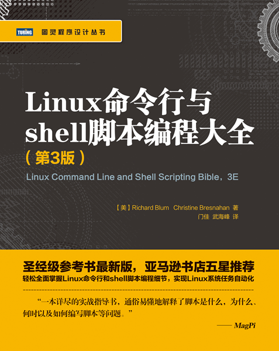

# Linux Command Line and Shell Scripting Bible

> 记录学习**Linux**的历程，参考自书籍[《Linux Command Line and Shell Scripting Bible, 3E》](https://book.douban.com/subject/26854226/)。
>
> 下载链接：<http://readfree.me/book/26854226/>

## 目录

- [第01章-初始Linux-shell](第01章-初始Linux-shell.md )
- [第02章-走进shell](第02章-走进shell.md)
- [第03章-基本的bash-shell命令](第03章-基本的bash-shell命令.md)
- [第04章-更多的bash-shell命令](第04章-更多的bash-shell命令.md)
- [第05章-理解shell](第05章-理解shell.md)
- [第06章-使用Linux环境变量](第06章-使用Linux环境变量.md)
- [第07章-理解Linux文件权限](第07章-理解Linux文件权限.md)
- [第08章-管理文件系统](第08章-管理文件系统.md)
- [第09章-安装软件程序](第09章-安装软件程序.md)
- [第10章-使用编辑器](第10章-使用编辑器.md)
- [第11章-构建基本脚本](第11章-构建基本脚本.md)
- [第12章-使用结构化命令](第12章-使用结构化命令.md)
- [第13章-更多的结构化命令](第13章-更多的结构化命令.md)
- [第14章-处理用户输入](第14章-处理用户输入.md)
- [第15章-呈现数据](第15章-呈现数据.md)
- [第16章-控制脚本](第16章-控制脚本.md)
- [第17章-创建函数](第17章-创建函数.md)
- [第18章-图形化桌面环境中的脚本编程](第18章-图形化桌面环境中的脚本编程.md)
- [第19章-初始sed和gawk](第19章-初始sed和gawk.md)
- [第20章-正则表达式](第20章-正则表达式.md)
