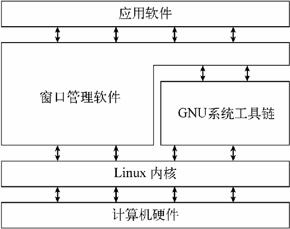

### 1.1 什么是Linux

Linux可划分为以下四部分：

+ Linux内核
+ GNU工具
+ 图形化桌面环境
+ 应用软件

#### 1.1.1 深入探究Linux内核

Linux系统的核心是内核 。内核控制着计算机系统上的所有硬件和软件，在必要时分配硬件，并根据需要执行软件。

内核主要负责以下四种功能：

+ 系统内存管理
+ 软件程序管理
+ 硬件设备管理
+ 文件系统管理

Linux系统将硬件设备当成特殊的文件，称为设备文件 。设备文件有3种分类：

+ 字符型设备文件
+ 块设备文件
+ 网络设备文件

字符型设备文件是指处理数据时每次只能处理一个字符的设备。大多数类型的调制解调器和终端都是作为字符型设备文件创建的。块设备文件是指处理数据时每次能处理大块数据的设备，比如硬盘。网络设备文件是指采用数据包发送和接收数据的设备，包括各种网卡和一个特殊的回环设备。这个回环设备允许Linux系统使用常见的网络编程协议同自身通信。

#### 1.1.2 GUN工具

1. 核心GNU工具

   GNU coreutils软件包由三部分构成：
   + 用以处理文件的工具
   + 用以操作文本的工具
   + 用以管理进程的工具

2. shell

   GNU/Linux shell是一种特殊的交互式工具。它为用户提供了启动程序、管理文件系统中的文件以及运行在Linux系统上的进程的途径。shell的核心是命令行提示符。命令行提示符是shell负责交互的部分。它允许你输入文本命令，然后解释命令，并在内核中执行。

