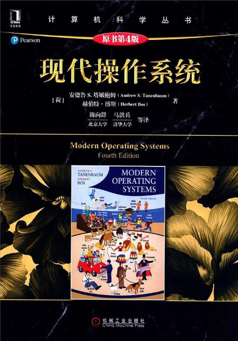

# 现代操作系统

> 关于计算机**操作系统**方面的知识点补充，参考书籍[《现代操作系统》](https://book.douban.com/subject/27096665/)

## 进度

- [ ] 第1章 引论
- [x] 第2章 进程与线程
- [ ] 第3章 内存管理
- [ ] 第4章 文件系统
- [ ] 第5章 输入/输出
- [ ] 第6章 死锁
- [ ] 第7章 虚拟化和云
- [ ] 第8章 多处理机系统
- [ ] 第9章 安全
- [ ] 第10章 实例研究1：UNIX、Linux和Android
- [ ] 第11章 实例研究2：Windows 8
- [ ] 第12章 操作系统设计