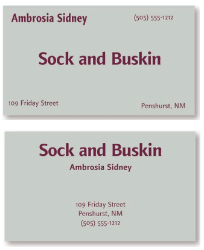
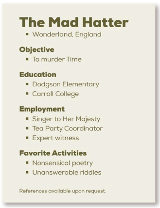
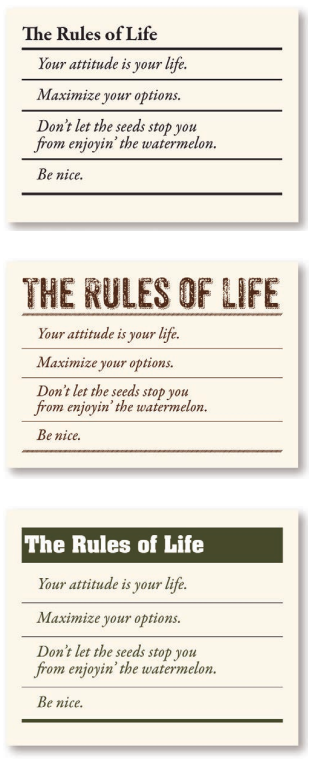

# “亲戚（齐）比重”，你学会了吗

> 生活中从不缺少美,而是缺少发现美的眼睛 —— 奥古斯特·罗丹

初拿起这本书的初衷是因为毕业设计前端部分遇到了阻碍，想从这上面找找网页设计的灵感。待合上这本书时，才发现这本书所给予我的不仅仅是书上所述的内容。

Robin 的写作功底十分深厚，几乎没有用到任何让人感到生僻的术语，就把设计原理和准则，以及操作方法用通俗、简洁易懂的句子描述得十分清楚，这对于我这个设计门外汉来说超级受用。以前我们光知道某个设计好看或是不好看，但要描述原因时，却说不出个所以然来。究其根本连设计的基本知识都不懂，只能靠直觉和感官进行判断。不过在本书中 Robin 不仅会解答设计背后的原因，还会推荐一些在入门阶段十分实用的技巧，这些都是帮助我们涉足设计领域的有力工具。

本书总结下来大概讲了设计四原则（亲密性、对齐、重复、对比），颜色运用及字体运用这几个方面。当然，全书的着重点放在了设计四原则上，从通篇的设计示例中你都能发现它们的重要性。别怕，它们并不是什么高不可攀的大山。相反，你会震惊于它们是如此地容易理解和使用。书看到一半时，我就按照四原则修改了自己的简历，效果十分显著。

为了方便记忆，可以把四原则简称为“亲戚（齐）比重”（不是我独创的）。相信我，不管你是在做 PPT，还是设计贺卡或明信片，抑或是制作简历时等，内心记得默念几遍“亲戚比重”，问问自己有没有达到这些标准，最后必然会做出不差的作品来。

废话不多说，接下来我就把本书讲到的“亲戚比重”四原则简单摘抄出来，希望以此作为一个引子，吸引你翻开这本书。（注意：以下各原则所举例子都是书中最简单的例子，方便直观看出该原则的应用效果）

### Robin 亲密性原则

**解释：**将相关的项组织在一起，移动这些项，使它们的物理位置相互靠近，这样一来，相关的项将被看作凝聚为一体的一个组，而不再是一堆彼此无关的片段。

**目的：**亲密性的根本目的是实现组织性。只需简单地将相关的元素分在一组建立更近的亲密性， 就能自动实现条理性和组织性。 如果信息很有条理，将更容易阅读，也更容易被记住。此外 还可以使空白更美观。 

**实现：**眯起眼睛，统计眼睛停顿的次数来数一数页面上有多少个元素。 看看哪些孤立的元素可以归在一组建立更近的亲密性，使之成为一个视觉单元。

**避免：**避免一个页面上有太多孤立的元素。不要在元素之间留出同样大小的空白，除非各组同属于一个子集。不同属一组的元素之间不要建立关系！ 如果元素彼此无关， 要把它们分开。不要仅仅因为有空白就把元素放在角落或中央。 

**例子：**下面就是一个运用了亲密性原则的例子，相信你一眼就看出下面的名片能更容易且快速地让你获取信息吧。

### Robin 对齐原则

**解释：**任何元素都不能在页面上随意安放。每一项都应当与页面上的某个内容存在某种视觉联系。

**目的：**对齐的根本目的是使页面统一而且有条理。其效果类似于把客厅里四处零落的洋娃
娃捡起来，并把它们放在一个玩具箱中。不论创建精美的、正式的、有趣的还是严肃的外观，通常都可以利用一种明确的对齐（当然， 要结合适当的字体）来达到目的。 

**实现：**要特别注意元素放在哪里。应当总能在页面上找出与之对齐的元素，尽管这两个对
象的物理位置可能相距很远。 

**避免：**要避免在页面上混合使用多种文本对齐方式（ 也就是说，不要将某些文本居中，而另外一些文本右对齐）。另外，要着力避免居中对齐，除非你有意识地想要创建一种比较正式、稳重（ 通常也更乏味） 的表示。并不是完全杜绝使用居中对齐，有时可以有意地选择这种对齐方式，但是不要把它作为默认选择。

**例子：**通过上下两幅图对比，采用对齐原则使信息进行了有效的组织，空间变得更加有序合理。发现了吗，狗狗图片的边缘和右对齐文本的边缘有条隐形的线，使得整体布局更清晰。

### Robin 重复原则

**解释：**设计的某些方面需要在整个作品中重复。重复元素可能是一种粗字体、一条粗线、某个项目符号、颜色、设计要素、某种格式、空间关系等。重复可以将作品中的各部分连在一起，从而统一并增强整个作品，否则这些部分只是彼此孤立的单元。重复不仅对只有一页的作品很有用，对于多页文档的设计更显重要。

**目的：**重复的目的就是统一，并增强视觉效果。不要低估页面视觉效果的威力，如果一个作品看起来很有趣，它往往也更易于阅读。 

**实现：** 重复可以认为是保持一致性，但是需要把现有的一致性更向前推进一步。可以只是找出现有的重复，然后将其加强。熟悉了这种思想之后，再开始创建新的重复元素，来增强设计的效果并提高信息的清晰度。

**避免：**要避免太多地重复一个元素， 重复太多会让人讨厌。

**例子：**重复的元素 —— 字体、项目符号、缩进、间隔、对齐方式。这些重复性元素清楚地指出了文档的主要内容，让读者在阅读时感到顺畅与清晰。

### Robin 对比原则

**解释：**页面上的不同元素之间要有对比效果，达到吸引读者的对比效果。如果两个项不完全相同，就应当使之不同，而且应当是截然不同。 

**目的：** 一是增强页面的效果，如果一个页面看起来很有意思，往往更有可读性。另一个目的是有助于信息的组织。读者应当能立即了解信息以何种方式组织，以及从一项到另一项的逻辑流程。

**实现：**可以通过字体选择、线宽、颜色、形状、大小、空间等来增加对比。

**避免：**如果你想形成对比，就加大力度。不要将一种粗线与一种更粗的线进行对比。不要将棕色文本与黑色标题建立对比。要避免使用两种或多种类似的字体。如果各个项不完全一样，干脆让它们截然不同！

**例子：**通过添加明显的对比，你会发现整个表单变得鲜明和精美起来，表达也更清晰，不再是之前那种平淡乏味的感觉，这会更容易吸引你去阅读。

以上就是对于本书的简要总结啦（实际就是作者本人写的小结啦，我只是简化了一点点😀），我说的没错吧，真的没有我们一开始想得那么难。

蔡元培先生曾说过：“人的一生，不外乎意志的活动，而意志是盲目的，其所恃以为较近之观照者，是知识；所以供远照、旁照之用者，是感情…… 人人都有感情，而并非都有伟大而高尚的行为是由于感情动力的薄弱。要转弱为强，转薄为厚，有待于陶养。陶养的工具，为美的对象，陶养的作用，叫做美育。” 作为在中国提出美育的第一人，先生亦以“以美育代宗教说”闻名于世，毕生都在倡导美育，临终嘱：科学救国，美育救国。可见，美学教育对于我们是何等的重要。这本书虽然是实用主义类，但合上书之后我才发现，它恰是为我开了一扇窗，这扇窗通向的就是美学的世界。跟学设计的同学交流后，她给我推荐了《美的历程》和《谈美》这两本书。这里也推荐给大家，希望对大家有用。

感谢 Robin : )

