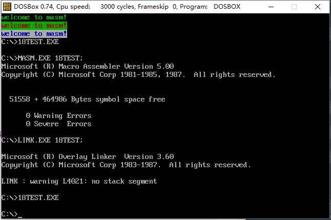

### # 简述

可以修改IP，或同时修改CS和IP的指令统称为转移指令。概括地讲，转移指令就是可以控制CPU执行内存中某代码的能力。

(1) 8086CPU的转移行为有以下几类：

① 只修改IP时，称为段内转移指令，比如：jmp ax。

② 同时修改CS和IP时，称为段间转移指令，比如：jmp 1000:0。

(2) 由于转移指令对IP修改范围的不同，段内转移又分为：短转移和近转移：

① 短转移IP的修改范围为-128-127。

② 近转移IP的修改范围为-32768-32767。

(3) 8086CPU的转移指令分为以下几类：

① 无条件转移指令（如：jmp）

② 条件转移指令

③ 循环指令（如：loop）

④ 过程

⑤ 中断

### # 操作符offset

操作符offset在汇编程序中是由编译器处理的符号，它的功能是取得标号的偏移地址。比如下面的程序：

```assembly
assume cs:codesg
codesg segment
start:    mov ax,offset start    ; 相当于mov ax,0
    s:    mov ax,offset s        ; 相当于mov ax,3
codesg ends
end start
```

### # jmp指令

jmp为无条件转移指令，可以只修改IP，也可以同时修改CS和IP。

jmp指令要给出两种信息：

(1) 转移的目的地址

(2) 转移的距离（段间转移、段内短转移，段内近转移）

### # 依据位移进行转移的jmp指令

(1) jmp short 标号（转到标号处执行指令）

这种格式的jmp指令实现的是段内短转移，它对IP的修改范围为-128-127，也就是说，他向前最多可以越过128个字节，向后转移最多可以越过127个字节。jmp指令中的“short”符号，说明指令进行的是短转移。jmp指令中的“标号”是代码段中的标号，指明了指令要转移的目的地，转移指令结束后，CS：IP应该指向标号处的指令。

实际上，“jmp short 标号”的功能为：（IP）=（IP）+8位位移。

① 8位位移=标号处的地址-jmp指令后的第一个字节的地址；

② short指明此处的位移为8位位移；

③ 8位位移的范围为-128-127，用补码表示。

④ 8位位移在编译时算出。

(2) jmp near ptr 标号（实现段内近转移）。

“jmp near ptr 标号”的功能为：（IP）=（IP）+16位位移。

① 16位位移=标号处的地址-jmp指令后的第一个字节的地址；

② near ptr指明此处的位为16位位移，进行的是段内近转移；

③ 16位位移的范围时-32768-32767，用补码表示。

④ 16位位移由编译程序在编译时算出。

### # 转移的目的地址在指令中的jmp指令

“jmp far ptr 标号”实现的是段间转移，又称为远转移。功能如下：

（CS）=标号所在段的段地址；（IP）=标号所在段中的偏移地址。

far ptr指明了指令用标号的段地址和偏移地址修改CS和IP。

### # 转移地址在寄存器中的jmp指令

指令格式：jmp 16位reg

功能：（IP）=（16位reg）

### # 转移地址在内存中jmp指令

转移地址在内存中jmp指令有两种格式：

(1) jmp word ptr 内存单元地址（段内转移）

功能：从内存单元地址处存放着一个字，是转移的目的偏移地址。

内存单元地址可用寻址方式的任一格式给出。比如：

```assembly
mov ax,0123H
mov ds:[0],ax
jmp word ptr ds:[0]
执行后,(IP)=0123H
```

又比如，下面的指令： 

```assembly
mov ax,0123H
mov [bx],ax
jmp word ptr [bx]
执行后,(IP)=0123H
```

(2) jmp dword ptr 内存单元（段间转移）

功能：从内存单元地址处开始存放两个字，高地址的字是转移的目的段地址，低地址处是转移的目的偏移地址。

(CS)=(内存单元地址+2)；(IP)=(内存单元地址)

内存单元地址可用寻址方式的任一格式给出。比如：

```assembly
mov ax,0123H
mov ds:[0],ax
mov word ptr ds:[2],0
jmp dword ptr ds:[0]
执行后,(cs)=0,(IP)=0123H,CS:IP指向0000:0123
```

又比如，下面的指令： 

```assembly
mov ax,0123H
mov [bx],ax
mov word ptr [bx+2],0
jmp dword ptr [bx]
执行后,(cs)=0,(IP)=0123H,CS:IP指向0000:0123
```

(3) 使程序中的jmp指令执行后，CS:IP指向程序的第一条指令 

```assembly
; Date : 2017-11-12 11:13:59
; File Name : 16TEST.ASM
; Description : jmp指令执行后，CS:IP指向程序的第一条指令
; Author : Angus
; Version: V1.0

assume cs:code
data segment
	db 0,0,0
data ends
code segment
start: 	mov ax,data
		mov ds,ax
		mov bx,0
		jmp word ptr [bx+1]
code ends
end start
```

(4) 使程序中的jmp指令执行后，CS:IP指向程序的第一条指令 

```assembly
assume cs:code,ds:data
data segment
    dd 12345678h
data ends
code segment
start:  mov ax,data
        mov ds,ax
        mov bx,0
        mov [bx],bx 
        mov [bx+2],cs 
        jmp dword ptr ds:[0]
code ends
end start
```

### # jcxz指令

jcxz指令为有条件指令，所有的有条件指令都是短转移，在对应的机器码中包含转移的位移，而不是目的地址。对IP的修改范围都为-128-127.

(1) 指令格式：jcxz 标号（如果（cx）=0，转移到标号处执行）；

(2) 操作：当（cx）=0时，（IP）=（IP）+8位位移；

(3) 8位位移=标号处的地址-jcxz指令后的第一个字节的地址；

(4) 8位位移的范围为-128-127，用补码表示；

(5) 8位位移有编译程序在编译时算出。

(6) 当（cx）≠0时，什么也不做，程序向下执行。

(7) 补全编程，利用jcxz指令，实现在内存2000H段中找查第一个值为为0的字节，找到后，将它的偏移地址存储在dx中。

```assembly
assume cs:code
code segment
start:  mov ax,2000H
        mov ds,ax
        mov bx,0
s:      mov ch,0
        mov cl,[bx]
        jcxz ok
        inc bx
        jmp short s
ok:     mov dx,bx
        mov ax,4c00h
        int 21h
code ends
end start
```

### # loop指令

loop指令为循环指令，所有的循环指令都是短转移，在对应的机器码中包含转移的位移，而不是目的地址。对IP的修改范围都为：-128-127.

(1) 指令格式：loop标号（（cx）=（cx）-1，如果（cx）≠0，转移到标号处执行）。

(2) 操作：① （cx）=（cx）-1； ② 如果（cx）≠0，（IP）=（IP）+8位位移。

(3) 8位位移=标号处的地址-loop指令后的第一个字节的地址；

(4) 8位位移的范围为-128-127，用补码表示；

(5) 8位位移有编译程序在编译时算出。

(6) 当（cx）=0时，什么也不做，程序向下执行。

(7) 补全程序，利用loop指令，实现在内存2000H段中查找第一个值为0的字节，找到后，将它的偏移地址存储在dx中。

```assembly
assume cs:code
code segment
start:  mov ax,2000h
        mov ds,ax
        mov bx,0
s:      mov cl,[bx]
        mov ch,0
        inc cx 
        inc bx
        loop s
ok:     dec bx
        mov dx,bx
        mov ax,4c00h
        int 21h
code ends
end start
```

### # 实验8 分析一个奇怪的程序

分析下面的程序，在运行前思考，这个程序可以正确返回吗？

```assembly
assume cs:codesg
codesg segment

        mov ax,4c00h
        int 21h
        
start:  mov ax,0
    s:  nop
        nop
        
        mov di,offset s
        mov si,offset s2
        mov ax,cs:[si]
        mov cs:[di],ax
        
   s0: jmp short s
   
   s1:  mov ax,0
        int 21h
        mov ax,0
        
   s2: jmp short s1
        nop

codesg ends
end start
```

解：可以正常返回，jmp short s1的机器码是EBF6，即使当前的IP=IP-10，将这条指令移动到s：处后，jmp short s1不会指到s1了，而是指到相对当前位置(jmp short s1的下一条指令)的-10的位置(mov ax,4c00h)，所以这个程序可以正常返回。

# # 实验9 根据材料编程

编程：在屏幕中间分别显示绿色、绿底红字、白底蓝字的字符串“welcome to masm！”。

编程所需知识：

80×25彩色字符模式显示缓冲区的结构：

(1) 内存空间中，B8000H~BFFFFH共32KB的空间，为80×25彩色字符模式的显示缓冲区。向这个地址写入数据，写入的内容立即出现在显示器上。

(2) 在80×25彩色字符模式下，显示器可以显示25行，每行80个字符，每个字符可以有256中属性（背景色、前景色、闪烁、高亮等组合信息）。

(3) 一个字符在显示缓冲区要占两个字节，分别存放字符的ASCII码和属性。80×25模式下，一屏的内容在显示缓冲区共占4000个字节。

(4) 显示缓冲区分为8页，每页4KB（≈4000B），显示器可以显示任意一页的内容。一般情况下，显示第0页内容。也就是说通常情况下，B8000~B8F9F中的4000个字节的内容将出现在显示器上。

(5) 在一页的缓冲区中：

​        偏移000-09F对应显示器上的第一行（80个字符占160个字节）；

​        偏移0A0-13F对应显示器上的第二行；

​        依次类推，可知，偏移F00-F9F对应显示器上第25行。

(6) 在一行中，一个字符占两个字节的存储空间（一个字），低位字节存储字符的ASCII码，高位字节存储字符的属性。即在一行中：

​        00-01单元对应显示器上的第1列；

​        02-03单元对应显示器上的第2列；

​        依次类推，可知，9E-9F单元对应显示器上的第25列。

(7) 在显示缓冲区中，偶地址存放字符，奇地址存放字符的颜色属性。

(8) 一个在屏幕上显示的字符，具有前景（字符色）和背景（底色）两种颜色，字符还可以以高亮度和闪烁的方式显示。

(9) 前景色、背景色、闪烁、高亮等信息被记录在属性字节中。属性字节的格式：

​               7        6    5    4        3        2    1    0

含义       <u>BL</u>      <u>R   G    B</u>        <u>I</u>         <u>R   G   B</u>

​              闪烁        背景         高亮         前景

可以直接按位设置属性字节，从而配出各种不同的前景色和背景色。比如：

红底绿字，属性字节为：01000010B；

红底闪烁绿字，属性字节为：11000010B；

红底高亮绿字，属性字节为：01001010B；

黑底白字，属性字节为：00000111B；

```assembly
; Date : 2017-11-12 12:28:15
; File Name : 18TEST.ASM
; Description : 在屏幕中间分别显示绿色、绿底红字、白底蓝字的字符串“welcome to masm！”
; Author : Angus
; Version: V1.0

assume cs:codesg,ds:datasg

datasg segment
	db 'welcome to masm!'
datasg ends

codesg segment
start:	mov ax,datasg
		mov ds,ax
		mov si,0			; ds:si指向数据

		mov ax,0b800h
		mov es,ax
		mov di,0			; es:di指向目的

		mov cx,16
	s:	mov al,[si]
		mov ah,00000010B
		mov es:160[di],ax	; 输入绿字

		mov ah,10100100B
		mov es:320[di],ax	; 输入闪烁绿底红字

		mov ah,01110001B
		mov es:480[di],ax	; 输入白底蓝字

		inc si
		add di,2
		loop s

		mov ax,4c00h
		int 21h
codesg ends
end start
```



