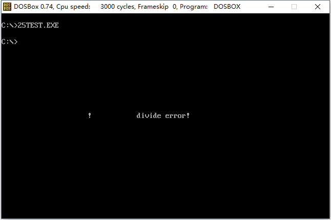
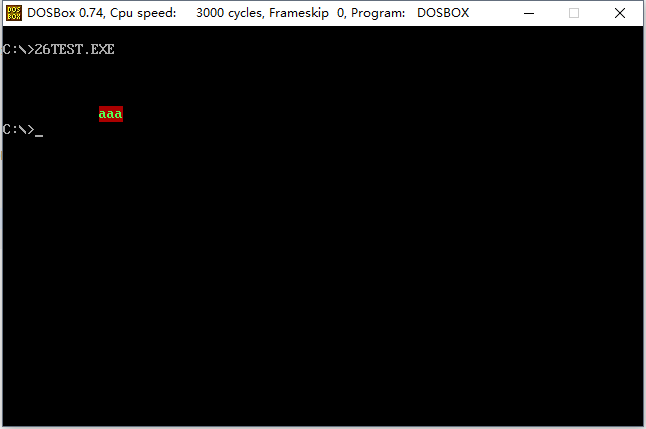
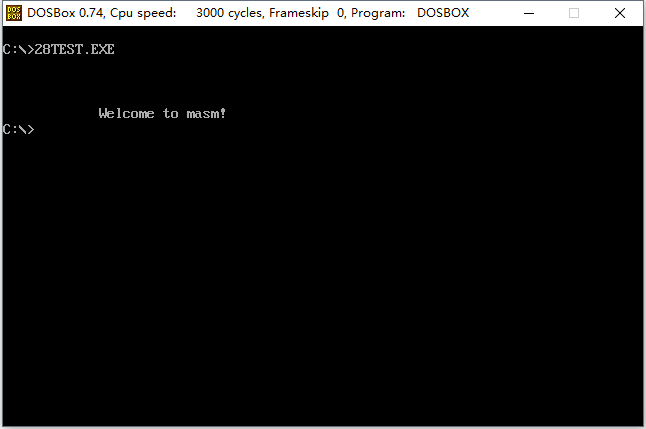
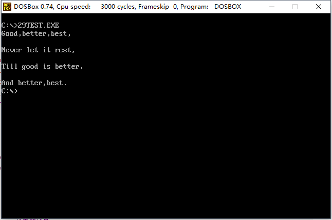

### # int指令

(1) int指令的格式为：int n，n为中断类型码，它的功能是引发中断过程。

(2) CPU执行int n指令，相当于引发一个n号中断的中断过程，执行过程如下。

① 取中断类型码n；

② 标记寄存器入栈，IF=0，TF=0；

③ CS、IP入栈；

④ （IP）=（n*4），（CS）=（n*4+2）。

从此处转去执行n号中断的中断处理程序。

可以在程序中使用int指令调用任何一个中断的中断处理程序。例如，下面的程序：

```assembly
assume cs:code

code segment
start: mov ax,0b800h
	   mov es,ax
	   mov byte ptr es:[12*160+40+2],'!'
	   int 0
code ends
end start
```



一般情况下，系统将一些具有一定功能的子程序，以中断程序的方式提供给应用程序调用。

### # 编写供应用程序调用的中断例程（中断处理程序）

### # 对int、iret和栈的深入理解

### # BIOS中断例程应用

(1) int10h中断例程是BIOS提供的中断例程，其中包含了多个和屏幕输出相关的子程序。

(2) 一般来说，一个供程序员调用的中断例程往往包含多个子程序，中断例程内部用传递进来的参数决定执行哪一个子程序。BIOS和DOS提供的中断例程，都用ah来传递内部子程序的编号。

(3) 下面看一下int 10h中断例程的设置光标位置功能。

```assembly
mov ah,2    ; (ah)=2表示调用中断例程的2号子程序：置光标
mov bh,0    ; 第0页
mov dh,5    ; dh中放行号
mov dl,12   ; dl中放列号
int 10h 
```

再看一下int 10h中断例程在光标位置显示字符功能。 

```assembly
mov ah,9    ; 在光标位置显示字符
mov al,'a'  ; 字符
mov bl,7    ; 颜色属性
mov bh,0    ; 第0页
mov cx,3    ; 字符重复个数
int 10h
```

编程：在屏幕的5行12列显示3个红底闪烁绿色的‘a’。 

```assembly
; Date : 2017-11-13 22:12:57
; File Name : 26TEST.ASM
; Description : 在屏幕的5行12列显示3个红底闪烁绿色的‘a’
; Author : Angus
; Version: V1.0

assume cs:code

code segment
	mov ah,2
	mov bh,0
	mov dh,5
	mov dl,12
	int 10h

	mov ah,9
	mov al,'a'
	mov bl,11001010b
	mov bh,0
	mov cx,3
	int 10h

	mov ax,4c00h
	int 21h
code ends
end
```



### # DOS中断例程应用

(1) int 21h中断例程是DOS提供的中断例程，其中包含了DOS提供给程序员在编程时调用的子程序。

(2) 前面一直使用的int 21h中断例程额的4ch号功能吗，即程序返回功能，如下：

```assembly
mov ah,4ch    ; 程序返回
mov al,0      ; 返回值
int 21h
```

（ah）=4ch表示调用第21h中断例程的4ch号子程序，功能为程序返回，可以提供返回值作为参数。

(3) int 21h中断例程在光标位置，显示字符串的功能：

```assembly
ds：dx 指向字符串        ; 要显示的字符串需用“$”作为结束符
mov ah,9                ; 功能号9,表示在光标位置显示字符串
int 21h
```

编程：在屏幕的第5行第12列显示“Welcome to masm!”。 

```assembly
; Date : 2017-11-13 22:34:11
; File Name : 28TEST.ASM
; Description : 在屏幕的第5行第12列显示“Welcome to masm!”
; Author : Angus
; Version: V1.0

assume cs:code,ds:data

data segment
	db 'Welcome to masm!','$'
data ends

code segment
start: mov ah,2		; 置光标
	   mov bh,0		; 第0页
	   mov dh,5		; dh中放行号
	   mov dl,12	; dl中放列号
	   int 10h

	   mov ax,data
	   mov ds,ax
	   mov dx,0		; ds:dx指向字符串的首地址
	   mov ah,9		; 功能号9，表示在光标位置显示字符串
	   int 21h

	   mov ax,4c00h
	   int 21h
code ends
end start
```



### # 实验13 编写、应用中断例程

(3) 下面的程序，分别在屏幕的第2、4、6、8行显示4句英文诗，补全程序。

```assembly
; Date : 2017-11-14 10:43:19
; File Name : 29TEST.ASM
; Description : 下面的程序，分别在屏幕的第2、4、6、8行显示4句英文诗，补全程序
; Author : Angus
; Version: V1.0

assume cs:code

code segment
s1:	db 'Good,better,best,','$'
s2:	db 'Never let it rest,','$'
s3:	db 'Till good is better,','$'
s4: db 'And better,best.','$'
s:	dw offset s1,offset s2,offset s3,offset s4
row: db 2,4,6,8

start: mov ax,cs
	   mov ds,ax
	   mov bx,offset s
	   mov si,offset row
	   mov cx,4

ok:	   mov bh,0		; 第0页
	   mov dh,[si]	; dh中放行号
	   mov dl,0		; dl中放列号
	   mov ah,2		; (ah)=2表示调用中断例程的2号子程序：置光标
	   int 10h		; int10h中断例程是BIOS提供的中断例程

	   mov dx,[bx]	; ds：dx 指向字符串,要显示的字符串需用“$”作为结束符
	   mov ah,9		; 功能号9,表示在光标位置显示字符串
	   int 21h		; int 21h中断例程是DOS提供的中断例程

	   inc si
	   add bx,2
	   loop ok

	   mov ax,4c00h
	   int 21h
code ends
end start
```

