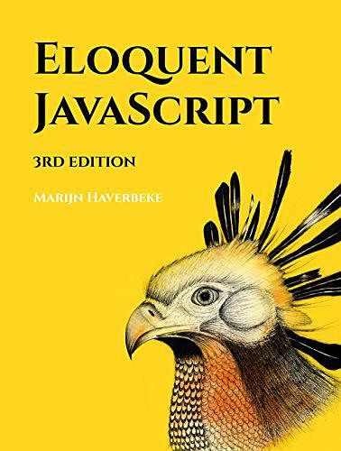

# JavaScript 编程精解

> 参考书籍[《Eloquent Javascript, 3rd Edition》](https://book.douban.com/subject/30275136/)，评分看着好高诶！
>
> 中文非官版链接：<https://github.com/wizardforcel/eloquent-js-3e-zh>

## 目录 & 进度

- [ ] 第1章 值，类型和运算符
- [ ] 第2章 程序结构
- [ ] 第3章 函数
- [ ] 第4章 数据结构：对象和数组
- [ ] 第5章 高阶函数
- [ ] 第6章 对象的秘密
- [ ] 第7章 项目：机器人
- [ ] 第8章 Bug 和错误
- [ ] 第9章 正则表达式
- [ ] 第10章 模块
- [ ] 第11章 异步编程
- [ ] 第12章 项目：编程语言
- [ ] 第13章 浏览器中的 JavaScript
- [ ] 第14章 文档对象模型
- [ ] 第15章 处理事件
- [ ] 第16章 项目：平台游戏
- [ ] 第17章 在画布上绘图
- [ ] 第18章 HTTP 和表单
- [ ] 第19章 项目：像素艺术编辑器
- [ ] 第20章 Node.js
- [ ] 第21章 项目：技能分享网站
