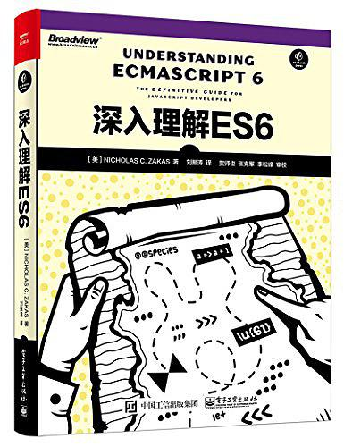

# 深入理解ES6

> 参考书籍[《深入理解ES6》](https://book.douban.com/subject/27072230/)，补充ES6方面知识。
>
> 下载链接：<https://readfree.me/book/27072230>

## 目录 & 进度

- [ ] 第1章 块级绑定
- [ ] 第2章 字符串与正则表达式
- [ ] 第3章 函数
- [ ] 第4章 扩展的对象功能
- [ ] 第5章 解构：更方便的数据访问
- [ ] 第6章 符号与符号属性
- [ ] 第7章 Set与Map
- [ ] 第8章 迭代器与生成器
- [ ] 第9章 JS的类
- [ ] 第10章 增强的数组功能
- [ ] 第11章 Promise与异步编程
- [ ] 第12章 代理与反射接口
- [ ] 第13章 用模块封装代码
- [ ] 附录A：较小的改进
- [ ] 附录B：理解ES7(ES2016)
