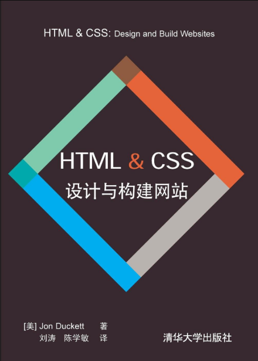

# HTML & CSS设计与构建网站

> 参考书籍[《HTML & CSS设计与构建网站》](https://book.douban.com/subject/21338365/)，设计非常精美的一本书！
>
> 下载链接：<https://readfree.me/book/21338365/>

## 目录 & 进度

- [ ] 第1章 结构
- [ ] 第2章 文本
- [ ] 第3章 列表
- [ ] 第4章 链接
- [ ] 第5章 图像
- [ ] 第6章 表格
- [ ] 第7章 表单
- [ ] 第8章 其他标记
- [ ] 第9章 Flash、视频和音频
- [ ] 第10章 CSS简介
- [ ] 第11章 颜色
- [ ] 第12章 文本
- [ ] 第13章 盒子
- [ ] 第14章 列表、表格和表单
- [ ] 第15章 布局
- [ ] 第16章 图像
- [ ] 第17章 HTML5布局 417
- [ ] 第18章 建站过程和设计方法
- [ ] 第19章 实用信息