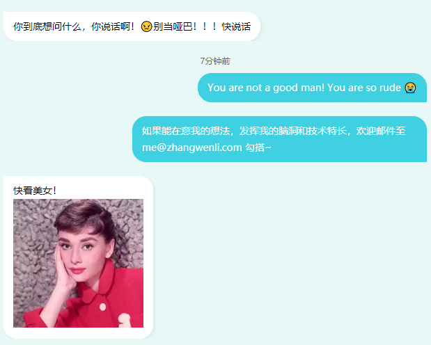

### 浮动元素的父级

如果一个包含元素只包含了一个浮动元素，有些浏览器就会将它的高度看成 0 像素。传统上，开发者在解决这个问题时，习惯在最后一个浮动盒子（位于包含元素中）的后面插入一个额外的元素，然后为这个新插入的元素添加一条 CSS 规则，将其 clear 属性的值设置为 both。但这样做意味着在 HTML 中加入一个额外的元素仅仅是为了调节包含元素的高度。

最近，开发者们选择一种纯粹基于 CSS 的解决方案，这样就不必在 HTML 页面中的浮动元素后面增加额外的元素。这种纯 CSS 的解决方案是在包含元素的样式中加入两条 CSS 规则：

- 将 overflow 属性的值设置为 auto。
- 将 width 属性的值设置为 100%。

```html
<!DOCTYPE html>
<html lang="en">
<head>
    <meta charset="UTF-8">
    <title>Bubble demo</title>
    <style>
        body {
            background-color: rgba(34, 195, 170, 0.1);
        }


        div.bubble {
            display: inline-block;
            max-width: 65%;
            padding: 9px 14px;
            border-radius: 20px;
            font-size: 14px;
            line-height: 24px;
            box-shadow: 2px 2px 5px rgba(102, 102, 102, 0.1);
        }

        div.left-bubble {
            background-color: #ffffff;
            border-top-left-radius: 0;
        }

        div.right-bubble {
            float: right;
            color: #fff;
            background-color: #3FD1E1;
            border-bottom-right-radius: 0;
        }

        .bubble-wrapper img {
            width: 100%;
            height: 100%;
        }


        .bubble-wrapper {
            clear: right;
            margin-bottom: 20px;
            overflow: auto;
            /*width: 100%;*/
        }

        /*.bubble-wrapper:before, .bubble-wrapper:after {*/
        /*    content: " ";*/
        /*    display: block;*/
        /*}*/

        /*.bubble-wrapper:after {*/
        /*    clear: both;*/
        /*}*/

        .time-wrapper {
            text-align: center;
            font-size: 12px;
            color: #666666;
            margin-bottom: 10px;
        }
    </style>
</head>
<body>
<div class="bubble-wrapper">
    <div class="bubble left-bubble">你好好，做气泡框</div>
</div>
<div class="time-wrapper">昨天</div>
<div class="bubble-wrapper">
    <div class="bubble right-bubble">你好好，做气泡框</div>
</div>
<div class="bubble-wrapper">
    <div class="bubble right-bubble">你好好，做气泡框</div>
</div>
<div class="bubble-wrapper">
    <div class="bubble left-bubble">你到底想问什么，你说话啊！😠别当哑巴！！！快说话</div>
</div>
<div class="time-wrapper">7分钟前</div>
<div class="bubble-wrapper">
    <div class="bubble right-bubble">You are not a good man! You are so rude 😭</div>
</div>
<div class="bubble-wrapper">
    <div class="bubble right-bubble">如果能在意我的想法，发挥我的脑洞和技术特长，欢迎邮件至 me@zhangwenli.com 勾搭~</div>
</div>
<div class="bubble-wrapper">
    <div class="bubble left-bubble">快看美女！<br/></div>
</div>
<div class="bubble-wrapper">
    <div class="bubble right-bubble"><b>你就这点出息！</b></div>
</div>
<div class="bubble-wrapper">
    <div class="bubble right-bubble"></div>
</div>
</body>
</html>

```



