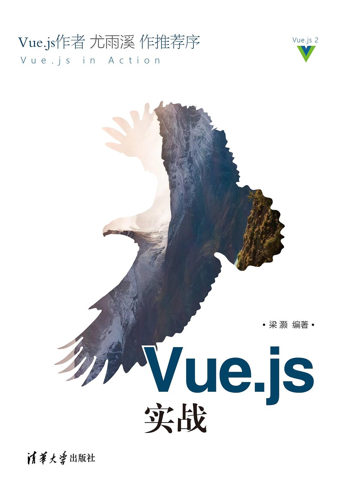

# Vue.js 实战

> 参考书籍[《Vue.js 实战》](https://book.douban.com/subject/27178802/)，想知道 iView 是怎么做出来的😀
>
> 下载链接：<https://readfree.me/book/27178802>

## 目录 & 进度

- [x] 第1章 初识Vue.js
- [x] 第2章 数据绑定和第一个Vue应用
- [x] 第3章 计算属性
- [x] 第4章 v-bind及class与style绑定
- [x] 第5章 内置指令
- [x] 第6章 表单与v-model
- [x] 第7章 组件详解
- [x] 第8章 自定义指令
- [x] 第9章 Render函数
- [x] 第10章 使用webpack 
- [x] 第11章 插件
- [x] 第12章 iView经典组件剖析
- [x] 第13章 实战：知乎日报项目开发
- [ ] 第14章 实战：电商网站项目开发
- [ ] 第15章 相关开源项目介绍

## 读后感

- 2019-03-21：因为想知道 iView 是怎么做出来，所以看这本书，希望不会失望。
- 2019-03-21：看了几个小时，有一点点失望了，很多地方是抄的官方的文档。
- 2019-03-22：嗯，例子还是不错的，有很多官方没有介绍的用法。