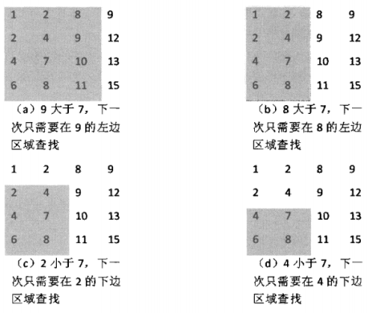

### 题目：

> 在一个二维数组中，每一行都按照从左到右递增的顺序排序，每一列都按照从上到下递增的顺序排序。请完成一个函数，输入这样的一个二维数组和一个整数，判断数组中是否含有该整数。

### 思路：

> 首先选取数组中右上角的数字。如果该数字等于要查找的数字，查找过程结束。如果该数字大于要查找的数字，剔除这个数字所在的列：如果该数字小于要查找的数字，剔除这个数字所在的行。也就是说如果要查找的数字不在数组的右上角，则每－次都在数组的查找范围中剔除行或者一列，这样每一步都可以缩小查找的范围，直到找到要查找的数字，或者查找范围为空。



### 代码：

```java
public class Main {
    public static void main(String[] args) {
        int[][] matrix = { // 测试矩阵
                {1, 2, 3, 4, 5, 6},
                {5, 7, 9, 11, 13, 15},
                {10, 13, 16, 19, 22, 25},
                {15, 19, 23, 27, 31, 35},
                {20, 25, 30, 35, 40, 45}
        };

        int number = 45; // 测试数字
//        number = 313; // 测试数字

        boolean result = find(matrix, number);
        System.out.println(result);

        result = betterFind(matrix, number);
        System.out.println(result);
    }

    public static boolean find(int[][] matrix, int number) {

        int rows = matrix.length; // 二维数组行数
        int columns = matrix[0].length; // 二维数组列数

        for (int column = columns - 1; column >= 0; column--) {
            if (number == matrix[0][column]) { // 和第一行的每一列进行比较，相等直接找到，大于就向下找
                System.out.println("row:" + 1 + ", column:" + ++column);
                return true;
            } else if (number > matrix[0][column]) {
                for (int row = 1; row < rows; row++) {
                    if (number == matrix[row][column]) {
                        System.out.println("row:" + ++row + ", column:" + ++column);
                        return true;
                    }
                }
            }
        }

        return false;
    }

    // 更好的解法（符合解题思路）
    public static boolean betterFind(int[][] matrix, int number) {

        int rows = matrix.length; // 二维数组行数
        int columns = matrix[0].length; // 二维数组列数

        int row = 0; // 进行查找的起始行号
        int column = columns - 1; // 进行查找时的起始列号

        while (row < rows && column > 0) { // 从右上角开始查找
            if (number == matrix[row][column]) { // 找到后直接返回true
                return true;
            } else if (number > matrix[row][column]) {
                row++; // 如果大于当前位置的数，下移一行（排除当前行的查找）
            } else {
                column--; // 如果小于当前位置的数，左移一列（排除当前列的查找）
            }
        }

        return false;
    }

}

```

