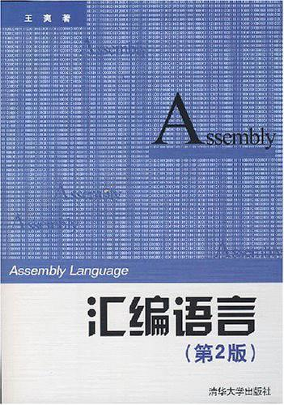

## Assembly（汇编语言）

> 记录学习**Assembly（汇编语言）**的历程，辅助“微机原理”学科的学习，参考自书籍[《汇编语言（第2版）》](https://book.douban.com/subject/3037562/)。【整理自原学习笔记】
>
> 下载链接：<http://readfree.me/book/3037562/> 

 

## 目录

+ [第01章_基础知识](第01章_基础知识.md)
+ [第02章_寄存器](第02章_寄存器.md)
+ [第03章_寄存器（内存访问）](第03章_寄存器（内存访问）.md)
+ [第04章_第一个程序](第04章_第一个程序.md)
+ [第05章_[BX]和loop](第05章_[BX]和loop.md)
+ [第06章_包含多个段的程序](第06章_包含多个段的程序.md)
+ [第07章_更灵活的定位内存地址的方法](第07章_更灵活的定位内存地址的方法.md)
+ [第08章_数据处理的两个基本问题](第08章_数据处理的两个基本问题.md)
+ [第09章_转移指令的原理](第09章_转移指令的原理.md)
+ [第10章_CALL和RET命令](第10章_CALL和RET命令.md)
+ [第11章_标志寄存器](第11章_标志寄存器.md)
+ [第12章_内中断](第12章_内中断.md)
+ [第13章_int指令](第13章_int指令.md)
+ [第14章_端口](第14章_端口.md)
+ [第15章_外中断](第15章_外中断.md)
+ [第16章_直接定址表](第16章_直接定址表.md)
+ [第17章_使用BIOS键盘输入和磁盘读写](第17章_使用BIOS键盘输入和磁盘读写.md)
+ [附录_SublimeText对ASM的支持](附录_SublimeText对ASM的支持.md)

